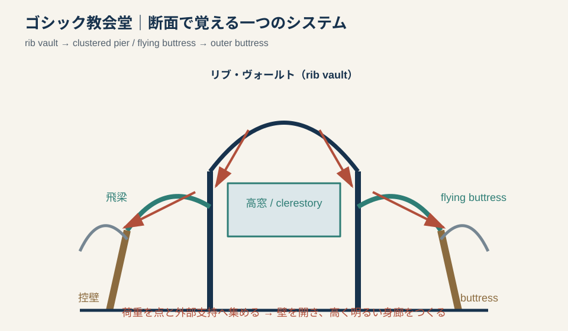
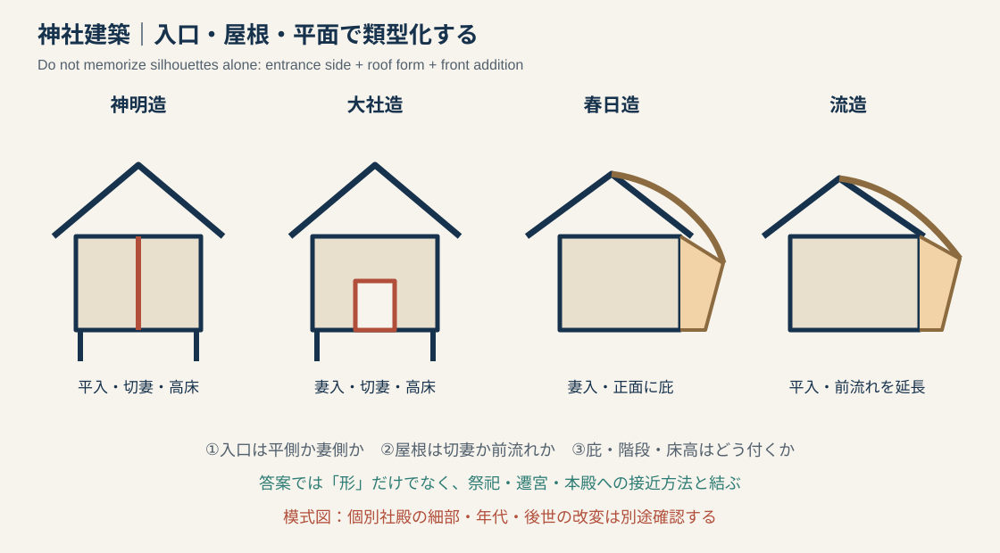
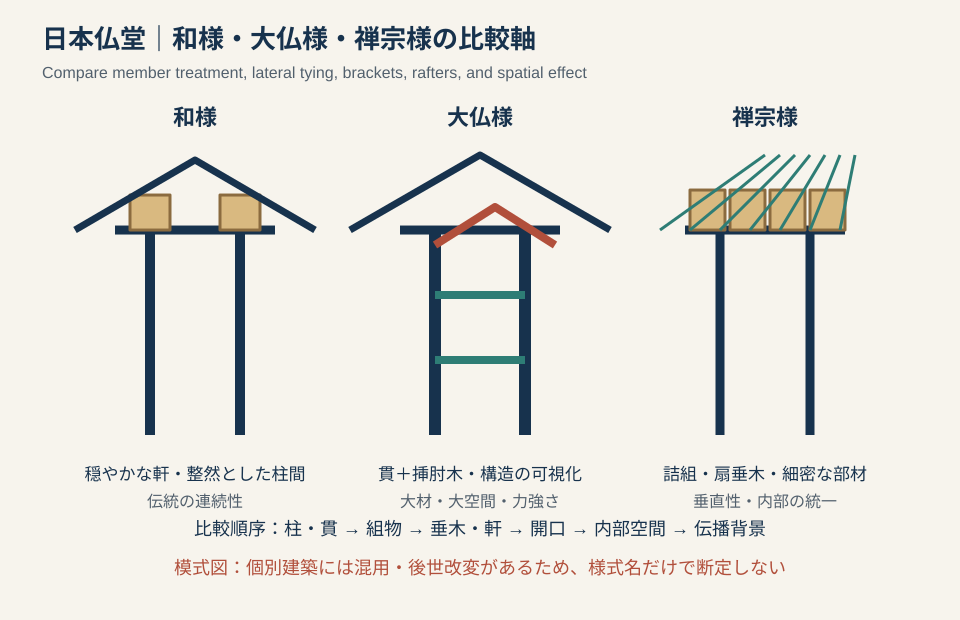
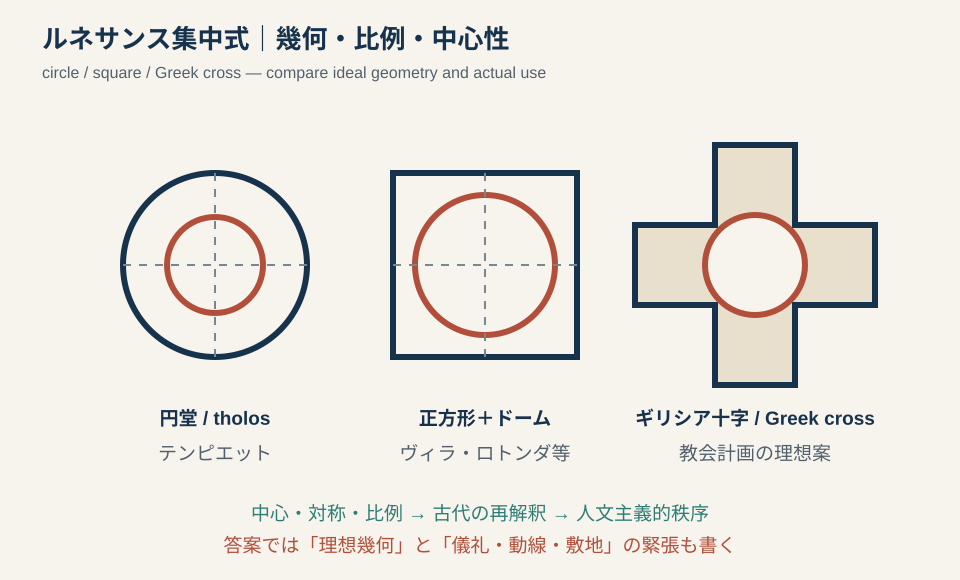
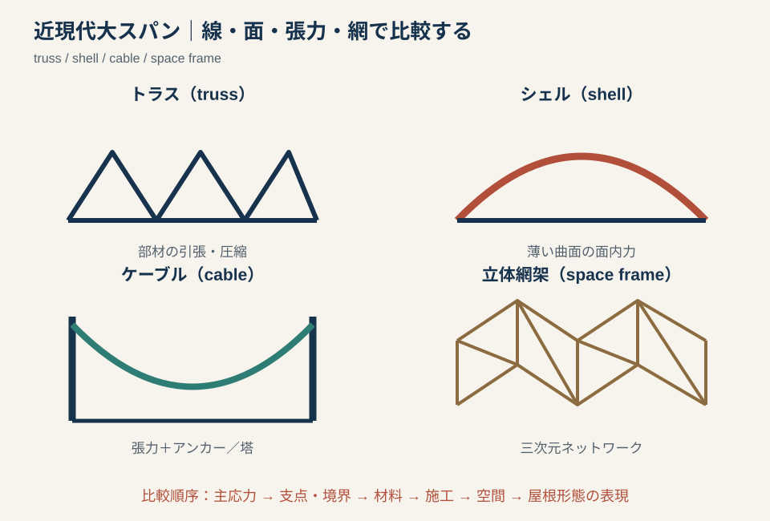

# 専門2-2 建築史：ケースファミリーと図示テンプレート v0.1

## 0. この文書の役割

ここで覚える単位は「一棟＝一答案」ではない。複数の建築に共通する仕組みを一つの**ケースファミリー**として持ち、出題された個別建築に応じて差分だけを差し替える。

`共通機構 → 個別差 → 歴史的条件 → 意義・限界`

図はすべて答案用の模式図であり、測量図ではない。30〜60秒で再現し、文章中の因果関係を矢印とラベルで可視化するために用いる。

### 図示の最低規則

1. 輪郭を写すだけでなく、論述する部材・軸・荷重を赤または矢印で示す。
2. ラベルは三〜五語に絞る。
3. 平面なら`中心／軸／入口／動線`、断面なら`荷重／支持／採光／高さ`を優先する。
4. 図の横に一文で「したがって何が可能になったか」を書く。
5. 不確かな細部は描かず、確実な模式へ抽象化する。

---

# 1. ゴシック教会堂：構造・光・制度を一つの系として書く

## 1.1 過去問への適応範囲

- ゴシック（Gothic）の様式説明。
- ロマネスク（Romanesque）との構築的比較。
- ノートル＝ダム、シャルトル、アミアン、ランス、ケルン等の単体分析。
- 火災後の復旧、真正性、世界遺産などの保存論述。

## 1.2 答案用の構造簡図

図の一文説明：リブ・ヴォールト（rib vault）で荷重を線状に集め、束ね柱とフライング・バットレス（flying buttress）を介して外部控壁へ流すことで、壁面を開口化し、高く明るい内部を可能にした。

## 1.3 変わらない中核

| 層 | 共通機構 | 答案での因果 |
|---|---|---|
| 構造 | 尖頭アーチ、リブ・ヴォールト、控壁系 | 荷重と水平推力を限定された支持点・外部支持へ流す |
| 空間 | 高い身廊、側廊、内陣、長軸、垂直性 | 構造の線材化が高さと連続した奥行をつくる |
| 光 | クリアストーリー（clerestory）、ステンドグラス（stained glass） | 壁の非耐力化・開口化が色彩光を可能にする |
| 社会 | 司教座、都市、巡礼、職人組織、長期造営 | 巨大聖堂が信仰と都市共同体の表象になる |

注意：三つの構造要素を「発明品の一覧」にせず、支持の連鎖として説明する。地域・年代によって構成は異なり、すべてのゴシック建築が同じ完成形を持つわけではない。

## 1.4 個別建築へ差し替える箇所

| 代表例 | 固定してよい焦点 | 差分として確認すること |
|---|---|---|
| パリのノートル＝ダム | 初期ゴシックからの展開、都市・宗教・国家的象徴 | 建設段階、後世の改変、19世紀修復、2019年火災後の復旧 |
| シャルトル大聖堂 | 建築・彫刻・ステンドグラスの統一、後続例への影響 | 1194年火災後の再建、巡礼、保存されたガラス |
| アミアン大聖堂 | 13世紀古典盛期、高い身廊、平面と立面の整合 | 三層立面、彫刻プログラム、建設速度 |
| ランス大聖堂 | 王権儀礼と彫刻、フランス王戴冠との結合 | 戦災・修復、ファサードと典礼の関係 |
| ケルン大聖堂 | フランス系形式の越境、長期建設と19世紀完成 | 13世紀着工と1880年完成を単純な連続とみなさない |

## 1.5 六行答案テンプレート

> ゴシック建築（Gothic architecture）は、【12〜13世紀／地域】の【宗教・都市条件】のもとで発達した。尖頭アーチとリブ・ヴォールト（rib vault）は荷重を支持点へ集め、フライング・バットレス（flying buttress）は側方推力を外部控壁へ伝える。そのため壁面を大きく開口でき、【クリアストーリー／ステンドグラス】による明るい内部と、高い身廊の垂直性が実現した。【建築名】では【固有の平面・立面・装飾】にこの原理が表れる。これは単なる構造革新ではなく、【典礼／巡礼／王権／都市共同体】を可視化する装置でもあった。ただし【地域差・建設段階・修復】を区別して評価する必要がある。

## 1.6 技術史として追加収集する項目

- 石材の採掘・運搬、石工の型板・作図法、足場と揚重。
- ヴォールトの仮枠、リブと充填面の施工順序。
- 鉄製タイや補強材、火災・風・地盤への対応。
- 長期工事における工匠組織、設計変更、資金調達。

---

# 2. 日本神社建築：形態分類を祭祀と更新制度へつなぐ

## 2.1 過去問への適応範囲

- 写真・平面から神明造、大社造、春日造、流造等を同定する問題。
- 伊勢神宮、出雲大社、春日大社、賀茂別雷神社、宇佐神宮等の単体分析。
- 式年遷宮・式年造替、文化財保存、技術継承の論述。

## 2.2 答案用の類型簡図

この図は四類型を同一縮尺で復原したものではない。最初に`平入／妻入`を判定し、次に屋根と正面付加部を見るための識別図である。

## 2.3 共通の比較軸

| 比較軸 | 観察するもの | 歴史へ接続する問い |
|---|---|---|
| 入口 | 平側か妻側か | 参拝者は本殿へどう接近するか |
| 屋根 | 切妻、前流れ、庇の付加 | 雨仕舞、正面性、儀礼空間をどうつくるか |
| 床・階段 | 高床、階段、縁 | 神体を納める内部と人の領域をどう分けるか |
| 配置 | 単殿、並列、前後二棟、権殿との対 | 祭神・儀礼・造替が配置をどう規定するか |
| 更新 | 遷宮、造替、修理、部材交換 | 物質の古さと形式・技術の継承をどう評価するか |

## 2.4 類型の最小差分

| 類型 | 形態上の手掛かり | 代表例 | 書き過ぎないための注意 |
|---|---|---|---|
| 神明造 | 平入、切妻、高床、直線的な構成 | 伊勢神宮内宮正殿 | 現在の社殿をそのまま原始住居の残存と断定しない |
| 大社造 | 妻入、切妻、高床、正面入口 | 出雲大社本殿 | 現社殿と古代の巨大神殿説を区別する |
| 春日造 | 妻入、正面に庇を付す小規模本殿 | 春日大社本殿 | 四棟並列・回廊等、社殿群全体との関係も見る |
| 流造 | 平入、前方の屋根流れを長く伸ばす | 賀茂別雷神社本殿・権殿 | 流造一般と個別社殿の規模・配置を混同しない |
| 八幡造 | 前後二棟を連結し、間に相の間をつくる | 宇佐神宮本殿 | 立面の輪郭だけでなく前後二殿の平面構成を書く |

## 2.5 五行答案テンプレート

> 【建築名】は【類型名】に属し、【平入／妻入】の【屋根形式】と【庇・高床・前後二棟等】を特徴とする。この構成は、単なる外形ではなく、【神体を納める本殿／参拝者の接近／祭祀動線】の分節を表す。また【遷宮／造替／権殿】の制度によって、建物の更新と祭祀の継続が結びつく。したがって、その歴史的価値は古い材料の残存だけでなく、形式・技術・儀礼が反復的に継承される点にもある。ただし現存社殿の年代と形式の起源は分けて論じる必要がある。

## 2.6 技術史として追加収集する項目

- 檜材の調達、木割、番付、建方、屋根材と葺替え。
- 遷宮・造替時の旧材再利用、工匠・祭儀・資金の組織。
- 発掘遺構、指図、絵画、修理工事報告書から何が判定できるか。
- 類型名が後世の建築史学による整理であることと、実際の混成・変化。

---

# 3. 日本中世仏堂：和様・大仏様・禅宗様を比較軸で書く

## 3.1 過去問への適応範囲

- 鎌倉期の複数建築から二棟を選び、平面・断面・歴史的特徴を述べる問題。
- 大仏様、禅宗様、和様の比較、文化移入、組物・軒構成の図示。
- 東大寺南大門、浄土寺浄土堂、円覚寺舎利殿等の単体分析。

## 3.2 答案用の比較簡図

図の一文説明：三様式は装飾語彙だけでなく、柱と貫の固め方、組物の配置、垂木・軒、内部架構の見せ方を同じ順序で比較する。

## 3.3 安定した比較軸

| 軸 | 和様 | 大仏様 | 禅宗様 |
|---|---|---|---|
| 歴史的位置 | 平安期までに日本化した寺院建築の系統 | 重源らによる宋代系技術の導入と東大寺再建 | 禅宗受容とともに宋・元代系の形式が展開 |
| 構築の印象 | 穏やかな軒、整然とした柱間 | 大材、貫、挿肘木等による力強く可視的な架構 | 詰組、扇垂木、細密な部材構成と垂直性 |
| 空間化 | 天井等で小屋組と内部を分節しやすい | 架構を内部に表し、大空間を一体化しやすい | 内外の部材秩序と仏殿空間を統一する |
| 代表例 | 平等院鳳凰堂、長弓寺本堂等 | 東大寺南大門、浄土寺浄土堂 | 円覚寺舎利殿等 |

注意：実在建築には混用と後世改変がある。様式名を見ただけで全特徴を機械的に当てはめず、当該建築で観察できる部位を根拠にする。

## 3.4 比較答案テンプレート

> 【A】と【B】は、ともに【時代・用途】の木造建築であるが、【伝播背景／宗教的目的】が異なる。【A】では【柱・組物・垂木・天井】によって【空間効果】をつくる。これに対し【B】では【貫・挿肘木／詰組・扇垂木等】を用い、【荷重・軒・内部架構】を【異なる方法】で処理する。この差は意匠の違いだけでなく、【宋代技術の受容／再建事業／禅宗儀礼】という歴史的条件に対応する。ただし両者を純粋様式として固定せず、混用と後世改変を確認する必要がある。

## 3.5 30秒図示の描き分け

- 和様：柱二本、柱上の組物、平行垂木、穏やかな軒。`柱上に配置`をラベル化。
- 大仏様：柱を横に貫通する貫、柱身から出る挿肘木、大きな虹梁。`構造を見せる`と書く。
- 禅宗様：柱間にも組物を置く詰組、放射状の扇垂木。`密な反復`と書く。
- 単体問題では、この比較図に対象建築の平面一図を追加する。

## 3.6 技術史として追加収集する項目

- 貫、挿肘木、遊離尾垂木、詰組、扇垂木の実際の荷重・施工上の働き。
- 重源と東大寺再建における材木調達、工匠組織、宋との人的・技術的関係。
- 部材加工痕、墨書、番付、修理時の解体調査をどう史料化するか。
- 「様式」と「構法」を同一視できない例、および後世の折衷。

---

# 4. ルネサンス集中式：理想幾何と実用条件の緊張を書く

## 4.1 過去問への適応範囲

- ルネサンス（Renaissance）建築の平面・比例・古典復興の説明。
- テンピエット、ヴィラ・ロトンダ、集中式教会案、サン・ピエトロ大聖堂計画等の単体分析。
- 中世教会との比較、建築家・パトロン・人文主義の論述。

## 4.2 答案用の平面簡図

図の一文説明：円、正方形、ギリシア十字（Greek cross）などの完結した幾何学と中心軸を用い、各部を比例的に統合する一方、祭壇・入口・行列・敷地は方向性を要求する。

## 4.3 共通の因果鎖

`古代建築・ウィトルウィウスの再読 → 幾何・比例・オーダーの体系化 → 中心をもつ明晰な全体 → 人文主義的秩序の表象`

この鎖だけでは不足する。答案の後半で、理想幾何が次の現実条件と衝突・調整されることを書く。

- キリスト教典礼が要求する祭壇への方向性。
- 入口、眺望、斜面、都市組織などの敷地条件。
- 既存建物、構造、工期、パトロン交代。
- 図面上の理想案と完成建築の差。

## 4.4 代表例の使い分け

| 代表例 | 幾何学上の核 | 個別の論点 |
|---|---|---|
| テンピエット（Tempietto） | 円形堂と周柱、放射状の中心性 | 小規模記念堂、古代円形神殿の再解釈、周囲中庭計画との関係 |
| ヴィラ・ロトンダ（Villa Rotonda） | 正方形＋中央円形広間＋四面ポルティコ | 四方向の眺望、住居機能、完全対称と敷地の調整 |
| サン・ピエトロ大聖堂の集中式案 | ギリシア十字と中央ドーム | 設計者交代、巨大教会の典礼、長堂化、計画と完成形の差 |

## 4.5 五行答案テンプレート

> 【建築名】は、ルネサンス（Renaissance）期の【建築家・年代】による【用途】である。平面は【円／正方形／ギリシア十字】を基礎とし、【中心・軸・オーダー】によって部分と全体を比例的に統合する。これは古代建築の再解釈と、人間の理性によって把握できる秩序を空間化したものといえる。一方、【祭壇・入口・動線・敷地・眺望】は方向性を要求し、理想的な中心性に修正を加える。したがって本作の意義は、単なる対称形ではなく、理念的幾何と具体的使用条件の調停にある。

## 4.6 技術史として追加収集する項目

- 実測、透視図法、作図、模型が設計・施工をどう変えたか。
- ドーム、石積、鉄鎖、二重殻等の構築技術と古代知識の再解釈。
- 建築家、職人、パトロンの分業と図面の権威。
- 理想案・施工図・完成建物を区別できる史料。

---

# 5. 近現代大スパン：構造形式より先に「主応力」を判定する

## 5.1 過去問への適応範囲

- 鉄・ガラス、鉄筋コンクリート、シェル、ケーブル、プレキャスト等の技術史。
- クリスタル・パレス、駅舎・市場・博覧会建築、代々木競技場、東京カテドラル等の単体分析。
- 構造合理性、工業化、国家イベント、保存価値を結ぶ問題。

## 5.2 答案用の構造比較図

図の一文説明：形の名称を答える前に、荷重を線・面・張力・三次元網のどれで支持し、どこへ伝えるかを判定する。

## 5.3 十分に安定した比較軸

| 形式 | 主な力・仕組み | 支持・境界 | 空間・形態 | 生産上の論点 |
|---|---|---|---|---|
| トラス（truss） | 棒材の引張・圧縮 | 柱・壁・橋台 | 深い梁で長距離を飛ばす | 規格材、接合、反復、現場組立 |
| シェル（shell） | 薄い曲面内の面内力 | 縁梁・支持点 | 構造と屋根形態が一致しやすい | 型枠、配筋・打設、曲面精度 |
| ケーブル（cable） | 張力 | アンカー、マスト、圧縮材 | 吊曲面、軽量な屋根 | 張力導入、施工時安定、被覆 |
| 立体網架（space frame） | 三次元部材網の軸力 | 多点支持が可能 | 均質で方向性の弱い大空間 | 節点、モジュール、工場製作 |

## 5.4 個別例へ差し替える箇所

| 代表例 | 主機構 | 歴史的条件 | 注意 |
|---|---|---|---|
| クリスタル・パレス | 鉄・ガラス部材の反復とプレファブリケーション（prefabrication） | 1851年万博、短工期、移設可能性、工業生産 | 大スパン一語でなくモジュールと生産工程を書く |
| 19世紀駅舎・市場 | 鉄トラス等でホーム・売場を覆う | 鉄道・物流・群衆・防火 | 石造ファサードと鉄骨内部の役割分担を見る |
| 国立代々木競技場 | 主ケーブルと吊屋根、圧縮支持・アンカー | 1964年東京五輪、象徴性と大観衆空間 | ケーブルだけでなく観客席・動線・都市景観へつなぐ |
| 東京カテドラル聖マリア大聖堂 | RC曲面壁と屋根形態の統合 | 戦後宗教建築、象徴的形態、光 | 一般的な薄肉シェルの説明をそのまま代入しない |
| シドニー・オペラハウス | プレキャストRCリブによる殻状屋根 | 国際設計競技、施工可能性への再設計 | 単純な一枚の薄肉シェルとは書かない |

## 5.5 六行答案テンプレート

> 【建築名】は、【材料・構造形式】によって【用途】に必要な大スパンを実現した。屋根荷重は【面／ケーブル／トラス／立体網架】により【引張・圧縮・面内力】として処理され、【支点・マスト・縁梁・アンカー】を経て地盤へ伝わる。この仕組みは柱の少ない【内部空間】をつくると同時に、【屋根形態・外観】を直接決定する。さらに【標準化／プレキャスト／現場打設／張力導入】という施工・生産方法が実現を支えた。背景には【万博・鉄道・五輪・宗教・文化政策】という社会的需要がある。よって意義は構造形式の新奇さだけでなく、技術、生産、空間、社会的表象を統合した点にある。

## 5.6 技術史として追加収集する項目

- 鋼・RC・PC・ガラスの材料規格、供給、試験、耐火・耐久性。
- リベット・ボルト・溶接・プレキャスト接合・ケーブル定着の年代差。
- 設計計算、模型実験、施工計測とエンジニアの役割。
- 完成後の防水、腐食、設備更新、補修と保存判断。

---

# 6. 五ファミリーを未知の出題へ適用する手順

## 6.1 90秒の答案設計

1. 設問の動詞を囲む：`図示／比較／背景／評価`。
2. 対象を最も近いファミリーへ仮置きする。
3. 共通機構を一文で書く。
4. 出題対象だけの差分を三点書く。
5. `条件 → 機構 → 空間的結果 → 歴史的意義`へ並べ替える。
6. 図は文章の中心因果を一つだけ可視化する。

## 6.2 汎用骨格

> 【対象】は【時代・地域・主体】の【課題／目的】に応答した。【材料・構造・平面・制度】という機構によって【具体的な空間・形態・社会的結果】を生んだ。この点は【同じファミリーの比較対象】と共通するが、【個別の条件】により【差異】がある。ゆえにその建築史的意義は【後世への影響／文化移入の変形／技術と社会の統合】にあり、同時に【限界・後世改変・史料上の留保】も考慮すべきである。

## 6.3 「適応できない」ことを検出するチェック

次のどれかが空欄なら、ファミリーの文章を無理に代入しない。

- 対象固有の年代・場所・人物。
- 図面または写真上で確認できる三つの根拠。
- 一般原理と異なる個別差。
- 歴史的条件を裏づける史料。
- 後世改変と当初状態の区別。

このチェックによって、フレームワークは「すべての問題に同じ答案を当てる型」ではなく、「不足している論拠を発見しながら答案を組み立てる型」になる。

---

# 7. 参照入口

- 過去問：`data/processed_questions/2014_専門2-2_建筑史_Q12.md`、`2016_専門2-2_建筑史_Q9.md`、`2016_専門2-2_建筑史_Q11.md`、`2020_専門2-2_建筑史_Q4.md`、`2022_専門2-2_建筑史_Q5.md`ほか。
- ゴシックの比較確認：[Chartres Cathedral / UNESCO](https://whc.unesco.org/en/list/81/)、[Amiens Cathedral / UNESCO](https://whc.unesco.org/en/list/162/)、[Paris, Banks of the Seine / UNESCO Urban Heritage Atlas](https://whc.unesco.org/en/urban-heritage-atlas/Paris/)。
- 春日大社の造替と祭祀：[春日大社「式年造替の本義と若宮御造替」](https://www.kasugataisha.or.jp/zotai/)。
- 個別建築の精密図・修理報告は、文化庁「国指定文化財等データベース」、各文化財修理工事報告書、東京大学建築史研究室デジタルミュージアム等で追加確認する。
