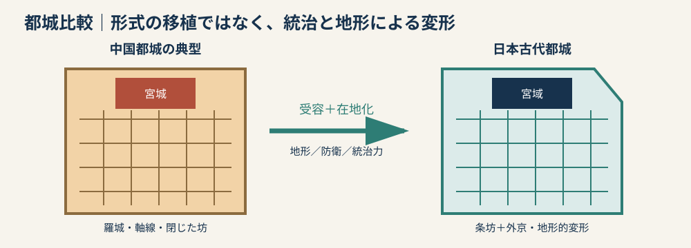
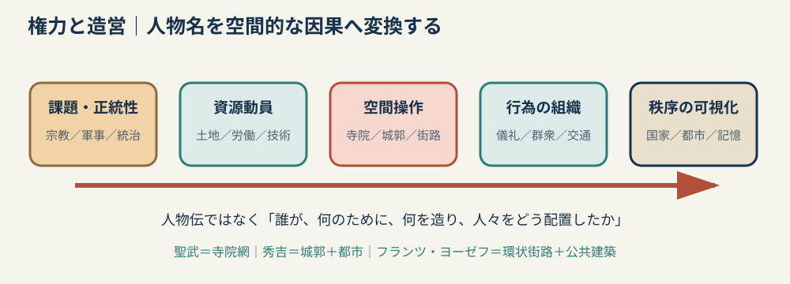
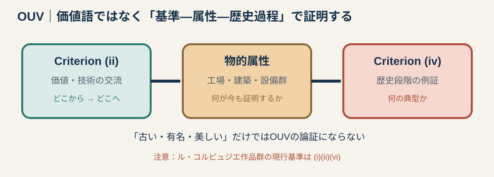
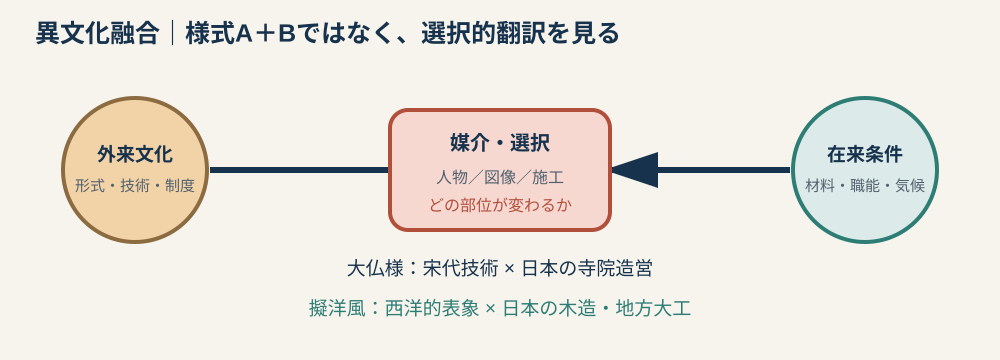
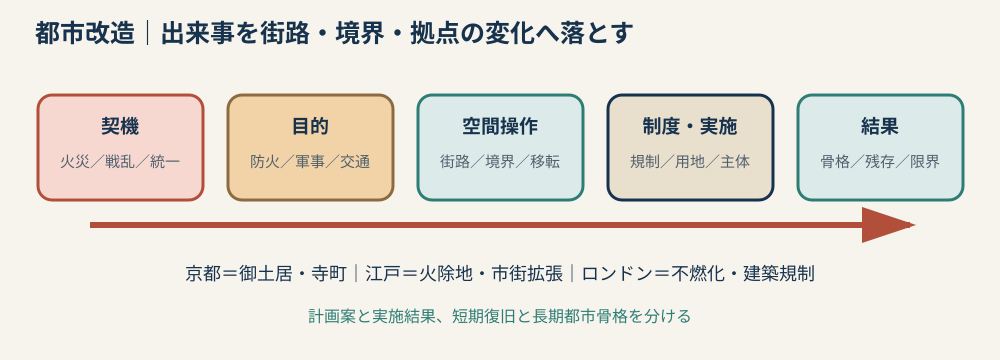
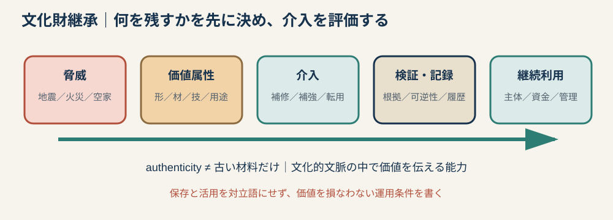

# 専門2-2 建築史：六主題判断カード v0.1

## 0. 使い方

これは暗記事典ではない。各カードは、未知題を見てから60秒以内に次の六枠を埋めるために使う。

`一文定義／背景二点／建築的結果二点／代表例二件／比較一件／30秒図`

答案の共通順序は、`背景 → 主体・目的 → 空間操作 → 結果 → 評価`とする。

---

# Card 1　中国都城と日本古代都城

## 一文定義

日本古代都城は、中国都城の方格街路、南北軸、宮域と京域の分節を導入しながら、地形、防衛条件、律令国家の統治能力に応じて変形した。

## 覚える三差

| 比較軸 | 中国の典型 | 日本の傾向 | 理由へつなぐ語 |
|---|---|---|---|
| 外郭 | 羅城・城門で囲う | 完全な連続外郭が弱い例が多い | 外敵、防衛、自然地形 |
| 幾何 | 長方形・軸線・左右対称を強く保つ | 外京や河川・地形による変形 | 敷地条件、既存交通 |
| 街区管理 | 坊・市場を門と制度で統制 | 条坊を導入するが運用は変質 | 統治力、都市活動の成長 |

## 二例

- 長安―平城京：モデルの受容と外京等の変形を比較する。
- 藤原京―平城京：日本内部でも都城制が段階的に整備されたことを示す。

## 30秒答案

> 日本古代都城は中国の都城制を参照し、南北軸、方格状の条坊、北部の宮域を導入した。しかし、中国都城の強固な羅城や坊制に比べ、日本では外郭が弱く、平城京の外京のように地形や既存条件による変形も生じた。これは形式の模倣ではなく、律令国家の統治、防衛条件、土地利用に応じた制度の在地化である。

注意：比較対象となる中国都城と日本都城を最初に限定し、「中国／日本は常にこうである」と一般化しない。

---

# Card 2　権力者・国家と造営

## 一文定義

権力者の造営は、個人の趣味ではなく、正統性、宗教政策、軍事、都市統治を、資源動員と空間秩序によって可視化する行為である。

## 五人物を一鎖で覚える

| 人物 | 目的・背景 | 建築・都市操作 | 結果 |
|---|---|---|---|
| 聖武天皇 | 国家安寧、仏教による統合 | 国分寺網、東大寺・大仏 | 中央と諸国を宗教施設で結ぶ |
| 藤原道長 | 摂関家の権勢、浄土信仰 | 法成寺の大伽藍 | 貴族権力を宗教景観として表す |
| 豊臣秀吉 | 統一政権、軍事・都市統治 | 大坂城、聚楽第、京都改造 | 城郭・街路・寺町で秩序を再編 |
| フランツ・ヨーゼフ1世 | 帝都改造、市民社会との調整 | ウィーン城壁撤去、リングシュトラーセ | 国家・市民施設を環状大通りに配置 |
| アドルフ・ヒトラー | 全体主義の宣伝、群衆統合 | ニュルンベルク党大会施設、ゲルマニア計画 | 巨大軸線と集会空間で権力を演出 |

## 比較の一文

> 聖武天皇が寺院網によって国家統合を図ったのに対し、秀吉は城郭と都市改造、フランツ・ヨーゼフ1世は近代的街路と公共建築によって統治秩序を表現した。

## 失点防止

- 人物伝記を書かず、建築・都市操作を最低二つ入れる。
- 実現建築と未実現計画を区別する。
- 「権力の象徴」で止めず、誰をどの空間へ組織したかを書く。

---

# Card 3　産業遺産・世界遺産・OUV

## 一文定義

顕著な普遍的価値（Outstanding Universal Value: OUV）は「有名・古い」という評価ではなく、どの歴史過程を、どの物的属性が、どの登録基準によって証明するかという論証である。

## 二基準

- Criterion (ii)：技術、建築、都市等における人類の価値の交流。
- Criterion (iv)：人類史の重要段階を例証する建築・技術的集合の優れた例。

## 三遺産の最小セット

| 遺産 | 交流・移転 | 例証する歴史段階 |
|---|---|---|
| 富岡製糸場と絹産業遺産群 | フランス式製糸技術の導入と日本での改良・普及 | 原料繭から製糸までを結ぶ近代的大量生産体系 |
| 明治日本の産業革命遺産 | 欧米技術を導入し、日本の条件へ適応 | 製鉄・製鋼、造船、石炭による短期間の工業化 |
| ル・コルビュジエの建築作品 | 近代建築思想と設計実践の国際的伝播 | 20世紀の新しい建築言語と社会的課題への応答 |

## 重要な留保

2017年過去問は三遺産を(ii)(iv)と結び付けているが、UNESCOの現行登録情報では、ル・コルビュジエ作品群は(i)(ii)(vi)であり(iv)ではない。試験では設問の枠を踏まえつつ、学習時には公式基準を混同しない。

## 30秒答案骨格

> 【遺産】は【技術・思想】が【地域間】で移転し、【現地の資源・制度】に適応した過程を示すため基準(ii)と関係する。また【工場群・建築群・生産設備】が一体として残り、【歴史段階】を物的に例証する点に基準(iv)上の価値がある。

---

# Card 4　異文化融合と擬洋風

## 一文定義

異文化融合は、二つの様式が並ぶことではなく、外来の形式・技術・制度が、地域の材料、職能、気候、用途によって選択的に翻訳される過程である。

## 五つの判定欄

`供給源 → 媒介者 → 受容部位 → 在来条件 → 新しい意味`

## 二例

### 大仏様

- 供給源：宋代中国の建築技術。
- 媒介者：重源と渡来工人・知識。
- 受容部位：貫、挿肘木、大断面部材、合理的な構造表現。
- 在来化：日本の木材・寺院造営へ組み込む。
- 例：東大寺南大門、浄土寺浄土堂。

### 擬洋風建築

- 供給源：西洋建築の塔、アーチ、柱、左右対称立面。
- 媒介者：写真・錦絵・見聞と地方大工。
- 在来条件：木造軸組、漆喰、瓦、在来職人。
- 結果：西洋化を示す外観と、日本の生産技術が重なる。
- 例：旧開智学校校舎。

## 失点防止

- 「和洋折衷」とだけ書かず、どの部位がどちらに由来するかを書く。
- 不完全な模倣として評価せず、情報・職能・制度の条件から説明する。
- 外観だけでなく、構造・平面・用途のどこまで変わったかを区別する。

---

# Card 5　都市改造

## 一文定義

都市改造は、災害、政権交代、交通・衛生問題を契機に、権力主体が街路、境界、拠点、用途配置、建築規制を組み替える行為である。

## 五項目

`契機 → 主体・目的 → 空間操作 → 実施制度 → 結果・残存`

## 三つの安全例

| 例 | 契機・目的 | 空間操作 | 結果・限界 |
|---|---|---|---|
| 秀吉の京都改造 | 統一後の軍事・統治・治水 | 聚楽第、御土居、寺町、短冊形町割 | 近世京都の骨格。平安京の左右対称性は変質 |
| 明暦大火後の江戸 | 防火と過密緩和 | 火除地、寺社移転、橋・広小路、市街拡張 | 防災を契機に都市域が外側へ広がる |
| 1666年大火後のロンドン | 防火・交通改善 | 煉瓦・石の要求、街路改善、建築規制 | 壮大な幾何学案より既存権利関係を踏まえた再建が優先 |

## 図を見たときの識別

- 城壁・土塁・寺院帯：境界と防衛を見る。
- 広小路・空地・河川：防火帯と避難を見る。
- 放射街路・広場：象徴軸と交通を見る。
- 改造案と実施図を区別する。

### 2024年問題について

保存されている公開画像は黒塗りで、二都市の同定を画像から確定できない。時期と「出来事後の改造」から江戸・ロンドンの大火後再建が有力だが、原画像確認前は確定事項として扱わない。

---

# Card 6　文化財制度・真正性・継承

## 一文定義

文化財継承は、建物を凍結することではなく、価値を担う属性を特定し、安全、利用、地域社会との関係を調整しながら、介入の根拠と履歴を将来へ渡す行為である。

## 最小年表

| 年 | 制度 | 覚える意味 |
|---:|---|---|
| 1897 | 古社寺保存法 | 近代国家による古社寺・建造物保護の制度化 |
| 1929 | 国宝保存法 | 保護対象と国家的価値づけの展開 |
| 1950 | 文化財保護法 | 戦後の総合的文化財保護 |
| 1975 | 伝統的建造物群保存地区制度 | 単体から町並み・環境へ |
| 1996 | 登録有形文化財制度 | 近代建築等を比較的緩やかに広く保護 |

## 指定と登録

| 重要文化財 | 登録有形文化財 |
|---|---|
| 重要なものを指定し重点的に保護 | 保存・活用措置が必要なものを登録 |
| 現状変更への強い規制・許可 | 届出を中心とする比較的緩やかな制度 |
| 厳選・重点型 | 裾野を広げる型 |

## オーセンティシティ

オーセンティシティ（authenticity）は材料の古さだけではない。形態・意匠、材料、技術、用途、場所、伝統等のうち、何が価値を伝えているかを文化的文脈に即して判断する。

## 15行論述の順序

`脅威 → 保存価値 → 残す属性 → 必要な介入 → 新用途 → 記録・可逆性 → 地域主体 → 継続管理`

### 課題と対策

- 課題：耐震・防火、所有者負担、空家化、用途喪失、設備更新。
- 対策：最小限の介入、区別可能で可逆的な補修、修理記録、適応的再利用、地域・行政・専門家の協働。

---

# 7. 六カード横断テンプレート

> 【対象】は【時代の問題】に対して、【主体】が【制度・技術・空間操作】を用いたものである。その結果、【形態・都市・生産・社会】に【変化】が生じた。この点は【比較例】と共通するが、【地域・資源・統治・文化】の条件によって異なる。したがって、その意義は【歴史過程】を物的に示す点にあり、同時に【限界・改変・史料上の留保】も考慮すべきである。

# 8. 主要確認資料

- [奈良文化財研究所「都城発掘調査部」](https://www.nabunken.go.jp/org/tojo/index.html)：藤原京・平城京と中国式都城、宮域・京域。
- 京都市「[秀吉の都市改造](https://www.city.kyoto.lg.jp/kamigyo/page/0000012443.html)」「[御土居](https://www.city.kyoto.lg.jp/bunshi/page/0000005643.html)」。
- [東大寺「東大寺の歴史」](https://www.todaiji.or.jp/history/)。
- UNESCO World Heritage Centre：[富岡製糸場](https://whc.unesco.org/en/list/1449)、[明治日本の産業革命遺産](https://whc.unesco.org/en/list/1484/)、[ル・コルビュジエの建築作品](https://whc.unesco.org/en/list/1321/)、[登録基準](https://whc.unesco.org/en/criteria)。
- [文化遺産データベース「旧開智学校校舎」](https://online.bunka.go.jp/db/heritages/detail/185076)。
- 文化庁「[有形文化財（建造物）](https://www.bunka.go.jp/seisaku/bunkazai/shokai/yukei_kenzobutsu/)」「[登録有形文化財登録基準](https://www.bunka.go.jp/seisaku/bunkazai/shokai/yukei_kenzobutsu/toroku_yukei_kijun.html)」「[伝統的建造物群保存地区](https://www.bunka.go.jp/seisaku/bunkazai/shokai/hozonchiku/)」。
- ICOMOS「[The Nara Document on Authenticity](https://landscapes.icomos.org/wp-content/uploads/1994-NARA-document-on-authenticity-International-Council-on-Monuments-and-Sites-1.pdf)」。
