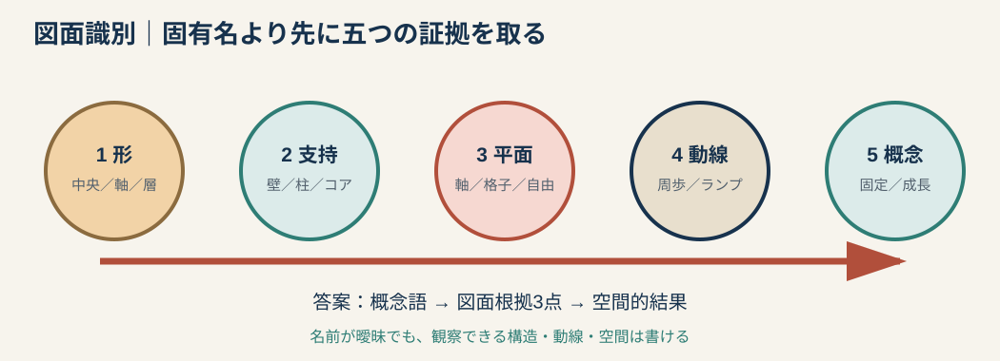
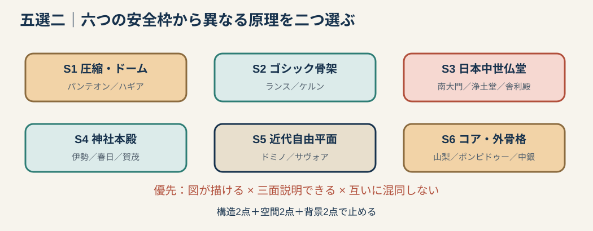
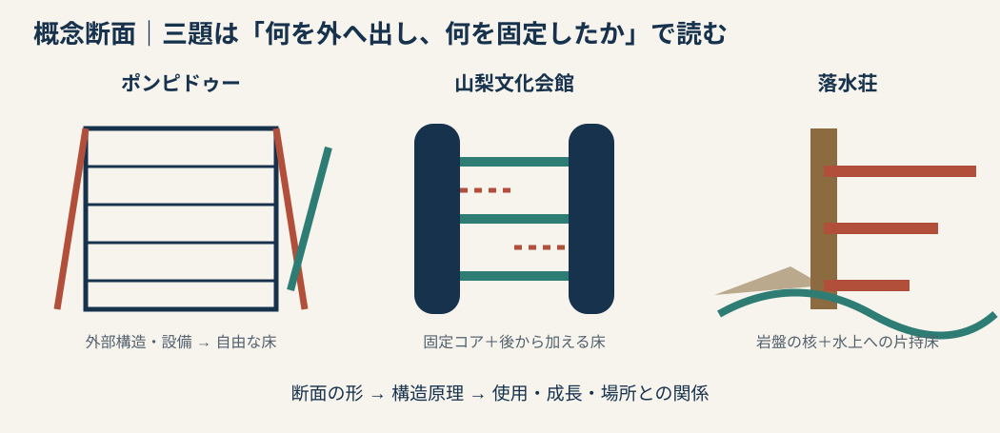

# 専門2-2 建築史：単体建築安全選択表と図面識別 v0.1

## 0. 目的

全作品を同じ深さで暗記しない。五候補から二棟を選ぶために、六つの安全枠と、図面から構造・空間・概念を読む順序だけを持つ。

`形 → 支持 → 平面 → 動線 → 概念`

固有名を思い出す前に、最初の20秒でこの五項目を見る。

---

# 1. 図面識別の五段階

| 段階 | 見るもの | すぐ書く語 |
|---|---|---|
| 1 形 | 中央式／長堂式／塔状／水平層／独立ユニット | 幾何、方向、高さ |
| 2 支持 | 壁、柱、コア、外骨格、ケーブル | 圧縮、曲げ、引張、荷重経路 |
| 3 平面 | 軸、グリッド、自由平面、核＋付加、回廊 | 空間の分節と連続 |
| 4 動線 | 正面軸、周歩、ランプ、外部階段、立体街路 | 人の移動と視線 |
| 5 概念 | 構造と設備を隠す／見せる、固定／成長、敷地と対立／統合 | 図面根拠三点 |

### 概念問題の答案式

> 【建築】における【概念】は、第一に【構造配置】、第二に【動線・設備】、第三に【平面・断面の変化】として具体化される。その結果、【利用者の行為／空間の柔軟性／敷地との関係】が生じる。

「透明性」「有機性」「成長」といった抽象語だけでは答えず、必ず図面上の三箇所へ戻す。

---

# 2. 六つの安全枠

## S1　圧縮・ドーム

| 安全例 | 一目で見る特徴 | 最小論点 |
|---|---|---|
| パンテオン | 円形平面、厚い円筒壁、格間ドーム、頂部オクルス | 壁体支持、材料軽量化、集中式内部 |
| ハギア・ソフィア | 中央ドーム、ペンデンティブ（pendentive）、東西半ドーム | 正方形から円蓋、側方推力、軸性と集中性の統合 |

識別：単純な円筒＋半球ならパンテオン、中央円蓋を半ドーム群が段階的に支えるならハギア・ソフィア。

## S2　ゴシック骨架

| 安全例 | 一目で見る特徴 | 最小論点 |
|---|---|---|
| ランス大聖堂 | 高い身廊、尖頭アーチ、リブ、飛梁 | 線状骨架、側圧処理、壁面の開放と光 |
| ケルン大聖堂 | 双塔、長大な身廊・内陣、飛梁 | ゴシックの継承と19世紀完成、都市的象徴 |

識別：教会名を忘れても、`リブ→飛梁→高窓`の荷重鎖を書けば構造点を守れる。

## S3　日本中世仏堂

| 系統 | 図面・部材の印 | 安全例 |
|---|---|---|
| 大仏様 | 貫、挿肘木、部材を構造表現として見せる | 東大寺南大門、浄土寺浄土堂 |
| 禅宗様 | 扇垂木、詰組、花頭窓、裳階 | 円覚寺舎利殿 |

識別：名称より、軒下の組物密度、垂木方向、柱を貫く水平材を見る。

## S4　神社本殿

| 系統 | 最初の判定 | 安全例 |
|---|---|---|
| 神明造 | 平入、直線的屋根、棟持柱、千木・鰹木 | 伊勢神宮内宮正殿 |
| 大社造 | 妻入、高床、非対称な内部への進入 | 出雲大社本殿 |
| 春日造 | 妻入、正面庇、反りのある屋根 | 春日大社本殿 |
| 流造 | 平入、前方へ長く流れる屋根 | 賀茂別雷神社本殿・権殿 |

識別順：`平入／妻入 → 正面庇 → 屋根の流れ → 高床・階段`。

## S5　近代自由平面

| 安全例 | 一目で見る特徴 | 最小論点 |
|---|---|---|
| ドミノ | 柱、水平スラブ、独立階段 | 壁から構造を解放し、平面・外皮を自由化 |
| サヴォア邸 | ピロティ、ランプ、水平連続窓、屋上庭園 | 五原則を動線と形態へ統合 |

識別：箱の外観より、壁と柱の役割が分離しているかを見る。

## S6　コア・外骨格・交換単位

| 安全例 | 一目で見る特徴 | 概念 |
|---|---|---|
| 山梨文化会館 | 複数の円筒コアと、その間に架かる床 | 空きを後から埋める成長可能性 |
| ポンピドゥー・センター | 外部構造、外部設備、外部エスカレーター、無柱大床 | 内部の柔軟性と技術の可視化 |
| 中銀カプセルタワー | 固定コア＋反復するカプセル | 長寿命支持体と交換単位の分離 |
| 国立代々木競技場 | マスト、主ケーブル、吊屋根 | 引張による大スパンと流動的内部 |

識別：`何が固定され、何が自由・交換・増殖できるか`を判定する。

---

# 3. 五選二・安全選択表

| 年 | 候補中の安全選択 | 選択理由 |
|---|---|---|
| 2018 | ハギア・ソフィア＋ラ・ロトンダ＋得意な日本建築一棟 | 三棟必要。中央式二棟を比較し、日本建築で分散する |
| 2023 | 東大寺南大門＋賀茂別雷神社 | S3とS4で干渉せず、断面記号が明確 |
| 2024 | ランス大聖堂＋円覚寺舎利殿 | 西洋骨架と日本木造で答案を混同しにくい |
| 2025 | ハギア・ソフィア＋春日大社本殿 | 既存サンプル＋神社識別表で処理できる |
| 2026 | 浄土寺浄土堂＋中銀カプセルタワー | 二棟とも縦断サンプルが完成済み |

### 選び方

1. 名前を知っているだけの建築は選ばない。
2. 30秒で図が描けるものを優先する。
3. 構造・空間・歴史の各二点を言えるか確認する。
4. 同じ家族二棟を選ぶ場合は、差異を説明できるときだけ選ぶ。
5. 一棟目は最も強い対象、二棟目は異なる構造原理の対象にする。

---

# 4. 残っていた図面問題の処理

## 4.1 2016 Q3：ポンピドゥー・センター

- 建築：ポンピドゥー・センター（Centre Pompidou）。
- 設計：レンゾ・ピアノ（Renzo Piano）、リチャード・ロジャース（Richard Rogers）を中心とするチーム。
- 概念：文化活動の変化を受け止める自由で可変な大床と、建築を都市へ開く公共的な動線。
- 図面根拠：構造を外部へ出す／設備を外部へ色分けして見せる／外部エスカレーターを立体的な公共街路とする。
- 結果：内部は用途を固定しない大きなプラトーとなり、技術そのものが外観表現になる。

### 五行骨格

> 本建築は、構造体、設備配管、昇降動線を外周へ配置し、内部に無柱で可変的な展示・文化活動の床を確保した。外部エスカレーターは各階を結ぶだけでなく、都市と建築を連続させる立体街路となる。通常は隠される技術要素を可視化することで、機能変化を許容する「生きた文化装置」という概念を断面に表した。

## 4.2 2022 Q1-(1)：山梨文化会館

- 建築：山梨文化会館。
- 設計：丹下健三。
- 概念：建築を固定した完成品でなく、成長する都市のようなシステムとする。
- 図面根拠：16本の円筒コア／コア間の梁と床／空きを残した立体構成。
- 実証：1974年には空いていた部分へ床を加える増築が行われた。

### 五行骨格

> 円筒コアに構造、階段、設備等を集約し、その間に梁と床を架けることで、機能を担う恒久部分と変更可能な床を分けた。断面に残された空隙は将来の増床を可能にし、実際に竣工後の増築へ用いられた。これによりメタボリズム（Metabolism）の成長・変化する建築という理念を具体化した。

## 4.3 2022 Q1-(2)：落水荘

- 建築：落水荘／カウフマン邸（Fallingwater）。
- 設計：フランク・ロイド・ライト（Frank Lloyd Wright）。
- 概念：有機的建築（organic architecture）。建物と敷地・自然を一体化する。
- 図面根拠：岩盤に固定した中心核／水上へ張り出すRC片持床／水平テラスと自然石の垂直要素／室内から水辺へ下りる階段。
- 結果：滝を見る建築ではなく、滝の上で水音・岩・森林を経験する住空間となる。

### 五行骨格

> 自然石の炉・壁を岩盤に結び付け、そこから鉄筋コンクリートの水平テラスを片持ちで滝の上へ張り出した。石の垂直性と床の水平性を周囲の岩棚に対応させ、開口と階段によって内部を水辺へ連続させる。したがって有機的建築とは自然風の形態ではなく、材料、構造、動線、場所の統合として実現されている。

---

# 5. 写真同定ができない場合

2019 Q5の公開画像は欠落しているため、建築名を推測しない。新しい写真問題では次の順序を使う。

1. 屋根、軒、開口、柱、壁、装飾を観察する。
2. 構造と外観のどちらが外来要素か分ける。
3. `外来文化 → 媒介者 → 融合部位 → 在来技術`を仮置きする。
4. 大仏様、禅宗様、擬洋風、歴史主義、植民地建築等の候補を比較する。
5. 固有名が不確実でも、写真で確認できる部位から融合の説明を書く。

避けるべき飛躍：洋風の装飾があるだけで擬洋風、アーチがあるだけで西洋石造、組物が見えるだけで大仏様と断定すること。

---

# 6. 主要確認資料

- [Centre Pompidou：An iconic architecture](https://www.centrepompidou.fr/en/centre-pompidou-is-transforming-itself/an-iconic-architecture)
- [Centre Pompidou：Piano/Rogers計画と自由な床](https://mediation.centrepompidou.fr/education/ressources/ENS-architecture-Centre-Pompidou/comment_ca_fonctionne/p1.htm)
- [山日YBSグループ「丹下健三と山梨文化会館」](https://www.sannichi-ybs.co.jp/tange-kenzo)
- [Frank Lloyd Wright Foundation：Fallingwater](https://franklloydwright.org/site/fallingwater/)
- [MoMA：Fallingwater](https://www.moma.org/collection/works/980)

