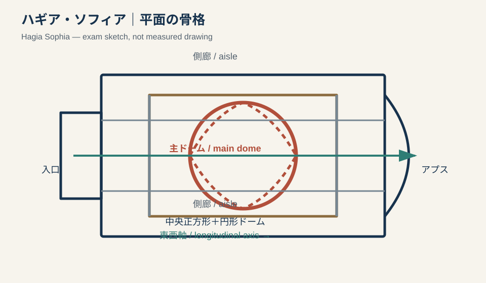
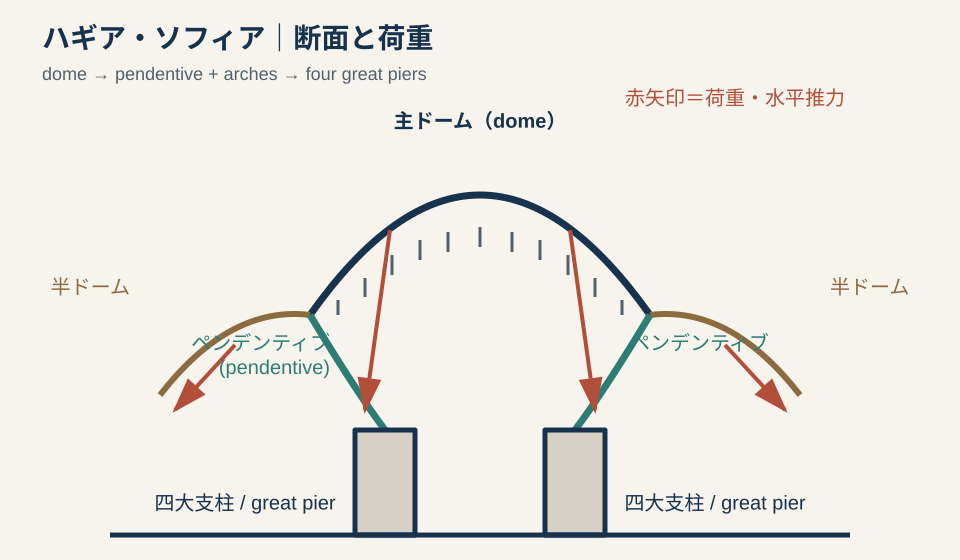
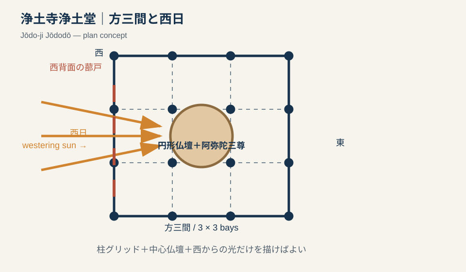
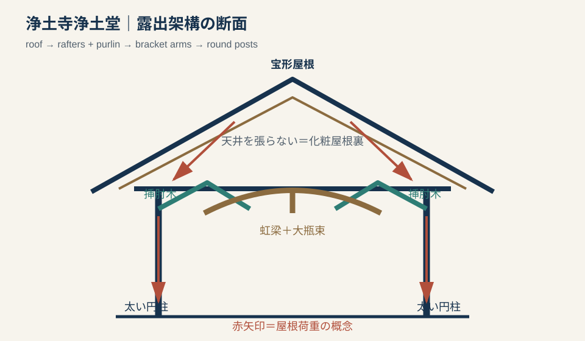
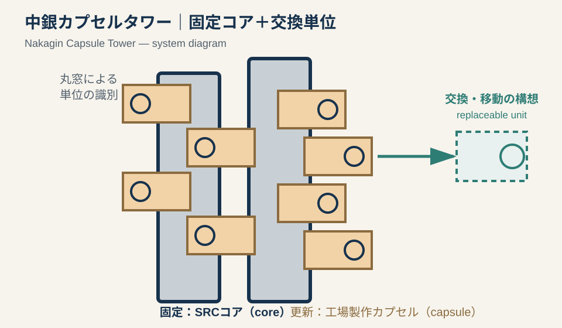
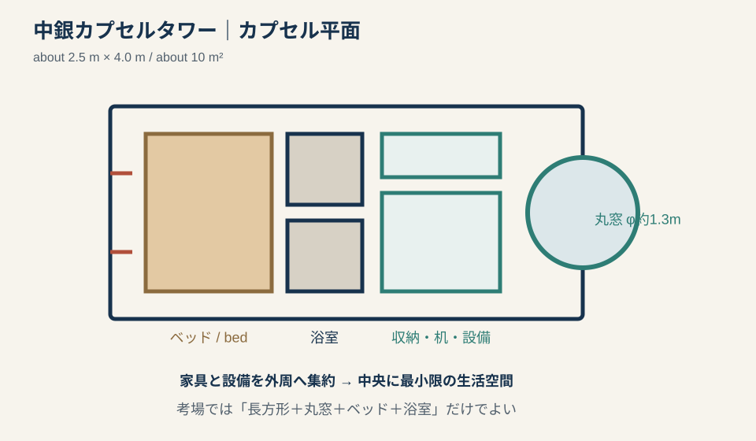

# 専門2-2 建築史：縦断サンプル v0.1

## 0. 使い方

この文書は模範答案集ではなく、同じ論拠を次の形式へ変換できるかを検証するための縦断サンプルである。

1. 30秒スケッチ。
2. 構造・空間・歴史の各三行。
3. 概念を説明する五行。
4. 200〜300字程度の長論述。
5. 比較問題。
6. 建築技術史上の既知事項と未確認事項。

片仮名語は初出時に原語を併記する。答案では初出以後、自分が確実に書ける一方だけを用いる。

---

# 1. ハギア・ソフィア（Hagia Sophia）

## 1.1 一文定位

ユスティニアヌス帝のもと532〜537年に建設され、バシリカ（basilica）の長軸性と集中式ドーム（dome）を統合した、ビザンティン（Byzantine）建築の画期的な大聖堂である。

## 1.2 原語セット

| 日本語 | 原語 | 答案での推奨表記 |
|---|---|---|
| ハギア・ソフィア | Hagia Sophia | 初出のみ両方。その後はハギア・ソフィア |
| ドーム | dome | `ドーム（dome）`、以後ドーム |
| ペンデンティブ | pendentive | 綴りに自信があれば初出併記 |
| バシリカ | basilica | 長軸性を説明するとき一度だけ併記 |
| 半ドーム | semi-dome | 日本語だけでもよい |
| ビザンティン | Byzantine | 初出だけ併記 |
| モザイク | mosaic | 装飾・光を論じる場合だけ使用 |

## 1.3 30秒スケッチ





上図は測量図ではなく、答案で構造・空間を説明するための模式図である。実際の平面確認には、Wikimedia Commonsの[現状平面図](https://commons.wikimedia.org/wiki/File:Aya_Sophia_Floor_Plan.svg)も参照する。

### 平面

1. 東西に長い長方形を描く。
2. 中央に正方形、その内側に円を描いて主ドームを示す。
3. 東西に半円を加え、半ドームを示す。
4. 南北に側廊を置く。
5. `主ドーム` `半ドーム` `側廊` `東西軸`を記入する。

### 断面

1. 中央に大ドームを描く。
2. ドーム下の四隅に三角曲面としてペンデンティブを描く。
3. 東西に段階的な半ドームを描く。
4. 荷重矢印を`主ドーム → ペンデンティブ・大アーチ → 四大支柱 → 地盤`として示す。
5. ドーム基部の窓を短線で示す。

## 1.4 論拠バンク

### 構造・構法

- 主ドームを四つのペンデンティブによって方形の四大支柱へ接続する。
- 東西の半ドームと付属する曲面が空間を長軸方向へ拡張し、主ドームの推力処理にも関係する。
- 大アーチ、大支柱、外部の扶壁を含む支持体系として理解し、ペンデンティブ単独ですべてを支えるとは書かない。

### 空間・平面

- バシリカの東西軸と、中央ドームによる集中性が重なる。
- 中央部は巨大な曲面によって包まれ、周囲の側廊・ギャラリーと階層的につながる。
- ドーム基部の開口とモザイクの反射が、上部を軽く、非物質的に感じさせる。

### 歴史・文化

- 皇帝ユスティニアヌス1世のキリスト教帝国を象徴する造営である。
- ローマの大空間構築を継承しながら、方形平面上の大ドームという新しい統合を実現した。
- 後世のビザンティン教会とオスマン・モスクの重要な参照例となった。

## 1.5 三行答案

### 構造・構法

```text
中央の大ドーム（dome）は、四つのペンデンティブ（pendentive）と大アーチを介して四大支柱に載る。
東西には半ドームを連ね、主空間を拡張しながらドームの水平推力に対応する。
大支柱と後世の扶壁を含む支持体系によって、巨大な中央空間が成立している。
```

### 空間・平面

```text
バシリカ（basilica）の東西方向の軸線と、中央ドームによる集中性を重ねた平面である。
主ドーム、半ドーム、側廊が中心から周縁へ階層的に連続する。
ドーム基部の採光により上部が軽く見え、中央の典礼空間が強調される。
```

### 歴史・文化

```text
ユスティニアヌス帝のもと、6世紀のコンスタンティノープルに建設された帝国大聖堂である。
ローマの大空間構築を継承しつつ、長軸式教会と集中式ドームを統合した。
後世のビザンティン教会とオスマン・モスクに大きな影響を与えた。
```

## 1.6 五行概念答案

```text
ハギア・ソフィア（Hagia Sophia）は、長軸式教会と集中式大空間を統合した建築である。
主ドームをペンデンティブ（pendentive）によって方形の四大支柱へ接続し、東西に半ドームを展開する。
そのため、入口から祭壇へ向かう軸線を保ちながら、中央には巨大な求心的空間が生まれる。
ドーム基部の光は上部構造を軽く見せ、皇帝とキリスト教典礼の中心性を強調する。
構造、空間、光を一体化し、ビザンティン帝国の権威を表象した点に意義がある。
```

## 1.7 長論述骨格

```text
ハギア・ソフィアは、ユスティニアヌス帝のもと6世紀に建設されたビザンティン帝国の大聖堂である。構造上は、中央の大ドームをペンデンティブによって方形平面の四大支柱へ接続し、東西に半ドームを連ねる。これにより、バシリカの祭壇へ向かう長軸性と、ドーム下の求心的な大空間が統合された。さらにドーム基部の採光は、巨大な曲面を軽く浮かぶように見せる。この建築はローマの大空間構築を継承しながら、構造・光・典礼を統合して帝国の権威を表現し、後世の教会堂とモスクに大きな影響を与えた。
```

## 1.8 比較に使う軸

| 比較対象 | 共通軸 | 差異の焦点 |
|---|---|---|
| パンテオン | ドーム、ローマ的構築 | 円形厚壁の一体空間／方形支点と長軸空間 |
| サンタ・コスタンツァ | 集中式、周縁空間 | 小規模な円形周歩廊／帝国的大スパンと長軸統合 |
| サン・ヴィターレ（San Vitale） | ビザンティン、集中式 | 八角形の多層的中心／バシリカ軸と大ドームの統合 |

## 1.9 建築技術史メモ

### 現時点で答案に使用可能

- 6世紀のドーム構築とペンデンティブによる方形・円形の接続。
- 半ドーム、大アーチ、大支柱を組み合わせた支持体系。
- 地震、崩落、再建、扶壁追加を経たため、現在の構造を537年完成時の単一状態として扱わない。

### 追加調査が必要

- 煉瓦、モルタル、型枠、施工区画などの材料・施工史。
- 558年の崩落と再建で、ドーム形状・高さ・推力処理がどう変化したか。
- ビザンティン期とオスマン期の扶壁・補強を図面上で区別すること。

---

# 2. 浄土寺浄土堂（Jōdo-ji Jōdodō / Amida Hall）

## 2.1 一文定位

重源が東大寺播磨別所に建立した、方三間・宝形造の阿弥陀堂であり、大仏様の架構と西日による来迎表現を統合した鎌倉前期の代表作である。

## 2.2 原語セット

日本語固有の構法語は、無理に英訳して覚えない。英語で建築名を書く必要がある場合だけ原語を使う。

| 日本語 | 原語・ローマ字 | 答案での推奨表記 |
|---|---|---|
| 浄土寺浄土堂 | Jōdo-ji Jōdodō | 日本語を基本とする |
| 阿弥陀堂 | Amida Hall | 英答時に使用可能 |
| 大仏様 | Daibutsuyō | 日本語答案では大仏様 |
| 挿肘木 | sashihijiki | 日本語固有語として覚える |
| 遊離尾垂木 | free-standing odaruki | 英訳より日本語の部材名を優先 |

## 2.3 年代の扱い

文化遺産オンラインは建久3年（1192）建立、小野市の解説は建久8年（1197）落成とする。答案で厳密な年を問われない場合は、`12世紀末／鎌倉前期`と書くのが安全である。年を断定する場合は、参照する史料と「建立」「落成」の語義差を確認する。

## 2.4 30秒スケッチ





上図は論述用の模式図である。詳細な部材配置は、東京大学建築学専攻デジタルミュージアムの[浄土寺浄土堂縦断面実測図](https://www.history.arch.t.u-tokyo.ac.jp/db/japanresearch/item.php?id=00496)で確認する。

### 平面

1. 方三間の正方形を描く。
2. 中央に円形仏壇と阿弥陀三尊を示す。
3. 西側に蔀戸と採光矢印を描く。
4. `方三間` `阿弥陀三尊` `西日`を記入する。

### 断面・見取図

1. 宝形屋根と中央頂部を描く。
2. 天井を張らず、化粧屋根裏が見えることを示す。
3. 円柱から挿肘木、斗、丸桁、垂木へ荷重が流れる図を描く。
4. 直線的な軒、隅扇垂木、虹梁、大瓶束を可能な範囲でラベルする。

## 2.5 論拠バンク

### 構造・構法

- 太い円柱に挿肘木を差し、斗を比較的自由に配置する大仏様の架構を示す。
- 丸桁と、隅だけ扇状になる垂木、遊離尾垂木、鼻隠板を付けた直線的な軒が特徴である。
- 内部に天井を張らず、断面円形の虹梁と大瓶束を含む力強い架構を見せる。

### 空間・平面

- 方三間の単純な外形の内部に、巨大な阿弥陀三尊を中心とする一体的空間をつくる。
- 架構を隠さず、構造部材そのものが内部の尺度と方向性をつくる。
- 西背面の蔀戸から西日を導き、阿弥陀の来迎を視覚化する。

### 歴史・文化

- 東大寺再建を担った重源が、播磨別所の中心建築として建立した。
- 宋から導入した新しい技術を、日本の材料・工匠・宗教空間へ適応した大仏様の純粋な遺構である。
- 構造的合理性だけでなく、阿弥陀信仰と光の演出を統合した点が重要である。

## 2.6 三行答案

### 構造・構法

```text
太い円柱に挿肘木を差し、斗を自由に配置する大仏様の架構を用いる。
丸桁、遊離尾垂木、隅扇垂木、直線的な軒が外観と荷重支持を特徴づける。
内部は天井を張らず、円形断面の虹梁と大瓶束による架構をそのまま見せる。
```

### 空間・平面

```text
方三間の正方形平面の中央に、巨大な阿弥陀三尊を置く一体的な空間である。
化粧屋根裏と露出架構が、堂内の高さと力強い方向性を示す。
西背面の蔀戸から西日を導き、阿弥陀の来迎を光によって表現する。
```

### 歴史・文化

```text
浄土寺浄土堂は、重源が東大寺播磨別所に建立した12世紀末の阿弥陀堂である。
宋から導入された構法を示し、大仏様をほぼ純粋に伝える遺構として重要である。
新しい架構技術と阿弥陀信仰の空間演出を統合した点に建築史的意義がある。
```

## 2.7 五行概念答案

```text
浄土寺浄土堂は、重源が東大寺播磨別所に建立した大仏様の阿弥陀堂である。
太い円柱、挿肘木、自由な斗の配置、円形断面の虹梁などに、力強く合理的な架構が表れる。
内部では天井を張らず、屋根を支える構造部材そのものを空間表現として見せる。
さらに西側の蔀戸から夕日を導き、阿弥陀三尊が来迎する宗教的場面を視覚化する。
外来構法を日本の木材・工匠技術と浄土信仰へ統合した点に大きな意義がある。
```

## 2.8 長論述骨格

```text
浄土寺浄土堂は、重源が東大寺播磨別所に建立した鎌倉前期の阿弥陀堂であり、大仏様を代表する。方三間・宝形造の単純な外形に対し、太い円柱、挿肘木、自由な斗の配置、遊離尾垂木、円形断面の虹梁などによる力強い架構を用いる。内部には天井を張らず、構造部材を直接見せて巨大な阿弥陀三尊を包む一体的空間をつくる。また、西背面の蔀戸から夕日を導き、来迎の場面を光によって演出する。宋から導入された構法を日本の木造技術と浄土信仰へ適応し、構造と宗教空間を統合した点に意義がある。
```

## 2.9 比較に使う軸

| 比較対象 | 共通軸 | 差異の焦点 |
|---|---|---|
| 東大寺南大門 | 重源、大仏様、貫・挿肘木 | 門の巨大架構／阿弥陀堂の光と一体空間 |
| 円覚寺舎利殿 | 鎌倉期、宋代建築文化 | 大仏様の力強い架構／禅宗様の細密な部材と垂直性 |
| 平等院鳳凰堂 | 阿弥陀堂、浄土信仰 | 寝殿造的・景観的構成／集中堂と西日の内部演出 |

## 2.10 建築技術史メモ

### 現時点で答案に使用可能

- 文化庁資料で、挿肘木、斗、丸桁、隅扇垂木、遊離尾垂木、虹梁、大瓶束を確認できる。
- 小野市資料で、東大寺再建の経済的拠点としての播磨別所と、西日による来迎表現を確認できる。
- 構造・空間・信仰を同一の因果鎖にできる。

### 追加調査が必要

- 使用樹種、材木調達、部材加工、建方、工匠組織。
- 宋代建築のどの技術を、どの伝播経路で受容したか。
- 1192建立説と1197落成説の史料上の関係。
- 現存部材と後世修理材の区別、解体修理記録。

---

# 3. 中銀カプセルタワービル（Nakagin Capsule Tower）

## 3.1 一文定位

黒川紀章が1972年に完成させた、二本のコア（core）に140個の工場製作カプセル（capsule）を取り付け、メタボリズム（Metabolism）の交換・成長思想を実物化した都市住宅・業務建築である。

## 3.2 原語セット

| 日本語 | 原語 | 答案での推奨表記 |
|---|---|---|
| 中銀カプセルタワー | Nakagin Capsule Tower | 初出のみ両方 |
| メタボリズム | Metabolism | 運動名なので大文字で開始 |
| カプセル | capsule | 初出併記、以後カプセル |
| コア | core | 初出併記、以後コア |
| プレファブリケーション | prefabrication | `工場生産（prefabrication）`でもよい |
| ユニット | unit | 日本語の`単位住戸`でも代替可能 |
| ホモ・モーベンス | Homo movens | 都市生活者像を論じる場合だけ使用 |

## 3.3 30秒スケッチ





構成図では固定コアと更新単位の対比、平面図では長方形・丸窓・ベッド・浴室だけを優先する。精密な確認申請図を縮写する必要はない。

### 立面・構成図

1. 高さの異なる二本の縦長コアを描く。
2. 周囲に箱形カプセルを不規則に突出させる。
3. 各カプセルに丸窓を一つ描く。
4. `SRCコア` `工場製作カプセル` `取付部`を記入する。

### 平面・詳細

1. 細長い約2.5m×4mの長方形を描く。
2. 短辺に直径約1.3mの丸窓を描く。
3. 壁際にベッド、収納・設備、浴室をまとめる。
4. コアとカプセルの接続部に、交換可能性を示す矢印を描く。

## 3.4 論拠バンク

### 構造・生産

- 二本の鉄骨鉄筋コンクリート造コアを現場施工し、140個のカプセルを取り付ける。
- カプセルは軽量鉄骨の全溶接トラス箱で、工場で製作・内装した単位を現場へ運ぶ。
- 固定コアと交換可能な単位を分け、長寿命部分と短寿命部分に異なる時間を与える構想であった。

### 空間・使用

- 約10平方メートルの極小空間に、ベッド、収納、設備、ユニットバスを集約する。
- 丸窓と組込み家具により、住宅というより工業製品・移動装置に近い内部をつくる。
- マンション、ホテル、オフィスの機能を重ね、都心で活動する単身のビジネスマンを想定した。

### 歴史・社会

- 高度経済成長期の人口集中、移動性、工業化された生活を背景とする。
- 生物の新陳代謝になぞらえ、都市と建築を固定した完成品ではなく交換・更新されるシステムとして捉えた。
- 実際にはカプセル交換が行われず、2022年に建物は解体されたが、23個が取り出され修復された。

## 3.5 三行答案

### 構造・構法

```text
二本の鉄骨鉄筋コンクリート（steel-reinforced concrete, SRC）造コア（core）に、140個の工場製作カプセル（capsule）を取り付けた。
カプセルは軽量鉄骨の全溶接トラス箱で、内装・設備を組み込んで現場へ運搬された。
固定されたコアと交換可能な単位を分離し、建築の更新を構法として表そうとした。
```

### 空間・平面

```text
約10平方メートルの細長い単位に、ベッド、収納、設備、浴室を集約する。
直径約1.3メートルの丸窓と組込み家具が、工業製品のような内部をつくる。
住居、ホテル、オフィスを兼ね、移動性の高い都市生活者の拠点として計画された。
```

### 歴史・文化

```text
黒川紀章が1972年に完成させた、メタボリズム（Metabolism）の代表作である。
建築を固定した完成品ではなく、社会変化に応じて部分交換されるシステムとして構想した。
交換は実現せず2022年に解体されたため、思想と維持管理制度の差も示す事例となった。
```

## 3.6 五行概念答案

```text
中銀カプセルタワー（Nakagin Capsule Tower）は、建築を成長・更新するシステムとして捉えた作品である。
長期使用する二本のコア（core）に、工場製作した140個のカプセル（capsule）を取り付けた。
各単位には家具と設備を集約し、移動性の高い都市生活者の小さな拠点をつくった。
固定部分と交換部分を分離する構法により、メタボリズム（Metabolism）の思想を実物化した。
一方、交換は実施されず解体に至り、技術的可能性だけでなく所有・設備・維持管理制度の重要性も示した。
```

## 3.7 長論述骨格

```text
中銀カプセルタワーは、黒川紀章が1972年に完成させたメタボリズムの代表作である。現場施工した二本の鉄骨鉄筋コンクリート造コアに、工場で製作・内装した140個の軽量鉄骨カプセルを取り付けた。各カプセルは約10平方メートルで、丸窓、ベッド、収納、設備、浴室を集約し、移動性の高い都市生活者の住居・ホテル・仕事場を想定した。固定コアと交換可能な単位を分離することで、建築を完成品ではなく更新されるシステムとして表現した。しかし実際には交換されず、2022年に解体された。この経緯は、工業化技術だけでなく、所有、設備、維持管理を含む制度が更新可能性を左右することを示す。
```

## 3.8 比較に使う軸

| 比較対象 | 共通軸 | 差異の焦点 |
|---|---|---|
| 山梨文化会館 | メタボリズム、コア、成長 | 空間の増築余地／完成した交換単位 |
| ユニテ・ダビタシオン（Unité d’Habitation） | 都市生活、集合住宅、規格化 | 恒久的な住戸と共同施設／交換可能な極小カプセル |
| ロイズ・オブ・ロンドン（Lloyd’s Building） | 固定部分と更新部分、設備 | 外部化された設備・交通／コアに取り付く住戸単位 |

## 3.9 建築技術史メモ

### 現時点で答案に使用可能

- 設計期間、施工期間、施工会社、カプセル製作担当が確認できる。
- SRCコアは現場施工、カプセルは工場製作という生産分業が確認できる。
- カプセルの寸法、軽量鉄骨全溶接トラス箱、外板、内装、設備の概要が確認できる。
- 交換構想が実現せず、解体後に23個を取り出して修復した経緯が確認できる。

### 追加調査が必要

- コアとカプセルの接合詳細、建方順序、揚重方法、設備接続の一次図面。
- カプセル交換を阻んだ要因を、所有権、設備、施工空間、費用、法規に分解すること。
- 当初仕様の石綿と、後年の安全・保存判断との関係。
- 交換不能を設計の失敗だけに帰さず、建物の使用史・管理史を検証すること。

---

# 4. 三例を通じたフレームワーク検証

| 検証項目 | ハギア・ソフィア | 浄土寺浄土堂 | 中銀カプセルタワー |
|---|---|---|---|
| 主な論述型 | A＋B | A＋B＋C | A＋C＋E＋F |
| 技術が生む空間 | ドームと長軸の統合 | 露出架構と来迎空間 | 固定コアと極小交換単位 |
| 技術史の中心 | 煉瓦・ドーム施工と補強史 | 宋風木構の移転・加工・建方 | 工場生産、現場取付、設備・管理 |
| 社会・文化 | 皇帝・典礼 | 東大寺再建・浄土信仰 | 高度成長・移動する都市生活者 |
| 主要な注意 | 現状と537年時点を混同しない | 建立年・落成年と史料を区別 | 設計思想と実際の運用を区別 |

三例とも同じ四面分析に入るが、必要な技術史資料はまったく異なる。したがって、今後の技術史収集は「構造形式」の横断目次だけでなく、`材料・工具・工程・生産組織・史料・修理／管理`の縦方向を必ず持たせる。

---

# 5. 参照資料

## 過去問

- `data/processed_questions/2018_専門2-2_建筑史_Q4.md`
- `data/processed_questions/2025_専門2-2_建筑史_Q3.md`
- `data/processed_questions/2026_専門2-2_建筑史_Q3.md`

## 公的・専門資料

- UNESCO World Heritage Centre, [Historic Areas of Istanbul](https://whc.unesco.org/en/list/356/).
- UNESCO document, [Report including a structural account of Hagia Sophia's dome system](https://whc.unesco.org/document/135738).
- 文化庁・文化遺産オンライン, [浄土寺浄土堂（阿弥陀堂）](https://online.bunka.go.jp/heritages/detail/147581).
- 兵庫県小野市, [浄土寺浄土堂（阿弥陀堂）（国宝）](https://www.city.ono.hyogo.jp/soshikikarasagasu/kokokan/siteibunkazai/1682.html).
- 東京都中央区, [中銀カプセルタワービル](https://www.city.chuo.lg.jp/a0052/bunkakankou/bunka/kyodoshiryokan/kindai_kentikubutu_tyousa/kindai85.html).
- カプセル建築プロジェクト, [1972 中銀カプセルタワービル](https://capsule-architecture.com/1972nakagin.html).
- 中銀カプセルタワービル保存・再生プロジェクト, [プロジェクト概要](https://www.nakagincapsuletower.com/project).

参照資料は答案に書くためではなく、論拠の確度と未確認点を管理するために用いる。
