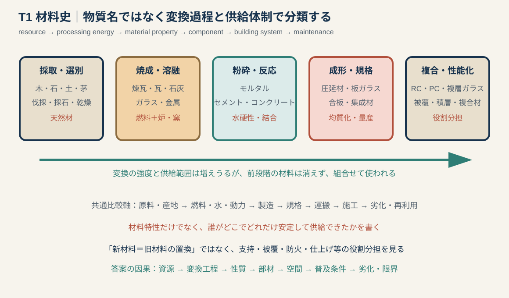
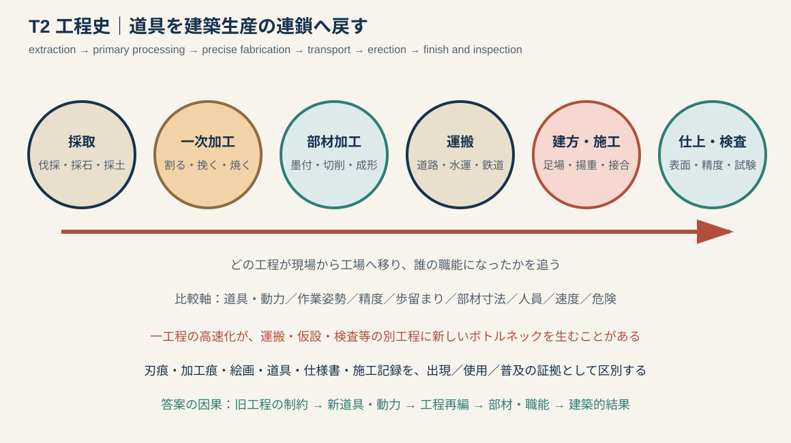
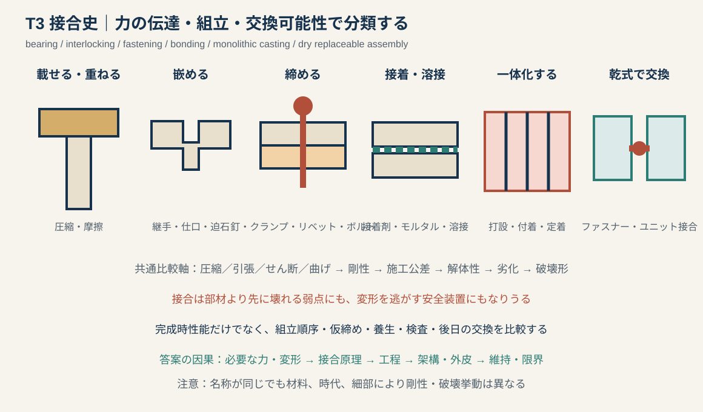
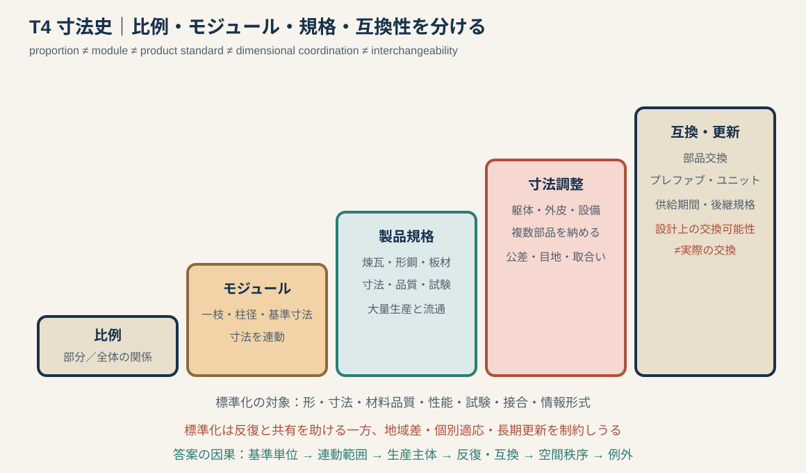

# 専門2-2 建築技術史：T1〜T4類型別知識池 v0.1

## 0. この文書の位置づけ

本書は、建築技術史の八類型のうち、T1〜T4を下位類型へ分解する。

- T1：材料・資源転換。
- T2：道具・加工・施工工程。
- T3：部材・接合・支持点。
- T4：寸法・モジュール・標準化。

材料名や道具名の辞典を作るのではなく、未知の対象を次の因果へ置くための知識池である。

`資源 → 変換工程 → 材料・部材 → 接合・寸法 → 生産 → 建築的結果 → 劣化・限界`

同じ対象は複数類型を横断する。例えば煉瓦は、T1焼成材料、T2窯業工程、T3モルタル接合、T4寸法規格として分析できる。

---

# 1. T1 材料・資源転換

## 1.1 共通図

材料史では、物性値だけでなく`どこで、何を、どの燃料・水・動力を使って、どれだけ安定して生産・輸送できたか`を問う。

## 1.2 六つの下位類型

| ID | 材料体制 | 代表材料 | 中心となる技術史問題 |
|---|---|---|---|
| T1-A | 生物・天然材 | 木、竹、茅、檜皮、繊維 | 成長・伐採・乾燥・選別・更新 |
| T1-B | 土・石・焼成材 | 土、石、日乾煉瓦、焼成煉瓦、瓦 | 採取、成形、窯、燃料、運搬 |
| T1-C | 結合材・流動成形材 | 石灰、石膏、モルタル、セメント、コンクリート | 粉砕、焼成、配合、水硬性、型枠 |
| T1-D | 金属 | 鋳鉄、錬鉄、鋼、銅、鉛、アルミニウム | 製錬、炉、成形、規格、腐食、耐火 |
| T1-E | 透明・薄板材 | ガラス、板ガラス、複層ガラス | 溶融、成形、大型化、光・熱性能 |
| T1-F | 工程材料・複合材 | 合板、集成材、RC、PC、積層材、被覆材 | 異材の役割分担、接着・付着、品質管理 |

## 1.3 T1-A 生物・天然材

### 木材史の比較軸

`樹種・林齢 → 伐採時期 → 原木径・長さ → 乾燥 → 木取り → 加工 → 接合 → 防腐・防虫 → 修理・再利用`

### 歴史問題へ変換する

- 大径材が得られるかは、柱・梁の寸法と継手に影響する。
- 含水率と乾燥は、収縮、割れ、反り、接合後の変形に影響する。
- 樹種の選択は、強度だけでなく耐久性、加工性、地域供給、儀礼的価値に関係する。
- 森林管理、筏流し、海運・陸運、材木商は大規模造営を支える。
- 修理時の部材交換・再利用を、創建時材料と区別する。

### 未知問題テンプレート

> 【木・植物材料】は【地域・森林】から調達され、【乾燥・割裂・製材・葺成】を経て【部材】となる。その寸法と性能は【樹種・原木径・含水・木理】に制約され、【架構・屋根・接合】を規定した。普及には【林業・運搬・職能】が必要であり、【腐朽・火災・更新周期】が維持上の条件となった。

## 1.4 T1-B 土・石・焼成材

### 三つを区別する

1. 土を乾燥・突固めて使う：版築、土壁、日乾煉瓦。水への弱さ、屋根・基壇による保護が重要。
2. 石を切り出して使う：採石、節理、石質、石切、運搬、積み方、金物。
3. 土を焼成して使う：煉瓦、瓦、陶管。窯、燃料、温度、焼成収縮、規格化が重要。

### 煉瓦史の因果骨格

`粘土供給 → 成形・乾燥 → 窯と燃料 → 焼成品質 → 寸法・目地 → 壁厚・アーチ → 生産量・価格 → 防火・都市景観`

### 石材史の因果骨格

`地質・採石場 → 切出し → 粗加工 → 重量と運搬 → 現場仕上げ → 組積・金物 → 風化・目地・補修`

石造・煉瓦造を「耐火・耐久」と一括しない。石種、煉瓦品質、モルタル、地震、凍結、塩類、鉄金物の腐食によって挙動が異なる。

## 1.5 T1-C 結合材・流動成形材

### 材料系列

- 気硬性石灰：主に空気中の二酸化炭素との反応で硬化する。
- 水硬性材料：水の存在下でも硬化しうる。ポッツォラーナ（pozzolana）を用いるローマ系材料や近代セメントを含むが、同一材料ではない。
- モルタル：結合材、水、細骨材等を配合し、組積、目地、仕上げに用いる。
- コンクリート：結合材ペーストと細・粗骨材を型枠等へ施工する。

### 近代セメントの生産史

`石灰石・粘土等 → 粉砕・調合 → 焼成 → クリンカー → 粉砕・石膏添加 → 品質試験 → 袋・バルク輸送`

日本では明治期に生産が始まり、窯形式、湿式／乾式工程、生産会社、輸送、規格が普及条件となった。小野田セメント等の資料を用いた研究では、明治期に広まった瓶窯が1908年以後ロータリーキルンへ置き換わり、生産性の高いシステムへ移行した過程が整理されている。

### 建築への接続

- 材料を流動状態で成形できることが、壁・床・曲面・基礎を変える。
- 型枠、配合、混練、運搬、打設、締固め、養生が完成性能を左右する。
- セメント生産の安定だけでなく、鉄筋、骨材、水、現場管理、計算・法規がRC普及に必要である。

## 1.6 T1-D 金属

### 鉄を一語で書かない

| 材料 | 概括的性質 | 歴史上の典型的役割 | 注意 |
|---|---|---|---|
| 鋳鉄（cast iron） | 圧縮に用いやすいが脆性的 | 柱、圧縮材、装飾、初期鉄橋 | 引張・衝撃、鋳造欠陥 |
| 錬鉄（wrought iron） | 比較的靱性があり引張材に使用 | タイ、チェーン、梁・トラス | 製法・品質差、現代鋼との混同 |
| 鋼（steel） | 強度・靱性・圧延性を管理しやすい | 骨組、トラス、ケーブル、鉄筋 | 鋼種、接合、座屈、耐火、腐食 |

### 変遷を作る軸

`鉱石・砂鉄・燃料 → 炉・送風・精錬 → 鋳造／鍛造／圧延 → 断面規格 → 接合 → 防錆・耐火 → 解体・再利用`

### 失点防止

- 「鉄が石・煉瓦を完全に置換した」としない。長く混構造として役割分担した。
- 不燃材料と耐火構造を区別する。
- 材料強度だけで高層化を説明せず、接合、床、耐火、基礎、エレベーター、計算を加える。

## 1.7 T1-E 透明・薄板材

### 板ガラス生産の変化

`小片・吹製／クラウン法等 → 機械引上げによるシートガラス → 磨板ガラス → フロート法等による大型・平滑・均質な板 → 強化・合わせ・複層・被膜による性能化`

### 建築史へ接続する五項目

1. 一枚の最大寸法と厚さ。
2. 歪み、透明度、表面品質。
3. 鉄・鋼・アルミのサッシおよびファスナー。
4. 採光・眺望と、日射・熱損失・結露・破損。
5. 温室、展示場、商店、オフィス、カーテンウォール等の建築類型。

## 1.8 T1-F 工程材料・複合材

### 共通原理

異なる材料に、圧縮、引張、被覆、断熱、防水、仕上げ等の役割を分担させる。

### 比較するもの

- 一体化の方法：付着、接着、機械接合、積層、被覆。
- 変形の適合：熱膨張、乾燥収縮、クリープ、含水変化。
- 界面の耐久：剥離、腐食、水分、火災。
- 製造場所：工場か現場か。
- 修理：部分交換できるか、界面を壊さず分離できるか。

## 1.9 T1の未知題チェック

- [ ] 原料・産地を一つ言える。
- [ ] 製造・加工に必要な燃料、水、動力のどれかを言える。
- [ ] 材料特性を部材・空間へ結べる。
- [ ] 供給・価格・規格の普及条件を一つ言える。
- [ ] 劣化と修理を一つ言える。
- [ ] 旧材料との併用・役割分担を説明できる。

---

# 2. T2 道具・加工・施工工程

## 2.1 共通図

道具名を、採取から検査までのどの工程で使うかへ戻す。同じ道具でも、伐採、製材、部材加工、仕上げでは意味が異なる。

## 2.2 六つの下位類型

| ID | 工程 | 主な対象 | 歴史的に問うこと |
|---|---|---|---|
| T2-A | 採取・一次処理 | 伐採、採石、採土、製錬原料 | 資源地、季節、粗加工、廃棄物 |
| T2-B | 寸法加工・成形 | 割裂、製材、石切、煉瓦成形、圧延 | 道具・動力、寸法、精度、歩留まり |
| T2-C | 墨付・接合加工・表面 | 墨壺、定規、鑿、鉋、穿孔、研磨 | 設計情報、作業姿勢、仕上げ品質 |
| T2-D | 運搬・足場・揚重 | 筏、水運、車両、クレーン、足場 | 部材重量・長さ、現場立地、安全 |
| T2-E | 湿式・熱的工程 | 積み、左官、溶接、型枠、打設、養生 | 天候、時間、品質、検査、不可逆性 |
| T2-F | 工場製作・現場組立 | プレカット、鉄骨、PC、ユニット | 分業、公差、物流、施工図、交換性 |

## 2.3 T2-A 採取・一次処理

### 問うべき連鎖

`資源位置 → 採取道具 → 現地粗加工 → 重量削減 → 運搬 → 現場または工場で再加工`

採石場や山で粗加工する理由は、運搬重量を減らすための場合がある。逆に、精密加工を早く行うと輸送中に角が欠ける等の問題もある。工程配置には材料と物流の判断がある。

## 2.4 T2-B 寸法加工・成形

### 道具変化を歴史化する五項目

1. 動作：叩く、割る、挽く、削る、回転させる、圧延する。
2. 動力：人力、水力、蒸気、電力、数値制御。
3. 材料損失：割裂、切屑、鋸屑、切断幅、歩留まり。
4. 得られる寸法：長さ、厚さ、断面、曲率、表面。
5. 職能：誰が、どこで、何人で作業したか。

### 板製材を配置する

板製材史はT2-Bの一例であり、`楔・鑿による打割 → 大鋸等による縦挽 → 木挽職 → 挽板供給`という工程転換として扱う。

## 2.5 T2-C 墨付・接合加工・表面

### 寸法情報との接続

- 墨壺、曲尺、定規、型板は、頭の中の寸法を部材へ移す。
- 鑿、鋸、錐等は接合形状を加工し、精度と施工時間を左右する。
- 槍鉋、台鉋、釿、研磨等は表面の平滑さ、塗装・接着、見え方に関係する。

加工痕は道具の証拠になりうるが、一つの痕だけで年代・職人・全工程を断定しない。

## 2.6 T2-D 運搬・足場・揚重

### 見落とされやすい構造条件

- 運搬可能な長さ・重量が部材分割と接合位置を規定する。
- 水運・鉄道・道路が採石場、森林、製鉄所と都市を結ぶ。
- 足場は作業面・安全・施工順序をつくる一時的建築である。
- クレーン能力と吊点がプレキャスト部材・鉄骨ユニットの寸法を制約する。
- 完成構造が安定でも、建方途中は仮設支保・仮締め・控えが必要である。

### 未知問題テンプレート

> 【部材】の寸法・重量は【輸送・揚重能力】に制約され、【分割・接合・吊点】を規定した。【足場・クレーン・仮設支持】によって施工時の安定を確保し、【順序】で組み立てた。したがって完成後の構造形式は、材料強度だけでなく物流と仮設技術の結果でもある。

## 2.7 T2-E 湿式・熱的工程

### 共通の品質変数

`材料温度・水量・配合 → 下地・型枠 → 施工順序 → 締固め／接合 → 冷却・硬化・養生 → 検査`

- 左官・モルタル：下地、層構成、乾燥、ひび割れ。
- 煉瓦積：目地、積み方、足場、日施工量、養生。
- コンクリート：型枠、配筋、打継ぎ、締固め、養生。
- 溶接：開先、姿勢、入熱、変形、欠陥検査。

これらは完成後に見えにくいため、施工記録、試験、解体調査が重要になる。

## 2.8 T2-F 工場製作・現場組立

### 因果骨格

`図面・規格 → 工場機械 → 品質管理 → 部材番号・梱包 → 輸送 → 現場接合 → 公差吸収 → 検査`

### 評価の両面

- 工場：天候に左右されにくく、治具・機械・検査を集約できる。
- 現場：敷地誤差、既存部分、搬入順序、クレーン、作業空間へ適応する。
- 課題：設計変更の柔軟性、輸送限界、接合部、公差、メーカー依存、部品廃番。

## 2.9 T2の未知題チェック

- [ ] 工程の前後を言える。
- [ ] 道具の動作と動力を言える。
- [ ] 寸法・精度・速度・歩留まりのどれが変わったか言える。
- [ ] 作業者・職能・工場／現場の変化を言える。
- [ ] 仮設・運搬・検査を一つ含めた。
- [ ] 出現、使用、普及を示す証拠を区別した。

---

# 3. T3 部材・接合・支持点

## 3.1 共通図

接合を名称で分類する前に、次の五点を確認する。

1. 何の力を伝えるか。
2. 回転・滑り・開きを許すか。
3. どの順序で組み立てるか。
4. 検査・締直し・交換ができるか。
5. どこが、どのように壊れるか。

## 3.2 六つの接合原理

| ID | 原理 | 代表例 | 主に働くもの | 主な限界 |
|---|---|---|---|---|
| T3-A | 載せる・重ねる | 柱梁、組物、組積 | 圧縮、摩擦、自重 | 滑り、浮上り、偏心 |
| T3-B | 嵌める・噛み合わせる | 継手、仕口、ほぞ、迫石 | 支圧、せん断、形状拘束 | 断面欠損、割裂、加工精度 |
| T3-C | 締める・留める | 釘、鎹、クランプ、リベット、ボルト | 引張、せん断、摩擦 | 孔欠損、緩み、腐食、疲労 |
| T3-D | 接着・溶接・目地 | 接着剤、溶接、モルタル | 付着、融合、面伝達 | 界面、熱影響、施工品質 |
| T3-E | 一体化する | RC、現場打ち接合、グラウト | 付着、定着、連続性 | 収縮、打継ぎ、不可視欠陥 |
| T3-F | 乾式・交換可能 | ファスナー、カーテンウォール、ユニット | 機械接合、支持・変位追従 | 公差、シール、部品廃番 |

## 3.3 T3-A 載せる・重ねる

### 歴史的意味

最も単純な柱梁でも、梁が柱頭でずれず、偏心せず、地震・風で浮き上がらないための加工・金物が必要になる。組物は、上部荷重を分散しながら軒桁を持ち出す積層接合として読める。

摩擦と自重だけで安定すると断定せず、ほぞ、金物、壁、屋根重量等の併用を確認する。

## 3.4 T3-B 嵌める・噛み合わせる

### 木造継手・仕口の比較軸

- 継ぐ方向：材軸方向か、直交材か。
- 断面欠損：ほぞ穴・欠込みが母材をどれだけ弱めるか。
- 引抜き：栓・楔・込栓・金物を併用するか。
- 加工：手加工、型板、プレカット。
- 解体：分解・再組立が可能か、実際に行われたか。

「木造接合は柔らかく地震に強い」と一般化しない。接合ごとに剛性、滑り、めり込み、割裂、抜けが異なる。

## 3.5 T3-C 締める・留める

### 金属締結の変遷軸

`釘・鎹・鉄クランプ → ボルト・ピン → 加熱リベット → 高力ボルト摩擦接合 → 締付け管理・検査`

### リベットとボルトを比較する

- リベット：加熱・挿入・かしめによる。工場・現場の人員、騒音、技能、孔精度が必要。
- 普通ボルト：軸・孔の支圧やせん断等で力を伝える。
- 高力ボルト：導入軸力で接合面を締め、摩擦等を利用する。表面処理、締付け、検査が重要。

同じ外観のボルトでも、設計原理と施工管理が異なる。

## 3.6 T3-D 接着・溶接・目地

### 溶接史を工程として書く

`部材端部・開先 → 仮組・拘束 → 熱による溶融 → 冷却・収縮 → 残留応力・変形 → 非破壊検査 → 補修`

### リベット／ボルト／溶接の比較軸

| 軸 | リベット | 高力ボルト | 溶接 |
|---|---|---|---|
| 接合原理 | かしめ、支圧・せん断等 | 締付け軸力、摩擦等 | 母材・溶着金属の連続化 |
| 孔 | 必要 | 必要 | 原則不要だが開先等が必要 |
| 現場性 | 多人数・加熱・騒音 | 締付け管理 | 姿勢・風・温度・技能に影響 |
| 変形・欠陥 | 孔ずれ、緩み、腐食 | すべり、軸力低下 | 入熱変形、割れ、未溶着等 |
| 検査 | 外観・打音等 | 軸力・締付け | 外観・超音波等 |

## 3.7 T3-E 一体化する

### RC接合の中心

- コンクリートと鉄筋の付着・定着。
- 柱梁接合部のせん断、鉄筋の継手・定着。
- 現場打ちの連続性と打継ぎ。
- プレキャストでは接合部グラウト、継手、後打ち部。

「一体構造」は継ぎ目がないという意味ではない。施工区画、打継ぎ、鉄筋継手、収縮ひび割れが存在する。

## 3.8 T3-F 乾式・交換可能

### 分けるべき三概念

1. 乾式施工：水を使う現場硬化工程が少ない。
2. 解体可能：接合を外して部材を分離できる。
3. 交換可能：寸法、設備、搬入、在庫、権利、費用まで含め、実際に交換できる。

中銀カプセルタワーのような例では、ボルト接合という技術的分離可能性と、運用上の交換実績を区別する。

## 3.9 接合史の汎用テンプレート

> 【接合】は【部材A】と【部材B】の間で【圧縮・引張・せん断・曲げ】を【原理】によって伝える。従来の【旧接合】に対し、【加工・締結・一体化】によって【組立速度・剛性・部材寸法】を変えた。ただし性能は【施工精度・孔・入熱・付着・公差】に左右され、【腐食・疲労・割裂・交換】が維持上の課題となる。

## 3.10 T3の未知題チェック

- [ ] 伝える力を一つ言える。
- [ ] 剛接・ピン等を名称だけでなく変形として説明できる。
- [ ] 加工・組立順序を言える。
- [ ] 検査方法を一つ言える。
- [ ] 典型的破壊・劣化を一つ言える。
- [ ] 解体可能性と実際の交換可能性を区別した。

---

# 4. T4 寸法・モジュール・標準化

## 4.1 共通図

比例、モジュール、規格、寸法調整、互換性は同義ではない。

## 4.2 五つの下位類型

| ID | 類型 | 定義 | 代表例 |
|---|---|---|---|
| T4-A | 比例体系 | 部分と全体の比を組織する | オーダー、木割、幾何学比例 |
| T4-B | 基準モジュール | 一つの単位で複数寸法を連動させる | 柱径、一枝、畳、基準グリッド |
| T4-C | 製品規格 | 製品の寸法・品質・性能を揃える | 煉瓦、形鋼、板材、ガラス、設備部品 |
| T4-D | モジュラー・コーディネーション | 複数サブシステムの取合い寸法を調整する | 躯体・外皮・間仕切・設備のグリッド |
| T4-E | 互換・更新体系 | 異なる時期・メーカーの部品を交換可能にする | プレファブ、ユニット、標準接続 |

## 4.3 T4-A 比例体系

### 比例の役割

- 形態的秩序：柱径と高さ、柱間、軒、細部を関係づける。
- 生産情報：個別寸法を毎回決めず、基準から派生させる。
- 規範：何を正しい・適切な形とみなすかを共有する。

木割書は単純な美的比例集ではなく、建物種類・規模に応じて部材寸法を組織する生産知識として読む。同一比例を異なる規模へ機械的に拡大できるとは限らない。

## 4.4 T4-B 基準モジュール

### 六枝掛を配置する

六枝掛はT4-Bの一例であり、一枝寸法を介して垂木割、三斗組、柱間を連動させる。ただし非六枝掛や扇垂木等の例外があり、全社寺へ一律に適用されない。

### 他の候補

- 柱径を基準に各部を定める比例。
- 畳・柱間と住宅平面。
- 煉瓦＋目地寸法による壁厚・開口。
- 近代の構造グリッドとオフィス平面。

## 4.5 T4-C 製品規格

### 規格化の対象

`寸法・形状・材料成分・強度・表面・試験方法・表示・許容差`

### 建築史的結果

- 遠隔地の材料を設計段階で指定しやすくなる。
- 見積り、調達、交換、検査が共通言語化する。
- 鉄骨断面、煉瓦壁、ガラス開口等が製品寸法と連動する。
- メーカー間競争と大量流通を支える。

一方、標準外の地域材料・修理材が入手しにくくなる場合がある。

## 4.6 T4-D モジュラー・コーディネーション

### 中心問題

構造、外装、内装、設備がそれぞれ異なる寸法論理をもつため、基準グリッド、目地、公差、取付金物で調整する。

### 比較軸

- 基準寸法とサブモジュール。
- 芯押え、内法、外法のどこを基準にするか。
- 製造公差と施工公差。
- 目地・シール・ファスナーが誤差をどう吸収するか。
- 設計変更時にどのサブシステムへ影響が及ぶか。

## 4.7 T4-E 互換・更新体系

### 互換性の条件

`寸法一致＋接合一致＋性能一致＋供給継続＋搬入可能＋所有・費用・管理の合意`

寸法だけ合っても、耐火・防水・設備・法規性能が合わなければ交換できない。設計時の交換可能性と、長期運用での部品供給を区別する。

## 4.8 標準化を評価する両面

| 可能にするもの | 制約・副作用 |
|---|---|
| 情報共有、反復、見積り | 個別地形・材料への適応低下 |
| 工場生産、品質検査 | メーカー・規格への依存 |
| 部品調達、短工期 | 公差累積、取合い問題 |
| 交換・更新の構想 | 廃番、規格変更、権利・費用 |
| 美的秩序 | 単調化とは限らないが、形式選択を制約しうる |

## 4.9 T4の未知題テンプレート

> 【寸法体系】は【基準単位】から【部材・柱間・製品】の寸法を連動させる。これにより【設計者・工匠・メーカー・現場】が情報を共有し、【納まり・反復・見積り・品質】を安定させた。さらに【規格／寸法調整】は複数部品の組合せを可能にしたが、【公差・地域差・規格変更・供給停止】が限界となる。

## 4.10 T4の未知題チェック

- [ ] 比例、モジュール、規格のどれかを区別した。
- [ ] 基準単位を特定した。
- [ ] どの寸法まで連動するか言える。
- [ ] 誰が情報を共有するための体系か言える。
- [ ] 公差・目地・取合いを一つ言える。
- [ ] 標準化の利益と制約を両方書いた。

---

# 5. T1〜T4横断練習

## 5.1 同じ対象を四方向から見る

### 例：煉瓦

| 類型 | 問う内容 |
|---|---|
| T1 | 粘土、成形、乾燥、焼成、燃料、品質、風化 |
| T2 | 窯、積み工程、足場、日施工量、目地養生 |
| T3 | モルタル目地、積み方、鉄タイ、アーチの支圧 |
| T4 | 煉瓦＋目地のモジュール、壁厚、開口、規格差 |

### 例：鉄骨柱梁接合

| 類型 | 問う内容 |
|---|---|
| T1 | 鋼種、圧延断面、耐火・腐食 |
| T2 | 孔あけ、リベット、ボルト締付け、溶接、検査 |
| T3 | 剛性、せん断・曲げ伝達、パネルゾーン、破壊 |
| T4 | 形鋼規格、孔・ボルト寸法、工場と現場の公差 |

### 例：板ガラス・カーテンウォール

| 類型 | 問う内容 |
|---|---|
| T1 | ガラス成形、大型化、強化・複層・被膜 |
| T2 | 工場加工、運搬、揚重、現場取付、シール施工 |
| T3 | ファスナー、支持、層間変位追従、交換 |
| T4 | パネル寸法、構造グリッド、公差、メーカー規格 |

### 例：プレキャスト・コンクリート

| 類型 | 問う内容 |
|---|---|
| T1 | コンクリート、鉄筋・PC鋼材、工場養生 |
| T2 | 型枠反復、工場製作、運搬、クレーン建方 |
| T3 | グラウト、継手、後打ち部、接合部性能 |
| T4 | 部材モジュール、輸送限界、公差、部品系列 |

## 5.2 ランダム出題への分類手順

1. 名詞を材料・工程・接合・寸法へ分解する。
2. T1〜T4から主類型を一つ、副類型を一つ選ぶ。
3. 旧方法とボトルネックを一つ書く。
4. 新しい資源、道具、接合、規格のどれが変わったかを書く。
5. 生産主体と建築的結果を書く。
6. 劣化、検査、供給停止等の限界を書く。
7. 設問操作O1〜O5に合わせて順序を変える。

## 5.3 既出題の位置

| 既出題 | 主類型 | 副類型 | 一般化した学習単位 |
|---|---|---|---|
| 板製材 | T2-B | T1-A・T7 | 道具・動力が寸法と職能を変える型 |
| 六枝掛 | T4-B | T3-A | モジュールが複数部材を連動させる型 |
| 和様組物 | T3-A/B | T4-B・T5 | 支持点と軒の持出しを部材型で比較する型 |
| ローマン・コンクリート | T1-C | T2-E・T5 | 流動成形材が曲面空間を可能にする型 |
| 鉄＋石／煉瓦 | T1-D/B | T3・T5・T6 | 異材が支持・被覆・耐火を分担する型 |

---

# 6. 次に個別史実を充填するセル

| 優先 | セル | 収集内容 |
|---|---|---|
| A | T1-B 焼成材 | 古代瓦、日本近代煉瓦、窯・燃料・寸法・流通 |
| A | T1-C セメント | 明治〜大正の国産化、窯、規格、RC生産との接続 |
| A | T1-D 建築鉄 | 鋳鉄・錬鉄・鋼、圧延断面、輸入・国産、耐火・腐食 |
| A | T2-D 仮設・揚重 | 古代造営、中世大聖堂、鉄骨・PC建方の比較 |
| A | T3-C/D 鉄骨接合 | リベット、高力ボルト、溶接、検査、地震被害 |
| A | T4-A/B 日本 | 枝割、木割書、畳・柱間、規模変化と例外 |
| B | T1-E ガラス | 生産法、大型化、温室・商業・オフィス、熱性能 |
| B | T2-F 工場化 | 鉄骨、PC、プレファブ、プレカット、物流・公差 |
| B | T4-C〜E | 工業規格、モジュラー調整、部品交換の実績と失敗 |

---

# 7. 主要参考資料入口

- 木工具・製材：渡邉晶「[古代・中世における建築用主要道具について](https://doi.org/10.50862/dougukan.11.0_1)」1999年。
- 近世以前の建築工程と道具：渡邉晶「[Construction Work and Tools Used before Modern Times in Japan](https://doi.org/10.50862/dougukan.15.0_1)」2003年。
- 縄文期の工具と復原実験：渡邉晶「[Major Architectural Tools Used in the Jomon Period](https://doi.org/10.50862/dougukan.12.0_1)」2000年。
- 石灰・左官材料史：「[A Chronological Study on the Using of Lime as a Plasterer's Material in Japan](https://www.jstage.jst.go.jp/article/dougukan/16/0/16_BTCTM1601/_article/-char/en)」2004年。
- 日本のセメント生産設備：大野富一ほか「[A Transition of Cement Production System](https://doi.org/10.3130/aija.71.251)」2006年。
- 日本の製鉄技術史：館充「[History of Iron and Steel Making Technology in Japan](https://doi.org/10.2355/tetsutohagane1955.91.1_2)」2005年。
- 板ガラス生産史：[National Glass Association, GANA Glazing Manual](https://www.glass.org/sites/default/files/2023-01/GANA_Glazing_Manual_2022_pw.pdf)。
- 六枝掛：[非六枝掛建築における垂木割と三斗組の寸法関係](https://doi.org/10.3130/aija.74.927)。
- 木割書の寸法体系：渡辺保忠・中川武「[大工規矩尺集における木割の方法と寸法体系](https://doi.org/10.3130/aijsaxx.194.0_81)」1972年。
- 木割と建築規模：山岸吉弘「[木割書に記述される建築規模の変化について](https://doi.org/10.3130/aija.78.213)」2013年。
- 鉄骨溶接の自動化：中込忠男ほか「[建築鉄骨における溶接接合部の合理化と自動化・ロボット化](https://doi.org/10.11273/jssc1994.2.1)」1995年。

### 確度と留保

- 材料の一般的性質を、個別歴史建築の実際の材料品質へそのまま代入しない。
- 材料・道具の発明年、最古例、普及期は別々に確認する。
- 木造接合、組積、鉄骨接合は同じ名称でも時代・地域・細部により挙動が異なる。
- 標準化は一方向の進歩ではなく、地域技法、修理、長期部品供給との緊張を含む。
