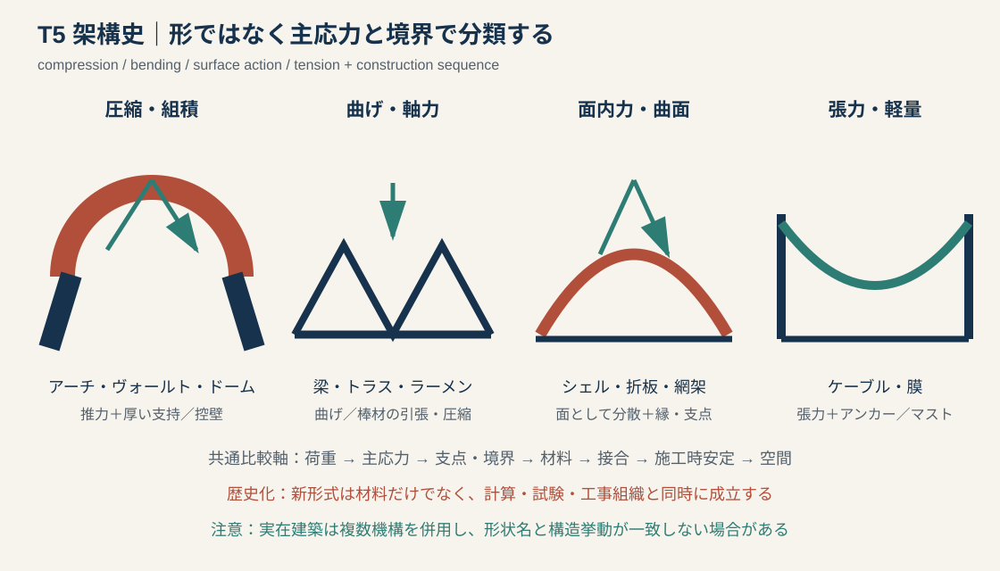
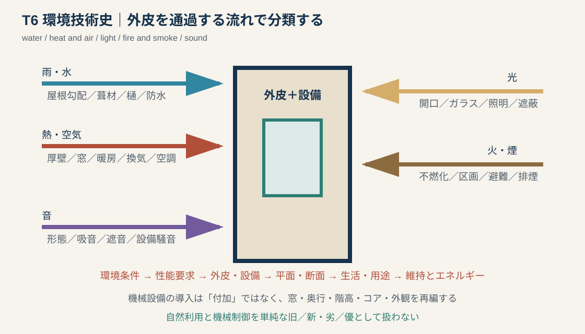
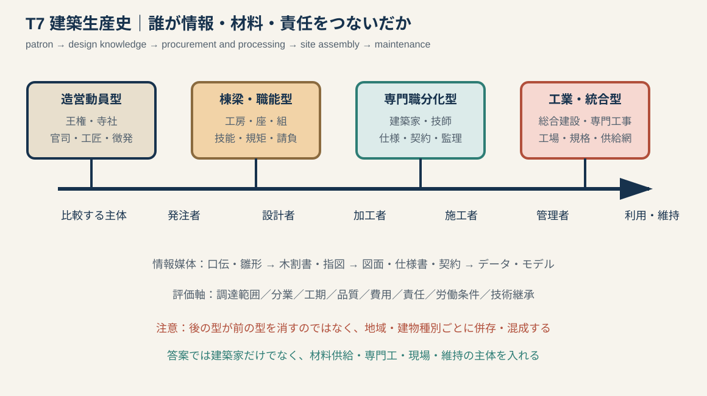
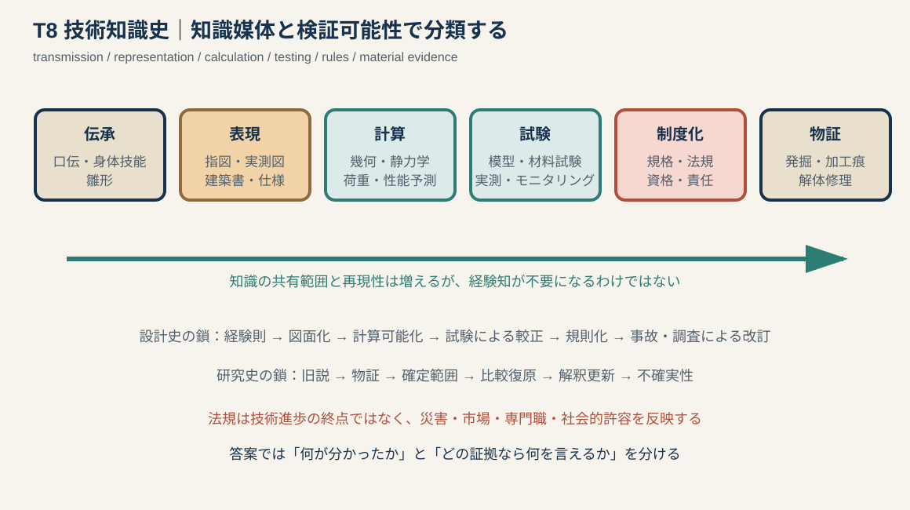

# 専門2-2 建築技術史：T5〜T8類型別知識池 v0.1

## 0. この文書の使い方

この文書は、出題候補の固有名詞一覧ではない。`専門2-2_建築技術史_類型フレームワーク.md`のうち、現在資料が薄いT5〜T8を、さらに下位類型へ分解した知識池である。

- T5：架構・大スパン・空間形成。
- T6：外皮・環境・安全性能。
- T7：建築生産・職能・工業化。
- T8：技術知識・表現・検証・継承。

一つの技術や建築を、必ず一類型だけに閉じ込める必要はない。まず主類型を決め、副類型との接続を一つ加える。

例：プレストレスト・コンクリート（prestressed concrete）は、主類型T5架構、副類型T3接合・定着、T7工場／現場生産、T8計算・試験として扱える。

---

# 1. T5 架構・大スパン・空間形成

## 1.1 共通比較図

構造形式を外形だけで判定せず、次の順序で読む。

`荷重 → 主応力 → 支点・境界 → 材料 → 接合 → 施工時安定 → 空間`

## 1.2 六つの下位類型

| ID | 下位類型 | 荷重処理の中心 | 代表的な論点 |
|---|---|---|---|
| T5-A | 組積・圧縮曲面 | 圧縮、水平推力 | アーチ、ヴォールト、ドーム、控壁、仮枠 |
| T5-B | 柱梁・トラス | 曲げ、棒材の軸力 | 柱間、三角形、接合、屋根・橋・駅 |
| T5-C | 骨組・ラーメン・高層 | 曲げ、軸力、水平力 | 鉄骨、RC、耐震壁、コア、チューブ |
| T5-D | RC・PC・薄肉曲面 | 鉄筋との複合作用、面内力、導入圧縮 | 型枠、配筋、定着、シェル、長スパン |
| T5-E | 立体網架・空間構造 | 三次元の軸力・面内力 | 節点、モジュール、多点支持、反復生産 |
| T5-F | 張力・軽量構造 | ケーブル・膜の張力 | マスト、アンカー、初期張力、形状決定 |

## 1.3 T5-A 組積・圧縮曲面

### 変遷を組み立てるための節点

1. 柱梁式石造：梁材の曲げと石材寸法が柱間を制約する。
2. アーチ：楔形材を圧縮状態で並べ、開口を拡大するが、側方推力を支持する必要がある。
3. ヴォールト：アーチを奥行方向へ展開して空間を覆う。交差ヴォールトは荷重を限定された支持点へ集めやすい。
4. ドーム：回転曲面で中心空間を覆う。支持壁、ペンデンティブ（pendentive）、スキンチ（squinch）等が平面との接続を調整する。
5. リブ・ヴォールトと控壁：リブ、束ね柱、フライング・バットレス等を一つの支持体系として壁面を開口化する。

これは世界共通の一方向進化ではない。材料、宗教空間、工匠、地域的伝統により、柱梁、アーチ、木造屋根等が併存する。

### 必ず調べる技術史項目

- 石材・煉瓦の規格、モルタル、積み方。
- センタリング（centering）と呼ばれる仮枠、施工順序、脱型時の安定。
- 推力を受ける壁、タイ、控壁、隣接空間。
- ひび割れ、不同沈下、後世補強を当初構造と区別する。

### 未知問題テンプレート

> 【構造形式】は【材料】を主として圧縮状態に置き、荷重を【支点】へ伝える。【旧形式】では【スパン・開口】が制約されたが、【アーチ／リブ／曲面／支持体系】により【空間】が可能になった。施工には【仮枠・積上げ順序】が必要であり、完成後は【水平推力・沈下】への対応が構造と外形を規定した。

## 1.4 T5-B 柱梁・トラス

### 二つを分ける

- 柱梁：梁が主に曲げを受ける。梁成、材料強度、接合、たわみがスパンを制約する。
- トラス（truss）：三角形に組んだ棒材が主に引張・圧縮を負担する。節点が理想的なピンか、実際には曲げも受けるかを区別する。

### 歴史化する軸

`木材の長さ・継手 → 木造小屋組 → 鉄の引張材／鋳鉄圧縮材 → 錬鉄・鋼の均質化 → リベット・ボルト・溶接 → 規格部材と大スパン`

「木造トラスから鉄骨トラスへ進歩した」とだけ書かない。防火、駅・市場・工場の用途、鉄道輸送、部材製造、施工時揚重、構造計算の発達を加える。

### 比較軸

| 軸 | 木造小屋組 | 19世紀鉄トラス | 近現代鋼トラス |
|---|---|---|---|
| 材料制約 | 原木長、節、含水、継手 | 鋳鉄と錬鉄の性質差 | 圧延形鋼、鋼種、溶接性 |
| 接合 | 継手・仕口・鉄物 | ボルト、ピン、リベット | 高力ボルト、溶接等 |
| 生産 | 工匠加工・現場建方 | 鋳造・鍛造工場＋現場 | 工場製作＋輸送＋現場組立 |
| 空間 | 寺院・住宅・ホール屋根 | 工場、駅、市場、温室 | 競技場、格納庫、展示場 |

## 1.5 T5-C 骨組・ラーメン・高層

### 変遷鎖

`組積耐力壁＋内部木架構 → 耐火工場の鉄柱・鉄梁＋煉瓦床 → 鋼骨組と非耐力外壁 → ラーメン・耐震壁 → コア・チューブ・ブレース等の水平力抵抗`

### 五つの問い

1. 鉛直荷重と水平荷重を同じ部材が負担するか、分担するか。
2. 接合はピン、剛接、半剛接のどれとして考えられたか。
3. 床は水平力を集めるダイアフラムとしてどう働くか。
4. 外壁は耐力壁か、カーテンウォール（curtain wall）か。
5. エレベーター、階段、設備シャフトを含むコアが構造と平面をどう組織するか。

### 高層史の答案骨格

> 高層化は鋼材の導入だけで成立したのではない。【骨組】が鉛直荷重を負担し、【ブレース・耐震壁・コア・チューブ】が風・地震による水平力と変形を制御した。さらに【耐火被覆、エレベーター、基礎、計算、法規】が組み合わさり、外壁を【非耐力化】して【平面・開口・都市密度】を変えた。

## 1.6 T5-D RC・PC・薄肉曲面

### 一括しない

- RC：コンクリートの圧縮抵抗と鉄筋の引張抵抗を、付着・定着によって組み合わせる。
- PC：緊張材であらかじめ圧縮を導入し、使用時の引張・ひび割れ・たわみを抑える。
- RCシェル：薄い曲面を主に面内力で働かせるが、縁・開口・支持条件では曲げが生じる。

### RC技術史の変遷鎖

`個別の特許システム → 鉄筋配置と計算式の併存 → 実験・施工経験 → 規準・法規による標準化 → 耐震設計と靱性評価 → 高強度化・プレキャスト化`

日本への導入では、海外技術の紹介だけでなく、地震、材料供給、施工技能、1920年代の法規化、関東大震災後の評価変化を扱う。

### PC・シェルで加える項目

- プレテンション／ポストテンション、緊張・定着・グラウト。
- 型枠費、曲面施工、配筋密度、打設順序。
- 模型実験、計算法、施工誤差、座屈。
- シェル状の外観と、実際の構造形式を区別する。

## 1.7 T5-E 立体網架・空間構造

### 中心因果

`規格化した短い部材＋再現性の高い節点 → 三次元ネットワーク → 多方向へ荷重分散 → 大面積・少柱空間 → 工場製作と現場組立`

答案では、単に「軽くて強い」と書かない。節点の偏心、部材数、施工公差、仮設支持、損傷時の冗長性を確認する。

## 1.8 T5-F 張力・軽量構造

### 中心因果

`引張に適した鋼線・膜材 → ケーブル形状の制御 → マスト・アンカーとの釣合い → 軽量大スパン → 動的挙動・施工張力の問題`

### 必須語

- ケーブル（cable）：圧縮・曲げをほぼ負担できず、荷重に応じて形が変わる。
- 初期張力（prestress）：形状安定とたるみ防止に関係する。
- アンカー（anchor）：ケーブル張力を地盤・構造へ伝える。
- 風・雪・振動：軽量化が動的感受性を増す場合がある。

### 答案骨格

> 【ケーブル／膜】は張力によって荷重を支持するため軽量化できるが、単独では形状を保てない。【マスト・圧縮リング・アンカー】と釣合い、【初期張力】を導入して安定させる。完成形だけでなく、張力導入と架設順序が構造形状を決定する点に特徴がある。

## 1.9 T5の未知題チェック

- [ ] 主応力を説明できる。
- [ ] 支点・境界・水平力処理を書ける。
- [ ] 接合を一つ挙げられる。
- [ ] 施工時の仮設・順序を一つ挙げられる。
- [ ] 空間的結果を一つ挙げられる。
- [ ] 材料以外の成立条件として計算・試験・生産組織を書ける。

---

# 2. T6 外皮・環境・安全性能

## 2.1 共通比較図

環境技術史は設備機器の年代表ではない。建築の内外を流れる`水・熱・空気・光・火・煙・音`の制御史として整理する。

## 2.2 六つの下位類型

| ID | 制御対象 | 建築的手段 | 典型的な歴史問題 |
|---|---|---|---|
| T6-A | 雨・水分 | 屋根、庇、葺材、樋、防水、通気層 | 気候適応、材料供給、耐久性 |
| T6-B | 熱・空気 | 壁厚、開口、炉、煙突、暖房、換気、空調 | 公衆衛生、深い平面、エネルギー |
| T6-C | 光・視環境 | 中庭、窓、ガラス、照明、日射遮蔽 | 構造と開口、工業生産、夜間利用 |
| T6-D | 給排水・衛生 | 井戸、水道、下水、便所、浴室、配管 | 都市インフラ、ホテル・病院・住宅 |
| T6-E | 火・煙・避難 | 不燃材料、区画、耐火被覆、避難、消火、排煙 | 都市火災、工場火災、法規 |
| T6-F | 音・振動 | 形態、吸音、遮音、浮床、設備防振 | 劇場、放送、機械設備、都市騒音 |

## 2.3 T6-A 雨・水分

### 比較軸

`降雨・積雪 → 屋根勾配 → 葺材寸法・固定 → 軒・庇 → 排水 → 下地通気 → 補修周期`

### 候補テーマ

- 茅葺、檜皮葺、杮葺、瓦葺、金属板葺。
- 陸屋根と防水層、ドレン、パラペット。
- 石・煉瓦壁の雨仕舞、目地、二重壁、通気層。

### 歴史化の注意

屋根形式を気候だけで説明しない。資源、身分・制度、防火、屋根荷重、職人、葺替え周期も関係する。

## 2.4 T6-B 熱・空気

### 四段階の整理

1. 建築形態による調整：方位、中庭、厚壁、庇、床下、通風、可動建具。
2. 局所暖房：炉、暖炉、ストーブ。煙の排出と室の分節が問題となる。
3. 中央暖房・機械換気：熱源と居室を分離し、配管・ダクト・機械室を建築へ組み込む。
4. 空気調和：温湿度・清浄度を機械的に制御し、深い平面や密閉外皮を可能にする一方、設備・エネルギー依存を増す。

### 日本近代の一つの鎖

`個別暖房 → 大正期の中央暖房・蒸気暖房 → 1920〜30年代の空調導入 → 戦後の事務所・ホテル・商業施設への普及 → 設備階・天井内・コアの拡大 → 省エネルギーと自然換気の再評価`

ホテルでは、個別暖房から中央暖房、空調、客室浴室・水洗便所へ進む過程が、近代的サービスと設備空間の形成を示す。ただし普及時期は建物種別・地域・階級で異なる。

### 未知問題テンプレート

> 【環境技術】は【熱・空気】を【自然的／機械的手段】で制御する。導入以前は【窓・平面・炉等】に依存したが、【熱源・配管・ダクト・制御】の導入により【建物奥行・階高・用途】が変化した。一方、【設備空間・エネルギー・保守・更新】が新たな設計条件となった。

## 2.5 T6-C 光・視環境

### 変遷鎖を複数持つ

- 構造側：厚い耐力壁の小開口 → 架構と控壁による壁面開口化 → 骨組とカーテンウォール。
- 材料側：小片ガラス → 板ガラスの大型化・均質化 → 複層・Low-E等の性能化。
- 設備側：昼光中心 → ガス灯・電灯 → 人工照明による夜間・深部利用。

### 答案で入れる緊張関係

`採光・眺望・透明性`と`日射取得・熱損失・眩しさ・プライバシー`は同時に生じる。ガラス面積の増大を無条件の進歩としない。

## 2.6 T6-D 給排水・衛生

### 中心因果

`都市人口・公衆衛生 → 上水・下水インフラ → 建物内配管 → 便所・浴室・厨房の固定化 → ホテル・病院・集合住宅の平面変化 → 立管・シャフト・保守`

### 未知問題への入口

- 古代都市の水路・排水。
- 近世都市の上水と共同施設。
- 近代ホテル・病院の衛生設備。
- 高層建築の給水圧・排水立管・設備コア。

## 2.7 T6-E 火・煙・避難

### 三つを分ける

1. 発火・延焼を減らす：不燃材料、防火地域、外壁・屋根規制。
2. 構造耐火：鉄骨耐火被覆、床・柱・梁の耐火時間。
3. 人命安全：区画、階段、避難距離、排煙、警報、消火。

### 変遷鎖

`都市・工場火災 → 木材を減らす混構造 → 鉄骨の加熱弱点認識 → 耐火被覆・試験 → 区画・避難を含む法規 → 性能設計`

「鉄は燃えないから耐火的」と書かない。鉄・鋼は不燃だが、高温で強度・剛性が低下する。

## 2.8 T6-F 音・振動

### 比較軸

- 音を届ける：劇場・講堂の形態、反射、残響。
- 音を吸収する：多孔質材、吸音面、可変音響。
- 音を遮る：質量、二重壁、隙間、固体伝搬。
- 振動源を切る：浮床、防振支持、設備機器の絶縁。

技術史では、電気音響、放送・録音、機械設備、交通騒音が建築音響の専門化を促した点へつなぐ。

## 2.9 T6の未知題チェック

- [ ] 何の流れを制御する技術か。
- [ ] 導入前の建築的調整方法は何か。
- [ ] 機器・材料だけでなく、平面・断面の変化を書けるか。
- [ ] 都市インフラまたは法規との接続があるか。
- [ ] エネルギー、保守、更新、故障時リスクを書けるか。

---

# 3. T7 建築生産・職能・工業化

## 3.1 共通比較図

T7は「有名建築家史」ではない。次の連鎖に登場する主体と情報媒体を問う。

`発注 → 設計 → 材料調達 → 加工 → 運搬 → 建方・施工 → 検査 → 利用・維持`

## 3.2 四つの組織類型

| 類型 | 中心主体 | 情報媒体 | 強み | 論じるべき限界 |
|---|---|---|---|---|
| T7-A 造営動員型 | 王権、寺社、官司、工匠 | 命令、帳簿、現場指示、雛形 | 大量資源・労働の集中 | 徴発、輸送、記録の偏り |
| T7-B 棟梁・職能型 | 棟梁、工房、座、職人集団 | 口伝、規矩、木割、指図 | 現場適応、技能統合 | 個人・集団依存、継承 |
| T7-C 専門職分化型 | 建築家、技師、請負者、行政 | 図面、仕様書、契約、計算 | 責任分担、遠隔共有 | 設計と施工の断絶、責任境界 |
| T7-D 工業・統合型 | 総合建設、専門工事、メーカー | 規格、施工図、工程表、データ | 規模、工期、品質、反復 | 多重下請、供給依存、労働問題 |

四類型は一方向に置き換わるのではない。現代でも伝統工匠型、専門職分化型、工業化型は建物種別に応じて併存する。

## 3.3 T7-A 造営動員型

### 観察するもの

- 発注主体と政治・宗教的目的。
- 材木・石材・瓦・金属の調達地域。
- 工匠、労働、運搬、食料、資金の編成。
- 造営官司、帳簿、木簡、墨書、刻印。
- 一回の巨大事業が技術移転・職人移動へ与えた影響。

### 答案骨格

> 【造営】は【王権・寺社】が【目的】のため、【官司・工匠】を組織して行った。【材料】を【地域】から調達し、【加工・運搬・建方】を分担したため、単体建築の構法だけでなく、広域的な資源・労働動員が建築規模を支えた。この事業は【技術移転・職能形成】を促したが、【史料の偏り・労働実態】には留保が必要である。

## 3.4 T7-B 棟梁・職能型

### 技術史の焦点

- 技能は身体、道具、口伝、雛形、木割書のどれで共有されたか。
- 棟梁は設計者、積算者、現場監督、職人のどの役割を担ったか。
- 木工、石工、左官、瓦工等の職種間調整を誰が行ったか。
- 請負・手間請負・材料支給等が品質と責任をどう変えたか。

## 3.5 T7-C 専門職分化型

### 変遷鎖

`工匠による統合 → 建築家・技師教育 → 図面・仕様書による設計情報の分離 → 入札・契約 → 監理・検査 → 資格・責任の制度化`

近代日本では、お雇い外国人、学校教育を受けた建築家・技師、官庁営繕、在来工匠が重なりながら新技術を受容した。外国人技師の設計を日本語仕様へ翻訳し、在来の手間請負で施工するような混成過程を重視する。

### 比較問題の軸

| 軸 | 棟梁型 | 専門職分化型 |
|---|---|---|
| 設計と施工 | 同一主体に近い | 契約上分離しやすい |
| 情報 | 口伝・雛形・木割 | 図面・仕様・計算・契約 |
| 変更 | 現場で調整 | 承認・記録・責任が必要 |
| 品質 | 熟練と慣行 | 仕様・検査・標準 |
| 限界 | 継承と属人性 | 分断、情報齟齬、責任境界 |

## 3.6 T7-D 工業・統合型

### 中心因果

`規格部品・工場製作 → 専門工事業 → 工程管理 → 現場組立 → 品質・工期の管理 → 多層的な供給・責任関係`

### 候補テーマ

- 鉄骨ファブリケーター、PC工場、カーテンウォールメーカー。
- プレファブ住宅、カプセル、ユニット化、設備サブシステム。
- 総合建設業、設計施工一貫、専門工事、多重下請。
- 施工図、工程表、品質検査、物流、ジャストインタイム。

### 評価の両面

- 可能にするもの：大量供給、短工期、精度、複雑な専門技術。
- 生じる問題：サプライヤー依存、部品廃番、更新困難、責任分散、技能・労働条件。

## 3.7 T7の未知題チェック

- [ ] 発注者、設計者、加工者、施工者、維持主体を区別した。
- [ ] 情報媒体を一つ挙げた。
- [ ] 材料調達と運搬を含めた。
- [ ] 契約・責任・検査のどれかを含めた。
- [ ] 生産組織の変化を建物規模・工期・品質へ結んだ。
- [ ] 労働と技能継承の問題を一つ含めた。

---

# 4. T8 技術知識・表現・検証・継承

## 4.1 共通比較図

T8では「科学的になった」という一文で終えない。何が記述可能・比較可能・再現可能・検査可能になったかを分ける。

## 4.2 六つの知識媒体

| ID | 媒体 | 得意なこと | 失われやすいもの |
|---|---|---|---|
| T8-A | 身体技能・口伝・雛形 | 材料への即応、手順、感覚的判断 | 暗黙知の記録、遠隔共有 |
| T8-B | 指図・実測図・建築書・仕様書 | 形、寸法、手順、発注内容の共有 | 実際の力・材料ばらつき |
| T8-C | 幾何・構造計算・環境計算 | 荷重、応力、流れ、性能の予測 | 仮定外の施工・劣化・利用 |
| T8-D | 模型・材料試験・実測 | 計算仮定の較正、破壊・挙動確認 | 実物との縮尺・境界差 |
| T8-E | 規格・法規・資格 | 最低水準、責任、反復可能性 | 個別解、地域技法、法外の知識 |
| T8-F | 発掘・加工痕・解体修理 | 実際の材料、工程、改変、年代 | 失われた上部、用途、設計意図 |

## 4.3 T8-A 身体技能・口伝・雛形

### 答案の焦点

- 墨付け、道具操作、材料選別は文章だけでは伝わらない。
- 雛形・模型は全体構成や納まりを共有するが、縮尺と実物材料の差がある。
- 技能継承は親方—弟子、工房、現場移動、修理事業等の組織に依存する。

書物がないことを、設計知識がないことと同一視しない。

## 4.4 T8-B 図面・建築書・仕様書

### 三つの機能

1. 記述：形・寸法・材料を記録する。
2. 伝達：離れた設計者、発注者、施工者の間で共有する。
3. 契約：何を作るか、誰が責任を負うかを固定する。

### 歴史化の問い

- 平面・立面・断面はいつ、誰のために描かれたか。
- 実測図と設計図と施工図を区別できるか。
- 木割書・建築書は実務を記録したのか、規範を示したのか。
- 仕様書の翻訳が外来技術を在来生産へどう移したか。

## 4.5 T8-C 計算可能化

### 変遷鎖

`経験則・比例 → 幾何学的作図 → 荷重と応力の明示 → 許容値・荷重組合せ → 動的・非線形評価 → 数値解析`

### 答案で書くべき変化

- 部材寸法を経験だけでなく、設定した荷重と材料強度から検討できる。
- 設計案を建設前に比較し、規模・スパンを拡大しやすくなる。
- 構造技師・設備技師等の専門職が成立する。
- 計算式が法規へ入ると、最低基準と責任が制度化される。
- 計算モデルには支持条件、材料、地震動等の仮定があり、現実そのものではない。

### 日本の構造規定を例にする場合

東京市建築条例案等の外国規定参照から、市街地建築物法での算出式、1924年の地震力規定、戦時規格を経た長期・短期荷重概念、1950年建築基準法へ、災害と研究が計算規定を更新した過程を扱える。

## 4.6 T8-D 試験・実測・モニタリング

### 三種類

- 材料試験：強度、弾性、耐火、耐久性。
- 部材・模型実験：接合、架構、風洞、振動台、シェル模型。
- 実物測定：沈下、変形、温湿度、換気量、振動、劣化。

### 因果

`計算上の仮定 → 試験 → 差の発見 → モデル・詳細の修正 → 規準化 → 実建物での再検証`

## 4.7 T8-E 規格・法規・資格

### 法規を歴史化する五項目

1. 契機：火災、地震、衛生問題、事故、市場拡大。
2. 対象：材料、構造、設備、都市、職能のどれを規制したか。
3. 手段：仕様規定、計算式、性能規定、検査、資格。
4. 効果：最低水準、普及、標準化、責任。
5. 限界：既存建物、地域技法、想定外荷重、規制コスト。

法規を、技術進歩が完成した結果とみなさない。災害、保険、行政、専門家団体、産業の交渉によって形成され、事故と研究で改訂される。

## 4.8 T8-F 発掘・加工痕・解体修理

### 証拠ごとに言える範囲

| 証拠 | 比較的直接言えること | 推定を要すること |
|---|---|---|
| 柱穴・礎石・基壇 | 平面、柱位置、規模、改築 | 高さ、屋根、細部意匠 |
| 瓦・土器・層位 | 年代、屋根材、変遷 | 建物用途の全体像 |
| 柱根・転用部材 | 材種、寸法、加工、接合痕 | 元の建物全体 |
| 刃痕・墨書・番付 | 道具、加工順、部材管理 | 工匠組織の全容 |
| 解体修理 | 隠れた接合、修理履歴、当初材 | 解体で失われる状態、創建時の利用 |
| 文献・絵画 | 名称、儀礼、同時代表象 | 寸法精度、描写の写実性 |

### 研究史答案骨格

> 従来【対象】は【文献・現存例】から【旧説】とされた。【発掘・解体・加工痕】により【物証】が確認され、【平面・年代・構法】が修正された。意義は【建築史像・研究方法】を更新した点にある。ただし【上部構造・用途・意図】は【比較資料】による推定を含む。

## 4.9 T8の未知題チェック

- [ ] 知識を担う媒体を特定した。
- [ ] 誰が作成し、誰が使ったかを書いた。
- [ ] 記述・予測・検証・規制のどれかを区別した。
- [ ] 技術知識が職能・責任をどう変えたかを書いた。
- [ ] 計算・図面・復原の仮定と限界を示した。

---

# 5. T5〜T8を横断する練習

## 5.1 同じ対象を四方向から見る

### 例：国立代々木競技場

| 類型 | 問う内容 |
|---|---|
| T5 | 主ケーブル、吊屋根、マスト、アンカー、荷重経路、施工張力 |
| T6 | 大観衆空間の換気・環境、屋根と雨仕舞、設備統合 |
| T7 | 建築家・構造家・施工者、1964年五輪事業、材料と工事組織 |
| T8 | 構造計算、模型・施工計測、保存時の調査と真正性 |

### 例：19世紀の駅舎

| 類型 | 問う内容 |
|---|---|
| T5 | 鉄トラスでホームを覆う大スパン |
| T6 | 蒸気・煙、採光、換気、耐火、雨天乗降 |
| T7 | 鉄道会社、技師、製鉄所、部材輸送、現場組立 |
| T8 | 規格図、構造計算、鉄道技術標準、検査 |

### 例：近代ホテル

| 類型 | 問う内容 |
|---|---|
| T5 | 多層骨組、耐震・耐火 |
| T6 | 暖房、空調、給排水、浴室、エレベーター |
| T7 | 国際観光政策、設計・施工、設備専門工事 |
| T8 | 仕様書、設備設計、衛生・防火法規、改修記録 |

## 5.2 ランダム出題への90秒分類

1. 名詞を技術対象へ変換する。例：`ガラス → 光・熱を通す外皮材料`。
2. T5〜T8の主類型を一つ、副類型を一つ選ぶ。
3. 旧技術または導入前の状態を一つ書く。
4. 変化を生んだM機制を二つ選ぶ。
5. 工程・部材・組織を各一つ書く。
6. 空間的結果と限界を一つずつ書く。
7. 設問がO1〜O5のどれかに合わせて並べ替える。

## 5.3 情報不足を見抜く

フレームワークで文章の形は作れても、次が不明なら断定しない。

- その道具・材料の「出現」と「普及」の年代。
- 当該建築で実際に用いられた接合・施工法。
- 当時の設計者が用いた計算・模型・経験則。
- 改修後に追加された補強・設備。
- 法規の制定年と適用範囲。
- 発掘・修理報告から直接分かる範囲。

---

# 6. 次に埋める具体的セル

| 優先 | セル | 収集単位 |
|---|---|---|
| A | T5-A 組積曲面 | アーチ、ヴォールト、ドーム、仮枠、推力処理の地域別比較 |
| A | T5-D RC・PC | 特許、計算、法規、施工、耐震化までの変遷 |
| A | T6-B 熱・空気 | 自然換気、暖房、機械換気、空調、平面変化 |
| A | T7-A〜C 日本 | 古代造営、中世工匠、近世作事方、明治技師・請負の接続 |
| A | T8-C〜E | 構造計算、実験、1920年代以後の規定変遷 |
| B | T5-B・C 鉄骨 | 鋳鉄・錬鉄・鋼、接合、高層・耐火との接続 |
| B | T6-D・E | 給排水衛生、火災、避難、設備法規 |
| B | T8-F | 発掘・解体修理の事例を証拠種類別に整理 |

---

# 7. 主要参考資料入口

- RC理論の日本への導入：増田泰良・西澤英和・藤岡洋保「[日本における鉄筋コンクリート構造理論の導入と受容の特徴](https://doi.org/10.3130/aija.73.2773)」2008年。
- 日本の構造計算規定：石川孝重・平田京子「[東京市建築條例学会案から市街地建築物法施行規則に至る構造計算規定](https://doi.org/10.3130/aijsx.415.0_21)」1990年。
- 荷重組合せと長期・短期概念：大橋雄二「[建築基準法の構造計算規定及びその成立過程](https://doi.org/10.3130/aijsx.424.0_1)」1991年。
- 建築設備導入：横山尚平・堀越哲美「[明治・大正・昭和初期におけるホテル建築への設備導入の変遷](https://doi.org/10.3130/aija.65.89_1)」2000年。
- 日本の換気研究史：小林知広「[我が国における建物の自然換気及び通風に関する研究の130年の歴史](https://doi.org/10.3130/aije.83.749)」2018年。
- 空調史の時系列：[ASHRAE, Air Conditioning and Refrigeration Timeline](https://www.ashrae.org/about/mission-and-vision/ashrae-industry-history/air-conditioning-and-refrigeration-timeline)。
- 近代建築仕様書と技術移転：「[幕末・明治期における住宅建築仕様書の変容](https://www.jstage.jst.go.jp/article/jusokennen/28/0/28_0015/_article/-char/ja/)」。
- 戦前建設業の構法・生産：藤木竜也「[昭和戦前期の建築構法・生産の変遷に関する産業史的研究](https://doi.org/10.20803/jusokenronbunjisen.47.0_143)」2021年。

### 確度と留保

- 本文の変遷鎖は、答案を組み立てる比較軸であり、全地域に共通する単線的発展図ではない。
- 個別建築へ適用する際は、年代、材料、当初状態、後世改修、使用した計算・施工法を個別資料で確認する。
- 近現代の法規・構造計算は国ごとの差が大きいため、日本、欧州、米国の制度史を混在させない。
