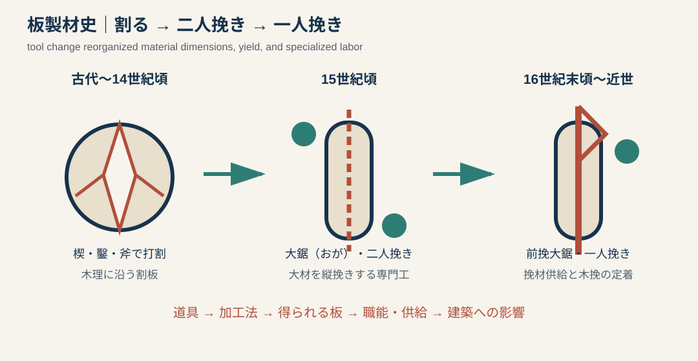
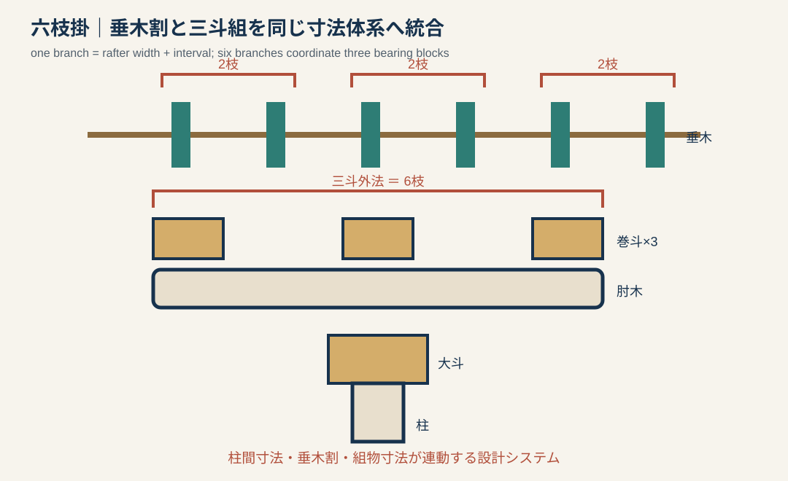
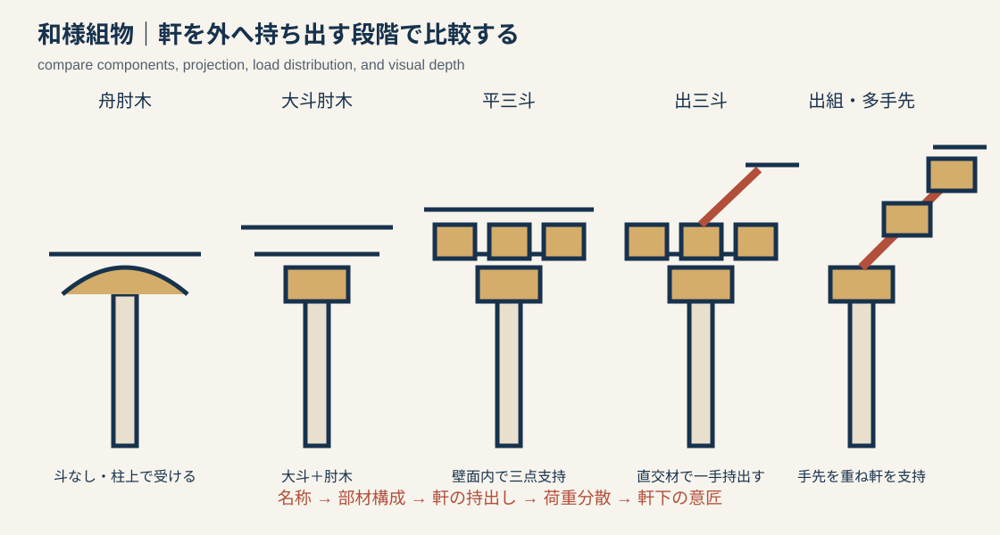
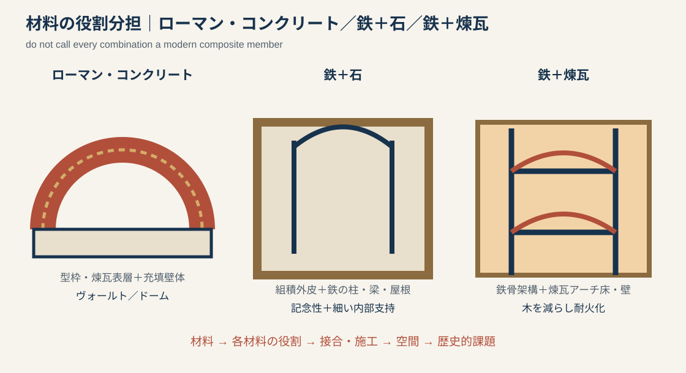
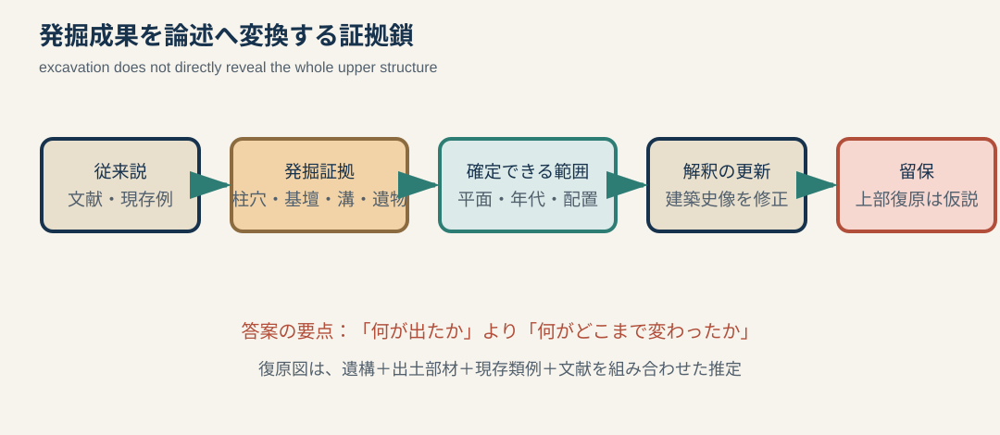

# 専門2-2 建築技術史：既出題サンプル集 v0.2

> 位置づけ：この文書は建築技術史全体の目次ではない。`専門2-2_建築技術史_類型フレームワーク.md`の八類型・十機制・五操作が、実際の過去問で機能するかを検証するサンプル集である。個別答案は字数・表現のテンプレートとして再利用できるが、これら六テーマだけを出題予測とはしない。

## 0. 建築技術史答案の基本単位

技術史は、部材名や発明年代の列挙ではない。まず対象を類型フレームワークへ配置し、その上で次の五段階を一組として準備する。

`旧来の材料・道具・工程 → 旧来の制約 → 転換 → 生産・構法の変化 → 建築史的結果`

証拠を問う問題では、これに次の鎖を用いる。

`従来説 → 新しい物的証拠 → 確定できる範囲 → 解釈の更新 → 復原上の留保`

片仮名語は初出時に原語を併記する。ただし、日本固有の用語を無理に英訳して覚えない。例えば六枝掛は`六枝掛（rokushigake）`とだけ補助的に表記し、答案では日本語を用いる。

---

# 1. 日本の板製材史

## 1.1 出題

2022年専門2-2問題4（1）：近世以前の板製材史を、加工方法・道具と関連させて約200字で説明する。

## 1.2 演変図

## 1.3 変遷鎖

| 時期 | 主な工程・道具 | 得られる材と生産組織 | 答案上の意味 |
|---|---|---|---|
| 古代〜14世紀頃 | 斧・楔・鑿で打ち割り、釿・槍鉋等で表面を整える | 木理に沿う割板。伐木・荒加工・仕上げが連続する | 板寸法は原木の木理と割裂性に強く制約される |
| 15世紀頃 | 大材には二人挽きの大鋸、小材には一人挽きの縦挽鋸が普及 | 大鋸挽・木挽等の専業化が進む | 木理だけに依存せず、所定位置で板を切り出しやすくなる |
| 16世紀末頃〜近世 | 一人挽きの前挽大鋸が使用される | 挽材の供給範囲と作業の柔軟性が増す | 板材利用・内装・建具等の展開を支える生産基盤となる |

### 注意

- 「鋸は中世に初めて日本へ来た」と書かない。鋸自体は古代から部材加工に用いられ、**製材工程が打割から縦挽へ大きく変化した**と書く。
- 割板を未熟、挽板を進歩とだけ評価しない。割裂は木理に沿い、用途によって合理性がある。
- 道具の出現年代、普及年代、絵画や刃痕で確認できる年代を同一視しない。

## 1.4 約200字答案

> 古代から中世前期の板材は、原木に楔や鑿を打ち、斧を併用して木理に沿って割り、釿や槍鉋で表面を整える方法が中心であった。このため板の幅や形は原木の性質に制約された。十五世紀頃には大材を二人で縦挽きする大鋸、小材を挽く鋸が普及し、大鋸挽・木挽という専業も成立した。さらに十六世紀末頃から一人挽きの前挽大鋸が用いられ、所定寸法の挽板を効率よく供給できるようになり、近世の板材利用や建具・内装の展開を支えた。

## 1.5 答案生成テンプレート

> 【時期A】には【道具】で【加工】したため、板材は【制約】を受けた。【時期B】に【新しい道具・工程】が普及すると、【材の寸法・精度・歩留まり】が変わり、【職能・供給】も再編された。その結果、【屋根・床・壁・建具・内装】における板材利用が【どのように】展開した。

---

# 2. 枝割と六枝掛

## 2.1 出題

2022年専門2-2問題4（2）：垂木の変遷、枝割の歴史と展開に触れ、六枝掛を約250字で説明する。

## 2.2 仕組みの図

## 2.3 定義と歴史

- 一枝寸法は、原則として`垂木幅＋垂木間隔`である。
- 枝割は、一枝寸法を単位として柱間を垂木数で計画する寸法体系で、中世初期に成立していく。
- 六枝掛は、三斗組の三つの巻斗それぞれに二本ずつ、計六本の垂木を対応させ、三斗外法と六枝の外法を整合させる納まりである。
- 13世紀末頃に成立し、近世末まで広く用いられたとされる。
- ただし、成立以前の遺構、扇垂木を用いる禅宗様、成立後の非六枝掛遺構もある。

## 2.4 何が歴史的に変わったか

`太く疎らで柱間ごとの差もある垂木配置 → 垂木の細密化・規則化 → 一枝を基準とする柱間計画 → 六枝掛による垂木・組物・柱間の統合`

六枝掛の重要性は、見た目を整えたことだけではない。

1. 柱間寸法を垂木数として扱える。
2. 肘木・巻斗・丸桁と垂木の位置を調整できる。
3. 軒の設計を反復可能な寸法システムへ組み込む。
4. 部材加工と現場の納まりを共有しやすくする。

## 2.5 約250字答案

> 古代の垂木は比較的太く疎らで、柱間ごとに間隔が異なる例もあったが、十二世紀後半以降、細い垂木を規則的に配る傾向が強まった。中世初期には、垂木幅と垂木間隔を合わせた一枝寸法を単位に柱間を定める枝割制が成立する。十三世紀末頃に成立した六枝掛は、三斗組の三つの巻斗に各二本、計六本の垂木を対応させ、三斗の外法と六枝の外法を一致させる方法である。これにより柱間、組物、軒を同じ寸法体系で計画でき、近世まで広く用いられた。ただし、禅宗様の扇垂木や非六枝掛遺構もあり、全社寺に一律に適用されたわけではない。

## 2.6 答案生成テンプレート

> 【旧段階】の垂木は【太さ・間隔・柱間との関係】を示した。その後、【一枝の定義】を単位とする枝割が【時期】に成立した。六枝掛とは【三斗組と六本の垂木の位置関係】を整える方法であり、【柱間・組物・軒】を共通の寸法体系へ統合した。その結果【設計・加工・意匠】が規則化したが、【例外】も存在する。

---

# 3. 和様寺院の組物

## 3.1 出題

2016年専門2-2問題11：和様寺院建築の主要な組物を図示し、各タイプの構造的・意匠的特徴を50〜100字程度で説明する。

## 3.2 比較図

図は部材数と持出しの段階を比較する模式図であり、個別遺構の正確な断面ではない。

## 3.3 共通原理

組物は柱頭付近で斗と肘木を組み、上部荷重を柱へ伝えながら軒桁を外方へ持ち出す。構造上は荷重分散と持出し、意匠上は軒下の奥行、陰影、反復秩序をつくる。

### タイプ別50〜100字答案

| タイプ | 答案例 |
|---|---|
| 舟肘木 | 柱頭に舟形の肘木を直接置き、斗を用いずに桁を受ける簡素な形式である。軒の持出しは小さいが、肘木の曲線が柱頭を視覚的に広げる。 |
| 大斗肘木 | 柱上の大斗に肘木を載せて桁を受ける。舟肘木より部材の役割が分節され、荷重を柱頭へ集中して伝える基本的な組物である。 |
| 平三斗 | 大斗上の肘木に三つの巻斗を置き、壁面と平行に上部材を三点で受ける。荷重を分散し、軒下に水平的で整然とした反復をつくる。 |
| 出三斗 | 三斗組に壁面直交方向の肘木を組み、一手外へ桁を持ち出す。平三斗より深い軒を支持し、正面と側面を立体的に結ぶ。 |
| 出組・多手先 | 斗と肘木を一手、二手、三手と外方へ積み重ね、深い軒を段階的に支持する。荷重の伝達経路が軒下に現れ、強い陰影と階層性を生む。 |

## 3.4 描く順序

1. 柱と桁を描く。
2. 柱上に大斗があるかを描く。
3. 肘木と巻斗の数・方向を描く。
4. 壁面から何手出るかを示す。
5. `荷重`と`軒の持出し`の矢印を加える。

### 失点しやすい書き方

- 部材名称だけを書き、どの上部材をどう受けるか説明しない。
- 平三斗と出三斗を正面図の外形だけで描き分けようとする。直交方向が重要なので、見取図または断面を併用する。
- 和様の主要タイプと、禅宗様の詰組、大仏様の挿肘木を同じ分類表へ無条件に混ぜる。

---

# 4. ローマン・コンクリート

## 4.1 出題

2014年専門2-2問題11A：具体例を挙げ、ローマン・コンクリート（Roman concrete）の建築史的特徴を約300字で説明する。

## 4.2 材料から空間まで

`石灰モルタル＋ポッツォラーナ（pozzolana）＋骨材 → 型枠または煉瓦・石の表層間へ充填 → 厚い壁・アーチ・ヴォールト・ドーム → 大規模な内部空間`

### 構成上の注意

- ローマン・コンクリートを近代ポルトランドセメントの均質な無筋コンクリートと同一視しない。
- 表面の煉瓦や石は、仕上げだけでなく施工時の型枠・表層として働く場合がある。
- 材料だけで大ドームが成立したとは書かず、壁厚、形状、開口、施工、支持体系と結ぶ。

## 4.3 約300字答案：パンテオン

> ローマン・コンクリート（Roman concrete）は、石灰モルタルにポッツォラーナ（pozzolana）と骨材を混ぜ、型枠または煉瓦・石の表層間に充填する構法である。水硬性をもつ材料を壁体や曲面へ成形できるため、切石の柱梁だけでは困難なアーチ、ヴォールト、ドームを構築できた。二世紀のパンテオンでは、円筒壁が直径約43メートルのドームを支持し、上方ほど軽い骨材を用い、格間とオクルスによって自重を抑えた。その結果、直径とほぼ同じ高さをもつ巨大な一室空間が成立した。材料、型枠、組積表層を組み合わせ、浴場・神殿等に包摂的な大内部空間を発達させた点に建築史的意義がある。

## 4.4 汎用テンプレート

> 【材料構成】を【型枠・表層】の内部へ施工し、【構造形態】を一体的に形成した。【建築名】では【支持・軽量化・開口】によって【空間】を実現した。これは【旧来の切石柱梁】の制約を越え、【建築類型・都市・帝国】に大規模内部空間を供給した点で重要である。

---

# 5. 鉄と石／鉄と煉瓦の混構造

## 5.1 出題

2014年専門2-2問題11B・C：鉄と石、鉄と煉瓦の混構造について、それぞれ具体例と建築史的特徴を約300字で説明する。

## 5.2 先に用語を限定する

ここでいう混構造は、異種材料が一棟の中で役割を分担する歴史的な構成として扱う。必ずしも現代の「合成構造」のように、異種材料を一つの断面として計算上完全に一体化したものを意味しない。

## 5.3 鉄＋石：サント＝ジュヌヴィエーヴ図書館

### 役割分担

- 石造外壁：都市的な外形、耐火的な囲い、記念性。
- 鋳鉄柱・鉄製アーチ・屋根架構：細い支持体、長い閲覧室、可視化された構造。
- 建築的結果：歴史的な組積外皮と工業材料による開放的内部の併存。

### 約300字答案

> 鉄と石の混構造の例として、アンリ・ラブルースト（Henri Labrouste）設計のサント＝ジュヌヴィエーヴ図書館を挙げられる。石造外壁は街路に対して閉じた矩形の外形と記念性をつくり、その内部では細い鋳鉄柱と鉄製アーチ・屋根架構が二廊式の大閲覧室を覆う。圧縮に適した石を外周の壁体に、細く長い部材をつくれる鉄を内部支持と屋根に用いることで、重厚な外観と明るく連続した公共空間を両立した。また、鉄を裏方に隠さず室内意匠として反復させ、書架・閲覧席・構造の秩序を統合した。これは歴史的な石造建築から鉄骨架構への単純な交替ではなく、十九世紀の公共建築が新材料を既存の都市表象へ組み込む過渡的構成として重要である。

## 5.4 鉄＋煉瓦：ディザリントン・フラックス・ミル

### 役割分担

- 鋳鉄柱・鋳鉄梁：多層架構。
- 煉瓦アーチ床：梁間を覆い、床を不燃化。
- 錬鉄タイ：アーチの開きを拘束。
- 煉瓦外壁：外周の囲いと安定に関与。
- 歴史的課題：木造床の工場火災を避ける。

### 約300字答案

> 鉄と煉瓦の混構造の例は、チャールズ・ベイジ（Charles Bage）が設計したディザリントン・フラックス・ミルである。1790年代末に建設された五階建工場で、内部に鋳鉄柱と鋳鉄梁の架構を置き、梁間を煉瓦アーチ床で覆い、錬鉄タイでアーチの開きを拘束した。外周には煉瓦壁を用いる。可燃性の木造梁・床を減らすことにより、紡績工場で深刻だった火災への対策を構造と材料の選択で実現した。また、鋳造部材の反復によって機械と生産を収容する多層空間を成立させた。鉄骨だけが自立する後世の骨組とは異なり、鉄と煉瓦壁・床が役割を分担する過渡的構成だが、多層鉄骨建築と近代工場の発展を先取りした点に意義がある。

## 5.5 比較答案の軸

| 軸 | 鉄＋石 | 鉄＋煉瓦 |
|---|---|---|
| 主な課題 | 公共建築の記念性と大空間 | 工場の耐火・多層化・生産 |
| 組積材 | 石造外壁 | 煉瓦壁・煉瓦アーチ床 |
| 鉄 | 細い柱、アーチ、屋根 | 柱、梁、タイ |
| 空間 | 閲覧室の連続性と採光 | 機械配置に対応する反復的床 |
| 歴史的位置 | 新材料を公共表象へ統合 | 耐火工場から骨組建築への過渡 |

---

# 6. 考古学と建築史研究

## 6.1 出題

2022年専門2-2問題4（3）：発掘成果が日本建築史研究で重要な役割を果たした事例を二例挙げ、各約300字で概要と意義を述べる。

## 6.2 証拠鎖

発掘で直接分かるのは、主に柱穴、礎石、基壇、溝、床面、焼土、瓦、部材、層位などである。これらから平面、規模、配置、年代、改築順序を論じられる。一方、屋根形、細部意匠、高さ、用途は、現存例・文献・絵画・出土部材を組み合わせた推定を含む。

## 6.3 事例A：難波宮跡

### 約300字答案

> 難波宮は『日本書紀』等に記されながら所在地と実像が不明であったが、山根徳太郎らが1950年代から法円坂で進めた発掘により、前期・後期二時期の宮殿遺構が重層していることが明らかになった。前期には掘立柱の内裏前殿と広大な朝堂院、後期には同じ中心軸上に礎石建・瓦葺の大極殿と朝堂院が確認され、柱穴、基壇、回廊、瓦などから配置と変遷が復原された。その結果、難波宮は藤原宮・平城宮に先行する本格的宮殿として位置づけられ、七〜八世紀の国家儀礼空間が段階的に整備されたことを物的に論じられるようになった。文献上の宮都を実在の平面へ結びつけた点が重要であるが、上部構造の細部は類例を用いた推定である。

## 6.4 事例B：三内丸山遺跡

### 約300字答案

> 三内丸山遺跡では、1992年以降の発掘により、縄文時代前期中葉から中期末に及ぶ大規模集落が確認された。多数の竪穴建物、長大な建物、貯蔵穴、墓、盛土に加え、直径約二メートルの柱穴を規則的に並べた大型掘立柱建物跡が検出され、建物と墓域等が計画的に配置されていたことが判明した。これは縄文社会を小規模で移動的な集団とみなす単純な像を改め、長期に営まれた拠点集落、共同労働、木材調達を建築的規模から考える契機となった。建築史の対象を現存社寺や文献のある時代から先史の集落・生産へ広げた点にも意義がある。ただし、六本柱の上部構造、高さ、用途は柱穴だけから一義的に決まらず、復原建物は比較資料を用いた仮説として扱う必要がある。

## 6.5 予備事例：平城宮第一次大極殿

### 使える論点

- 発掘により建物平面、基壇、雨落溝、柱位置、造営・改変段階を把握。
- 柱根、転用部材、瓦、縮尺模型部材等が上部復原の手掛かりとなる。
- 現存古代建築、修理成果、文献、絵図、中国・朝鮮の類例と統合して復原原案を作成。
- 発掘遺構だけから完成立面が自動的に得られるわけではないことを示す好例。

### 汎用300字テンプレート

> 従来、【対象】は【文献・旧説】から【理解】されていた。ところが【遺跡】の発掘で【柱穴・基壇・溝・遺物】が確認され、【平面・規模・年代・変遷】が明らかになった。この結果、【建築類型・都市・社会】について【新しい理解】が可能になり、建築史の対象・方法を【どのように】更新した。意義は発見自体ではなく、【従来説】を物的証拠によって検証・修正した点にある。ただし【上部構造・用途・復原】には【現存例・文献・比較資料】による推定が含まれる。

---

# 7. 六テーマに共通する採点チェック

## 7.1 技術史として成立しているか

- [ ] 材料名だけでなく、加工・施工方法を書いた。
- [ ] 転換前の方法と制約を書いた。
- [ ] 道具・部材の変化を、生産組織または寸法体系へ結んだ。
- [ ] 技術変化が平面・断面・空間へ与えた結果を書いた。
- [ ] 「発明」と「普及」を区別した。
- [ ] 一般原理と個別建築の事実を区別した。

## 7.2 史料批判があるか

- [ ] 遺構・刃痕・出土道具・絵画・文献・修理報告のどれを根拠にするか示した。
- [ ] 発掘で直接判明する平面と、比較による上部復原を区別した。
- [ ] 後世改変を当初技術として説明していない。
- [ ] 例外や地域差を一文で留保した。

---

# 8. 主要参考資料

- 板製材・道具：渡邉晶「[古代・中世における建築用主要道具について](https://doi.org/10.50862/dougukan.11.0_1)」『竹中大工道具館研究紀要』11、1999年。
- 伐木・製材：渡邉晶「[近世以前の日本の伐木・製材用具](https://doi.org/10.50862/dougukan.14.0_1)」『竹中大工道具館研究紀要』14、2002年。
- 六枝掛：濱田晋一・櫻井敏雄・麓和善「[非六枝掛建築における垂木割と三斗組の寸法関係について](https://doi.org/10.3130/aija.74.927)」『日本建築学会計画系論文集』638、2009年。
- 組物用語：[JAANUS「斗栱」](https://aisf.or.jp/~jaanus/deta/t/tokyou.htm)、[JAANUS「三斗斗栱」](https://www.aisf.or.jp/~jaanus/deta/m/mitsudotokyou.htm)。
- ローマン・コンクリート：松沢晃一ほか「[古代ローマコンクリート建築物の仕上げに関する研究](https://doi.org/10.14820/finex.2010.0.38.0)」、2010年。
- 鉄＋石：[Ville de Paris, Bibliothèque Sainte-Geneviève](https://cdn.paris.fr/paris/2019/07/24/b9659827d8dd9623ea6ce68bc8fadc2b.pdf)。
- 鉄＋煉瓦：[Historic England, History of Shrewsbury Flaxmill Maltings](https://historicengland.org.uk/campaigns/visit/shrewsbury-flax-mill/history/)。
- 難波宮：[大阪市「難波宮跡」](https://www.city.osaka.lg.jp/kensetsu/page/0000009667.html)。
- 平城宮復原：[奈良文化財研究所「大極殿の復元研究」](https://www.nabunken.go.jp/heijo/museum/guide.html)。
- 三内丸山：[文化遺産オンライン「三内丸山遺跡」](https://bunka.nii.ac.jp/db/heritages/detail/200926)。

### 確度メモ

- 板製材・六枝掛の年代は、上記研究の要約に従う。個別遺構には過渡例・非六枝掛がある。
- パンテオンの骨材配置や寸法は、個別の材料調査資料で今後さらに補強する。
- 「鉄＋石」の代表例は設問が例を自由選択させることを前提に、材料の役割分担が説明しやすいサント＝ジュヌヴィエーヴ図書館を採用した。
- 発掘事例の上部復原は確定事項として扱わない。
