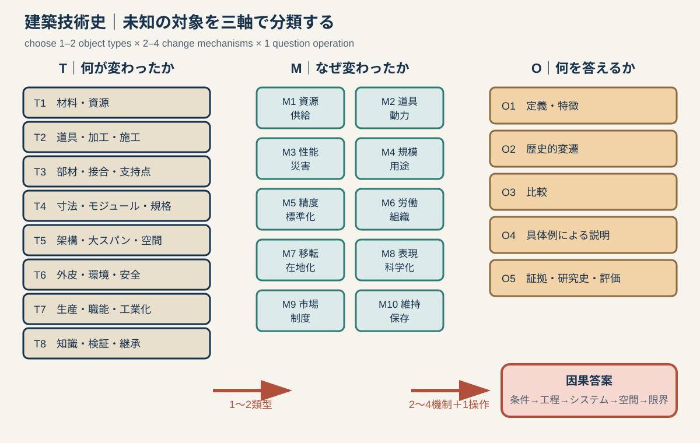

# 専門2-2 建築技術史：類型フレームワーク v0.1

## 0. 目的

建築技術史の出題対象は、板材、組物、コンクリート、鉄、煉瓦、構造、道具、設計法、工匠、発掘など、事前に閉じたリストへ限定できない。したがって、個別用語ごとの答案を増やすだけでは対応できない。

本フレームワークでは、未知の対象を次の三軸で分類する。

1. **技術対象類型 T**：何が変化したのか。
2. **変化機制 M**：なぜ、どのように変化したのか。
3. **設問操作 O**：受験者は何をするよう求められているか。

答案は、三軸の組合せとして組み立てる。

`答案 = 技術対象類型 T × 変化機制 M × 設問操作 O × 具体例`



板製材、六枝掛、ローマン・コンクリート等の既出題は、この分類を検証するサンプルであって、学習目次の中心ではない。

下位類型と知識池は`専門2-2_建築技術史_T1-T4知識池.md`および`専門2-2_建築技術史_T5-T8知識池.md`を参照する。

---

# 1. 第一軸：八つの技術対象類型

## T1 材料・資源転換型

### 中心問題

何を、どこから調達し、どのような人工材料または建築部材へ変えたか。

### 対象候補

- 木材、板材、石材、土、日乾煉瓦、焼成煉瓦、瓦。
- 石灰、石膏、モルタル、ローマン・コンクリート、セメント、RC、PC。
- 鋳鉄、錬鉄、鋼、ガラス、アルミニウム、合成材料。
- 檜皮、茅、鉛、銅、鉄板、防水材。

### 必要な論拠

`原料 → 採取・製造 → 性質 → 施工可能な形 → 空間・耐久性 → 供給と普及`

### 汎用テンプレート

> 【材料】は【原料・産地】を【製造・加工】して得られる。従来の【旧材料】に比べて【圧縮・引張・耐火・加工性等】をもつため、【部材・構法】が可能になり、【空間・規模・外観】を変えた。一方、普及には【資源・燃料・輸送・規格・費用】が必要であり、【地域差・劣化・施工上の限界】も生じた。

### 未知問題への転用例

「瓦の普及」なら、瓦の形だけでなく、粘土、成形、乾燥、焼成、窯、運搬、屋根荷重、寺院・宮殿の不燃性と権威へ展開する。

---

## T2 道具・加工・施工工程型

### 中心問題

道具、動力、工程の変化が、加工精度・速度・部材寸法・職能をどう変えたか。

### 対象候補

- 斧、釿、鑿、鋸、鉋、錐、墨壺、規矩術。
- 石切、煉瓦積、型枠、足場、揚重機、クレーン。
- リベット、ボルト、溶接、現場打ち、プレキャスト、張力導入。
- 手加工、水力・蒸気力、工作機械、数値制御、ロボット施工。

### 必要な論拠

`旧工程 → 作業上の制約 → 新道具・動力 → 工程再編 → 精度・速度・部材 → 職能・建築`

### 汎用テンプレート

> 【旧時期】には【道具・工程】で【加工】したため、【寸法・速度・形状】に制約があった。【新道具・動力】の導入により【工程】が変化し、【精度・生産量・部材規模】が向上／変化した。同時に【工匠・専門職・工場と現場】の分業が再編され、【建築的結果】をもたらした。

### 未知問題への転用例

「中世の石切技術」なら、鑿の名称列挙ではなく、採石場での粗加工、運搬重量、現場での仕上げ、石工のテンプレート、組積精度へつなぐ。

---

## T3 部材・接合・支持点型

### 中心問題

力をどの部材へ集め、異なる部材をどう接合し、交換・変形をどう許容したか。

### 対象候補

- 継手・仕口、貫、長押、組物、挿肘木、尾垂木。
- アーチの迫石、鉄クランプ、タイ、アンカー。
- リベット、ボルト、溶接、鉄筋定着、プレキャスト接合。
- カーテンウォールのファスナー、カプセル接合、免震・制振装置。

### 必要な論拠

`荷重・変形 → 部材の役割 → 接合方法 → 組立・解体 → 空間・耐久性 → 破壊または維持`

### 汎用テンプレート

> 【部材・接合】は【上部荷重・水平力・引張等】を【支持点】へ伝える。その接合は【差込み・緊結・一体化・乾式接合】によって【回転・滑り・交換】を【許容／拘束】する。これにより【軒・開口・大空間・更新性】が可能になるが、【腐朽・疲労・応力集中・施工誤差】が限界となる。

### 未知問題への転用例

「鉄クランプ」なら、鉄が石造を骨組へ変えたと短絡せず、石材間のずれ止め・引張補助、腐食膨張、石の割裂まで論じる。

---

## T4 寸法・モジュール・標準化型

### 中心問題

経験的な寸法決定が、反復可能な比例・モジュール・規格へどう組織されたか。

### 対象候補

- 柱間、垂木割、枝割、六枝掛、木割書。
- オーダー、比例論、幾何学、尺貫法、メートル法。
- 煉瓦寸法、鉄材形状、工業規格、モデュロール。
- プレファブ、カプセル、部品寸法、モジュラー・コーディネーション。

### 必要な論拠

`基準単位 → 部分間の対応 → 設計・加工・施工の共有 → 反復・互換 → 空間秩序 → 例外`

### 汎用テンプレート

> 【寸法体系】は【一枝・柱径・人体・規格部品等】を基準単位とし、【柱間・部材・全体】の寸法を連動させる。これによって設計情報を【工匠・工場・現場】で共有し、【反復・納まり・見積り・互換性】を高めた。ただし【敷地・材料・用途・地域技法】により調整され、すべての建築へ一律には適用されない。

### 未知問題への転用例

「煉瓦規格」なら、寸法表だけでなく、目地を含むモジュール、壁厚、開口寸法、量産・輸送・法規への連動を書く。

---

## T5 架構・大スパン・空間形成型

### 中心問題

荷重を線・面・立体のどの経路で地盤へ流し、どのような内部空間を可能にしたか。

### 対象候補

- 柱梁、壁式、アーチ、ヴォールト、ドーム、扶壁。
- 木造・鉄骨トラス、ラーメン、立体網架。
- RC・PC、シェル、折板、ケーブル、膜。
- 高層の耐風・耐震架構、コア、チューブ、免震。

### 必要な論拠

`荷重条件 → 主応力 → 架構形態 → 支点・境界 → 施工時の安定 → 柱間・断面・空間`

### 汎用テンプレート

> 【構造形式】は、【固定・積載・水平荷重】を主として【圧縮・引張・曲げ・面内力】で処理し、【支点・壁・柱・アンカー】を経て地盤へ伝える。これにより【スパン・高さ・開口】が可能になり、【内部空間・外観】を形成した。成立には【材料・接合・計算・施工順序】が必要であり、完成形だけでなく施工時安定も重要である。

### 未知問題への転用例

「PC」なら、RCとの見た目の違いではなく、事前に圧縮を導入して使用時引張を抑えること、定着・緊張工程、長スパン・薄肉化へ展開する。

---

## T6 外皮・環境・安全性能型

### 中心問題

屋根・壁・開口・設備が、雨、温熱、光、音、火災、衛生、地震等へどう応答したか。

### 対象候補

- 屋根勾配、葺材、庇、雨仕舞、樋、防水。
- 厚壁、窓、ガラス、二重外皮、カーテンウォール。
- 暖炉、煙突、暖房、換気、空調、給排水、照明、音響。
- 耐火床、防火区画、耐震補強、免震、防災設備。

### 必要な論拠

`環境・災害条件 → 要求性能 → 外皮・設備・構造手段 → 室内環境 → 建築類型・生活 → 新しいリスク`

### 汎用テンプレート

> 【気候・災害・衛生上の課題】に対し、【外皮・設備・防災技術】は【熱・水・光・空気・火】の流れを制御する。その結果、【室内用途・居住時間・建物規模】が変化した。一方、【設備空間・エネルギー・維持管理・材料劣化】という新たな条件も生じた。

### 未知問題への転用例

「ガラス」なら透明性だけでなく、板ガラス製造、鉄骨との組合せ、採光、温室・商業空間、日射・熱損失の問題まで書く。

---

## T7 建築生産・職能・工業化型

### 中心問題

誰が知識と責任を持ち、材料・部品・労働・資金をどう組織して建てたか。

### 対象候補

- 工匠、番匠、木工、石工、座、工房、棟梁。
- 造営組織、寺社・宮廷・幕府の作事方、請負。
- 建築家、技師、構造家、施工会社、専門工事業。
- 工場生産、プレファブ、サプライチェーン、品質管理。

### 必要な論拠

`発注主体 → 設計・調達・施工の分担 → 情報媒体 → 労働と契約 → 品質・速度・費用 → 建築の規模と反復`

### 汎用テンプレート

> 【時代・事業】では、【発注者】のもとで【設計者・工匠・技師・請負者】が【役割】を分担した。【図面・木割書・仕様書・契約・模型】が情報を媒介し、【材料調達・加工・建方】を組織した。その結果【規模・工期・品質・反復性】が変わったが、【責任分担・労働・費用・維持】の問題も生じた。

### 未知問題への転用例

「大聖堂の工匠組織」なら、匿名の中世職人という説明にせず、長期造営、資金、石材供給、マスター・メイソン、型板・作図、設計変更を一つの生産系として扱う。

---

## T8 技術知識・表現・検証・継承型

### 中心問題

技術を何によって記録・計算・検証し、失われた建築をどこまで復原・継承できるか。

### 対象候補

- 口承、雛形、木割書、建築書、実測図、施工図、仕様書。
- 幾何学、透視図、構造計算、図式解法、模型実験、材料試験、コード。
- 発掘、年輪年代、加工痕、解体修理、復原実験。
- 保存修理、部材交換、アーカイブ、デジタル計測。

### 必要な論拠

`従来の知識媒体・旧説 → 新しい記録／証拠／計算法 → 検証可能範囲 → 設計・研究史の更新 → 不確実性と継承`

### 汎用テンプレート

> 従来、【技術・建築】は【口承・文献・現存例】から【旧理解】とされた。【図面・計算・試験・発掘・解体】によって【新証拠】が得られ、【寸法・年代・構法・性能】が検証された。その結果【設計実務／建築史像】が更新されたが、【失われた上部・境界条件・材料差】は推定として残る。

### 未知問題への転用例

「構造計算の成立」なら公式名の年表ではなく、経験則から荷重・応力を明示する計算へ移り、技師の職能、部材断面、法規、責任が変化したと書く。

---

# 2. 第二軸：十の変化機制

対象類型だけでは歴史にならない。同じ材料や構造がなぜその時代に変わったかを、次の機制から二〜四個選ぶ。

| ID | 変化機制 | 問うべきこと | 典型例 |
|---|---|---|---|
| M1 | 資源・供給 | 原料、産地、燃料、輸送、価格はどう変わったか | 大径木不足、石炭と製鉄、セメント工業 |
| M2 | 道具・動力 | 人力、道具、機械、揚重は工程をどう変えたか | 縦挽鋸、蒸気機関、クレーン |
| M3 | 性能・災害 | 火災、地震、風、衛生、耐久性へどう応答したか | 耐火工場、耐震壁、防水 |
| M4 | 規模・用途 | 新しい人数、機械、儀礼、交通は何を要求したか | 大聖堂、駅、工場、競技場 |
| M5 | 精度・標準化 | 寸法と品質をどう揃え、反復したか | 六枝掛、煉瓦規格、プレファブ |
| M6 | 労働・組織 | 誰が加工・設計・監督し、分業したか | 木挽、作事方、技師、施工会社 |
| M7 | 移転・在地化 | 外来技術が材料・気候・制度へどう適応したか | 大仏様、煉瓦造、RCの地域化 |
| M8 | 表現・科学化 | 図面、計算、実験が意思決定をどう変えたか | 透視図、図式静力学、風洞実験 |
| M9 | 市場・法規・制度 | 特許、規格、建築法、保険、公共事業が何を促したか | 防火法規、工業規格、公共調達 |
| M10 | 維持・更新・保存 | 修理、交換、設備更新、真正性をどう扱ったか | 遷宮、解体修理、近代建築保存 |

### 選び方

- 材料史であれば、最低でもM1とM2を検討する。
- 構造史であれば、M3またはM4に加え、M8を検討する。
- 日本への外来技術であれば、M7を必ず検討する。
- 近現代技術であれば、M6、M8、M9のどれかを欠くと単なる構造説明になりやすい。

---

# 3. 第三軸：五つの設問操作

| ID | 操作 | 答案の順序 | 図示 |
|---|---|---|---|
| O1 | 定義・特徴説明 | 定義 → 部材／工程 → 働き → 意義 | 構成図、荷重図 |
| O2 | 歴史的変遷 | 旧段階 → 制約 → 転換 → 新段階 → 普及・例外 | 時系列図 |
| O3 | 比較 | 共通課題 → 共通軸 → A/Bの差 → 原因 → 結果 | 対照断面、表 |
| O4 | 具体例による説明 | 一般原理 → 建築名 → 観察可能な部位 → 空間 → 歴史的位置 | 平面・断面・接合詳細 |
| O5 | 証拠・研究史・評価 | 旧説 → 証拠 → 更新 → 意義 → 限界 | 証拠鎖、復原範囲 |

同じ対象でも操作が違えば答案は変わる。例えばローマン・コンクリートをO1で問われれば材料と施工を定義し、O2なら共和政末から帝政期の展開を扱い、O3なら切石構法と比較し、O4ならパンテオン等へ具体化する。

---

# 4. 共通因果論述法

## 4.1 八段階の完全形

`歴史的条件 → 既存技術 → ボトルネック → 新しい資源・知識 → 工程・組織 → 部材・システム → 空間・社会的結果 → 普及・限界`

すべての答案で八段階を書く必要はない。字数に応じて圧縮する。

### 100字前後

`定義 → 仕組み → 建築的結果`

### 200〜300字

`旧技術と制約 → 転換 → 工程・システム → 結果 → 意義・例外`

### 500字以上

`条件 → 旧技術 → 転換要因 → 材料・道具 → 生産組織 → 構法・空間 → 具体例 → 普及・制度 → 限界`

## 4.2 因果を作る接続詞

- 原因：`〜を背景として`、`〜への対応として`、`〜が制約となったため`
- 機制：`〜を用いることで`、`〜を介して`、`〜を分担させ`
- 結果：`その結果`、`これにより`、`したがって`
- 歴史化：`従来の〜に対して`、`〜から〜への転換を示す`
- 留保：`ただし`、`一律ではなく`、`現存例と当初状態を区別すべきである`

---

# 5. 既出題による適応性検証

| 既出題 | 主類型 | 変化機制 | 操作 | フレームワークで生成する答案 |
|---|---|---|---|---|
| 板製材史 | T2 道具・工程 | M2・M6・M1 | O2 | 打割から縦挽へ、板寸法と木挽職の変化 |
| 六枝掛 | T4 寸法・標準化 | M5・M6 | O2＋O1 | 一枝を介して柱間・垂木・三斗組を統合 |
| 和様組物 | T3 部材・接合 | M4・M5 | O1＋O3 | 荷重分散と軒の持出しをタイプ比較 |
| ローマン・コンクリート | T1 材料＋T5 架構 | M1・M2・M4 | O4 | 材料・施工から曲面架構と内部空間へ |
| 鉄＋石 | T1＋T5 | M4・M7・M9 | O3＋O4 | 材料の役割分担と公共建築への統合 |
| 鉄＋煉瓦 | T5＋T6 | M3・M4・M6 | O3＋O4 | 耐火要求から鉄架構・煉瓦床・工場へ |
| 発掘成果 | T8 知識・検証 | M8・M10 | O5 | 旧説、物証、復原可能範囲、研究史更新 |

### 検証結果

既出題は一つの「技術史型」へまとまらない。しかし、八類型のうちT1〜T8を横断しており、十機制と五操作を組み合わせれば、答案を同じ文章へ均すことなく分類できる。

---

# 6. 未出題候補によるストレステスト

## 6.1 瓦の生産史

- 分類：T1材料＋T2工程＋T7生産。
- 機制：M1燃料・粘土、M2窯、M6瓦工、M7大陸からの移転、M9国家寺院造営。
- 論述：製造技術ではなく、寺院・宮殿の屋根荷重、不燃性、権威、瓦当編年まで接続できる。

## 6.2 ゴシックの石工技術

- 分類：T2加工＋T5架構＋T7工匠＋T8作図。
- 機制：M4大聖堂、M6長期造営、M8幾何・型板、M1石材供給。
- 論述：リブ・ヴォールトの名称説明を、採石・作図・仮枠・揚重・工匠組織へ歴史化できる。

## 6.3 エレベーターと高層建築

- 分類：T6設備＋T5高層架構＋T7生産。
- 機制：M3安全装置、M4都市用途、M8構造計算、M9法規・不動産市場。
- 論述：設備単体の発明史ではなく、垂直動線、コア、賃貸階、都市密度を結ぶ。

## 6.4 プレストレスト・コンクリート

- 分類：T1材料＋T3定着＋T5架構。
- 機制：M4長スパン、M5部材標準化、M8計算、M6工場・現場分業。
- 論述：圧縮導入、緊張・定着、ひび割れ制御、薄肉化、施工順序を一つの鎖にできる。

## 6.5 空調の普及

- 分類：T6環境＋T7生産＋T8計算・制御。
- 機制：M3衛生・快適性、M4オフィス等の大規模化、M9エネルギー制度、M10設備更新。
- 論述：機械名ではなく、深い平面、密閉外皮、設備階、エネルギー、保存上の更新問題へ展開できる。

このストレステストで、過去問に未登場の対象も同じ分類法へ置ける。ただし、分類できることと固有の史実を知っていることは別であり、各セルに具体的論拠を蓄積する必要がある。

---

# 7. 学習資料の作り方

## 7.1 個別カードを作る前に付けるタグ

```text
primary_type: T1〜T8
secondary_type: T1〜T8
change_mechanisms: M1〜M10から2〜4個
possible_operations: O1〜O5
old_system:
bottleneck:
new_resource_or_knowledge:
process_and_organization:
component_or_system:
architectural_consequence:
diffusion_and_limits:
evidence:
```

## 7.2 一テーマに必要な最小成果

1. 変遷を示す一枚の図。
2. 旧段階と新段階を比較する表。
3. 200〜300字の標準答案。
4. 別の設問操作へ変換した答案一つ。
5. 代表例二件。成功例だけでなく限界または例外を一件含む。
6. 物的証拠と研究上の留保。

## 7.3 収集優先順位

過去問に出た固有名詞の周辺だけを掘らず、八類型の空欄を埋める。

| 優先 | 類型上の不足 | 次に集める内容 |
|---|---|---|
| A | T5・T6の歴史的連鎖 | アーチ〜ドーム、トラス、RC・PC、シェル・ケーブル、耐火・設備 |
| A | T7の生産史 | 古代造営、中世工匠、近世作事方、近代請負・技師、工業化 |
| A | T8の科学化 | 作図、建築書、構造計算、模型・材料試験、法規 |
| B | T1・T2の地域横断 | 石・煉瓦・木・鉄・セメント・ガラスの供給と加工比較 |
| B | M7移転・在地化 | 中国→日本、西欧→日本、植民地・地域材料への適応 |
| B | M10維持更新 | 遷宮、解体修理、補強、設備更新、近代建築保存 |

---

# 8. このフレームワークの限界

- 八類型は検索・整理用であり、歴史的現象を八つへ分断するものではない。一題には主類型と副類型を付ける。
- 十機制を全部書く必要はない。対象の変化を実際に説明する二〜四個を選ぶ。
- 因果骨格だけでは得点にならない。年代、地域、人物、建物、部材、史料による具体化が必要である。
- 現代構造力学で説明可能であっても、当時その知識・材料・施工法が存在したとは限らない。
- 技術を自動的な「進歩」とみなさず、失われた性能、費用、労働、環境負荷、維持上の問題も評価する。
