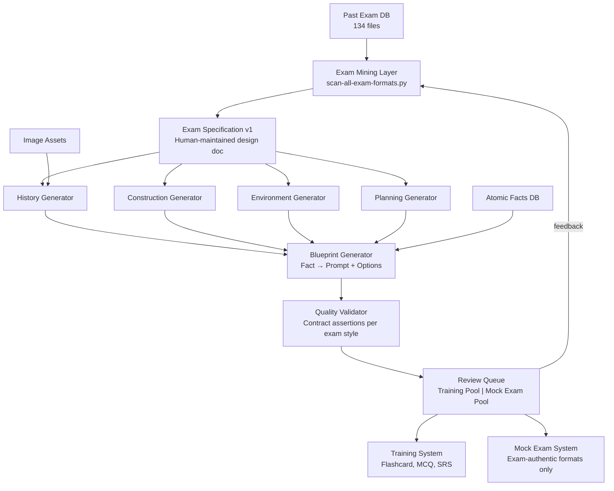

# Exam Specification v1

> **Status:** Design Contract — all future development MUST obey this document.
> **Precedence:** This document overrides all existing Generator, Blueprint, and Contract implementations.
> **Backward Compatibility:** Not preserved. System redesign takes priority.

---

## Part 1: Per-Subject Exam Analysis

### 1.1 History (建築史)

**Evidence:** 40 exam files (専門1: 17, 専門2-2: 23). Scan of all 134 past exams.

#### Dominant Question Types (専門1)

| Type | Frequency | Evidence |
|------|-----------|----------|
| **Image Identification** | 7/7 years | 2014-2020, 2022-2026 Q5: 20 photographs → write building/architect/style name |
| **Word Bank Matching** | 7/7 years | Every 専門1 Q5 uses 語群A (people/styles) + 語群B (terms/concepts) |
| **Building Pairing** | 5/7 years | ①-⑩ buildings matched to architects, styles, periods |

**Why these types?**
- 建築史専門1 tests **visual recognition**, not verbal reasoning. The exam presents an image and asks: "What is this? Who designed it? What style?"
- Word banks prevent answer-by-elimination: 36 terms for 20 items forces genuine recall.
- The examinee must retrieve the name from memory — the image is the only cue.

**Prohibited Types:**
- MCQ (四选一): The exam never uses standalone 4-option MCQ. All selection happens within word bank or pairing frameworks.
- Fill-blank with options inline: Not observed in 専門1 architecture history.

#### Dominant Question Types (専門2-2)

| Type | Frequency | Evidence |
|------|-----------|----------|
| **Essay (論述)** | 21/23 files | 200-300 character explanations with required structure |
| **Term Explanation** | 21/23 files | "Explain X. Include: features → background → representative examples" |
| **Diagram (作図)** | 9/23 files | Draw plans, sections, details with annotations |
| **Design Process** | 9/23 files | Analyze a building's concept → form translation |

**Why these types?**
- 専門2-2 tests **synthesis and communication**: can you explain WHY a building looks the way it does, in structured Japanese, with supporting diagrams?
- Not "do you recognize this?" but "can you construct an argument about this?"

---

### 1.2 Construction (建築構法)

**Evidence:** 29 exam files (専門1: 15, 専門2-2: 14).

#### Dominant Question Types (専門1)

| Type | Frequency | Evidence |
|------|-----------|----------|
| **Numerical Value Select** | 7/15 files | Material properties and allowable-stress values |
| **Essay** | 5/15 files | Short explanations of methods/materials |
| **Short Answer** | 4/15 files | Name the term, material, or component |
| **Fill-Blank (Word Bank)** | 3/15 files | 2022 Q3: 20 blanks, 27-term word bank |
| **Formula Completion** | 3/15 files | Match formula to concept, complete missing values |

**Why these types?**
- Construction tests **applied knowledge**: can you select the right term for a specific construction situation?
- Word bank surplus (27 terms for 20 blanks) prevents process-of-elimination.
- The exam focuses on **discrimination between similar terms** (CFT vs CLT, SSG vs MPG, フレミッシュ bond vs others).

**What the exam actually evaluates:**
- Can you distinguish between terms that sound similar but mean different things?
- Can you match a construction description to the correct technical term?
- Not: "Can you define this term from memory?"

#### Dominant Question Types (専門2-2)

| Type | Frequency | Evidence |
|------|-----------|----------|
| **Essay** | 12/14 files | Explain methods, compare systems |
| **Diagram** | 5/14 files | Draw construction sequences, support conditions |
| **Design Process** | 5/14 files | Design relocation method, seismic isolation installation |
| **Term Explanation** | 7/14 files | Structured explanations with background |

---

### 1.3 Environment (建築環境工学)

**Evidence:** 13 exam files (all 専門1, no 専門2-2 in our dataset).

**This is the most important finding in the entire analysis.**

#### Dominant Question Types (専門1)

| Type | Frequency | Evidence |
|------|-----------|----------|
| **Numerical Calculation** | **13/13 years (100%)** | Every single environment exam contains numerical calculation |
| **Correct Statement Select** | 5/13 years | "Which of the following statements is correct?" |
| **Formula Completion** | 3/13 years | 2022 Q2 Part 2: formula → quantity name + exponent |
| **Short Answer** | 4/13 years | Name the term, law, or phenomenon |
| **Fill-Blank** | 3/13 years | Complete the sentence with the correct term |
| **Calculation Select** | 3/13 years | Calculate then select the correct answer |

**Critical observation:**
- The 2022 Q2 format is the canonical environment exam: 16 phenomenon descriptions → match to 36-term word bank, plus 6 formulas → identify quantity name and exponent.
- Environment **never uses standalone MCQ**. When selection is required, it's always within a word bank or calculation framework.
- The exam tests **quantitative understanding**: can you apply the formula correctly with given numbers?

**Prohibited Types (for Mock Exam):**
- MCQ with definitions as options (never appears in real exam)
- "What is the formula for X?" as MCQ with formula options (exam uses formula completion, not selection)
- Word bank for phenomena when numerical calculation is available (exam always prefers calculation)

**Why numerical calculation dominates:**
- Environmental engineering is an applied physics discipline. The exam tests whether you can USE the formula, not whether you can RECOGNIZE it.
- Distinguishing 環境工学 from 建築史: History asks "what?" Environment asks "how much?"

---

### 1.4 Planning (建築計画)

**Evidence:** 39 exam files (専門1: 18, 専門2-2: 21).

#### Dominant Question Types (専門1)

| Type | Frequency | Evidence |
|------|-----------|----------|
| **Free Response Limited** | 7/18 files | Character/line-count constrained answers |
| **Inline Numeric Select** | 7/18 files | 2022 Q4: sentences with (3000, 10000, 20000, 40000) — pick the right value |
| **Numerical Calculation** | 6/18 files | Elevator traffic, parking layout, facility optimization |
| **Correct Statement Select** | 5/18 files | "Which statement about X is correct?" |
| **Essay** | 4/18 files | Short explanations of planning concepts |

**Why these types?**
- Planning tests **standard knowledge + application**: do you know the correct numeric standard? Can you apply it to a specific scenario?
- Inline numeric options (3-4 values in parentheses) are the defining format — never a separate answer bank.
- The exam blends memory (standards) with reasoning (which standard applies here?).

#### Dominant Question Types (専門2-2)

| Type | Frequency | Evidence |
|------|-----------|----------|
| **Essay** | 19/21 files | Extended explanations with derivation |
| **Free Response Limited** | 18/21 files | Character-count constrained |
| **Term Explanation** | 18/21 files | Structured academic explanations |
| **Design Process** | 14/21 files | Facility planning, area programming |
| **Diagram** | 10/21 files | Plans, area diagrams, circulation |

---

## Part 2: System Separation

### Training System

**Purpose:** Memorization and knowledge acquisition.

**Allowed simplifications:**
- Flashcard: image → building name (Anki-style)
- Simple MCQ: architect → work, building → period, building → style
- Concept recall: term → definition
- Style recognition: image → style name
- Numerical drill: standard → value

**Design principle:** If it helps the user remember a fact, it belongs in Training.

**Question types:**
- Flashcard (image on front, name on back)
- architect_to_work (simple 4-option MCQ)
- building_to_period
- building_style_pairing
- term_to_definition (MCQ)
- concept_four_choice
- number_four_choice
- number_fill_blank

**Source data:** Anki notes, Notion cache, atomic facts (all confidence levels).

**Quality bar:** Lower. "Does this help memorization?" is the only criterion.

---

### Mock Exam System

**Purpose:** Reconstruct the University of Tokyo entrance exam experience.

**Prohibited simplifications:**
- No MCQ where the real exam uses word banks
- No formula selection where the real exam uses calculation
- No definition matching where the real exam uses phenomenon→term matching

**Design principle:** If a blueprint rarely appears in the real exam, it should rarely appear in Mock Exam.

**Question types:**
- Image identification (history)
- Word bank matching (history, construction, environment)
- Fill-blank with word bank (construction)
- Numerical calculation (environment); inline numeric value selection (building construction)
- Formula completion (environment)
- Correct statement select (environment, planning)
- Inline numeric select (planning)
- Short answer (all subjects)
- Essay with character limit (all subjects, 専門2-2)
- Diagram/design process (専門2-2)

**Source data:** Atomic facts (high confidence, human-confirmed only), past exam patterns.

**Quality bar:** Must match the real exam format. A technically correct question in the wrong format is rejected.

---

## Part 3: Blueprint Classification

### Group A — Training Only

These blueprints help memorization but rarely appear as standalone questions in the real exam.

| Blueprint | Rationale |
|-----------|-----------|
| `architect_to_work` | Real exam uses image→architect, not architect→work MCQ |
| `building_to_period` | Real exam uses image→period through word banks |
| `building_style_pairing` | Real exam uses image→style through word banks |
| `term_to_category` | Category classification is Anki-internal, not exam format |
| `term_to_definition` | Real exam uses fill-blank from description, not term→definition MCQ |
| `number_four_choice` | Real exam uses inline selection within sentences, not standalone MCQ |
| `number_fill_blank` | Real exam embeds this within inline numeric select |
| `concept_four_choice` | Planning 専門2-2 uses essay, not MCQ |

### Group B — Exam Only

These blueprints directly reconstruct real exam question formats. They have no training equivalent.

| Blueprint | Real Exam Reference |
|-----------|-------------------|
| `image_to_building` | 専門1 建築史 Q5: 20 photographs |
| `image_to_architect` | 専門1 建築史 Q5: 語群A (人物) |
| `image_to_style` | 専門1 建築史 Q5: 語群B (様式) |
| `image_to_component` | 専門1 建築構法: 図→部材名 |
| `formula_to_quantity` | 専門1 環境 Q2 Part 2 |
| `numeric_calculation` | 専門1 環境: 13/13 years |
| `quantity_to_calculation_formula` | 専門1 環境 Q2 |
| `phenomenon_to_criterion` | 専門1 環境 Q2 Part 1 (現象→用語) |

### Group C — Training + Exam

These blueprints serve both systems, with different formats per system.

| Blueprint | Training Format | Exam Format |
|-----------|----------------|-------------|
| `definition_to_term` | MCQ: definition → select term | Fill-blank with word bank (2022 Q3) |
| `description_to_pattern` | MCQ: description → select pattern | Short answer or correct statement select |
| `pattern_comparison` | MCQ: compare two patterns | Essay: structured comparison (専門2-2) |
| `building_to_architect` | MCQ: building → architect | Image → architect through word bank |
| `phenomenon_to_term` | MCQ: phenomenon → term | Word bank matching (36 terms for 16 items) |
| `correct_statement_select` | Training MCQ | Exam: genuine 正誤判断 (planning 5/7, environment 5/13) |

### Group D — Discard

| Blueprint | Reason for Removal |
|-----------|-------------------|
| `odd_one_out` | Never observed in any past exam year. Pedagogically questionable. |
| `false_statement_identify` | Redundant with correct_statement_select. Adds no new exam value. |
| `case_to_feature` | Conflates building cases with spatial patterns. Better served by description_to_pattern. |
| `term_association` | "Most related term" is subjective without exam-defined relations. Not observed in exam. |
| `condition_change_judge` | Covered by numerical_calculation (calculate the change). Separate blueprint unnecessary. |
| `quantity_to_definition_equation` | Redundant with formula_completion + quantity_to_calculation_formula. |
| `unit_conversion` | Sub-problem of numerical_calculation. Not a standalone exam question. |
| `conservation_relation` | Never observed as standalone question. Part of calculation context. |

---

## Part 4: Per-Subject Generators

### 4.1 History Generator

**Supported Blueprints:** image_to_building, image_to_architect, image_to_style, building_pairing (via word bank)

**Supported Answer Types:**
- `free_recall` (image → write the name)
- `word_bank_matching` (image → select from 語群)
- `essay` (専門2-2: structured explanation)
- `diagram` (専門2-2: annotated drawing)

**Distractor Strategy:**
- Word bank: 2× surplus terms. For 10 prompts, provide 15-20 terms. Surplus terms from same era/region.
- Free recall: No distractors. The difficulty is the recall itself.

**Review Strategy:**
- Image→Name cards use flashcard review (Training System)
- Word bank matching uses exam simulation (Mock Exam System)

**Prohibited:**
- MCQ with 4 options
- architect→work as standalone question (must be image→architect)
- Style names as MCQ options without images

---

### 4.2 Construction Generator

**Supported Blueprints:** definition_to_term, component_to_function, image_to_component, defect_to_cause

**Supported Answer Types:**
- `fill_blank_word_bank` (20 blanks, 27 terms, 7 surplus)
- `short_answer` (name the component/method)
- `image_identification` (image → component name)
- `essay` (専門2-2: construction process design)
- `diagram` (専門2-2: draw construction sequence)

**Distractor Strategy:**
- Word bank: surplus terms must be from adjacent construction domains (similar abbreviations, similar-sounding terms)
- Short answer: No distractors

**Prohibited:**
- MCQ with definitions as options
- term→category as exam question (category is internal taxonomy, not exam format)
- Cross-domain distractors (waterproof term in steel structure question)

---

### 4.3 Environment Generator

**Supported Blueprints:** numeric_calculation, formula_to_quantity, phenomenon_to_term, correct_statement_select

**Supported Answer Types:**
- `numerical_calculation` (given values → compute answer)
- `formula_completion` (formula → quantity name + missing exponent)
- `word_bank_matching` (16 phenomena → 36-term bank)
- `correct_statement_select` (4 statements, 1 correct)
- `calculation_select` (compute → select from 4 numeric options)

**Distractor Strategy:**
- Numerical: common miscalculation values, wrong-unit values, order-of-magnitude errors
- Word bank: terms from adjacent physics domains (acoustics in thermal question, etc.)
- Correct statement: false statements generated by reversing conditions, swapping quantities, inverting inequalities

**Prohibited:**
- MCQ (never used in real exam — 0/13 years)
- Formula selection from options (exam uses formula COMPLETION, not selection)
- Definition→term MCQ (exam uses phenomenon description, not formal definition)

---

### 4.4 Planning Generator

**Supported Blueprints:** inline_numeric_select, number_fill_blank, correct_statement_select, description_to_pattern, short_answer

**Supported Answer Types:**
- `inline_numeric_select` (sentence with (option1, option2, option3, option4))
- `fill_blank` (numeric standard recall)
- `correct_statement_select` (which statement is correct?)
- `short_answer` (name the pattern/concept)
- `essay` (専門2-2: facility planning derivation)

**Distractor Strategy:**
- Numeric: same unit, same order-of-magnitude, adjacent standard values
- Correct statement: false statements from related but incorrect standards
- Short answer: No distractors

**Prohibited:**
- Pattern→case mixing (pattern name as answer, building case as prompt — or vice versa — must be consistent)
- Cross-useType distractors (hospital standard in school question)
- Institution/regulation mixed with spatial pattern in same question

---

## Part 5: Generation Pipeline

```
┌─────────────────────────────────────────────────────┐
│                   PAST EXAM DATABASE                 │
│             134 files, 2013-2026, all subjects       │
└────────────────────────┬────────────────────────────┘
                         │
                         ▼
┌─────────────────────────────────────────────────────┐
│                  EXAM MINING LAYER                   │
│  scan-all-exam-formats.py                            │
│  Extracts: question types, formats, distractor       │
│  strategies, word bank sizes, frequency per year     │
└────────────────────────┬────────────────────────────┘
                         │
                         ▼
┌─────────────────────────────────────────────────────┐
│                EXAM SPECIFICATION (this document)     │
│  Defines: which formats per subject, prohibited      │
│  types, distractor rules, quality thresholds         │
│  This layer is HUMAN-MAINTAINED, not auto-generated. │
└────────────────────────┬────────────────────────────┘
                         │
          ┌──────────────┼──────────────┐
          ▼              ▼              ▼
┌──────────────┐ ┌──────────────┐ ┌──────────────┐
│HISTORY GEN   │ │CONSTRUCT GEN │ │ENVIRONMENT   │
│              │ │              │ │GEN           │
│Image Ident   │ │Fill-Blank    │ │Num Calc      │
│Word Bank     │ │Short Answer  │ │Formula Compl │
│Essay(D2-2)   │ │Essay(D2-2)   │ │Correct State │
│Diagram(D2-2) │ │Diagram(D2-2) │ │              │
└──────┬───────┘ └──────┬───────┘ └──────┬───────┘
       │                │                │
       └────────────────┼────────────────┘
                        │
                        ▼
┌─────────────────────────────────────────────────────┐
│                BLUEPRINT GENERATOR                   │
│  Per blueprint: maps facts → prompt template         │
│  Uses Exam Style to select question type             │
│  Applies per-subject distractor rules                │
│  Outputs: Draft Question (not yet validated)         │
└────────────────────────┬────────────────────────────┘
                         │
                         ▼
┌─────────────────────────────────────────────────────┐
│                QUALITY VALIDATOR                     │
│  Contract assertions (per exam style, not per MCQ)   │
│  Type consistency (answer matches question format)   │
│  Distractor peer validation (per exam style rules)   │
│  Format compliance (matches real exam template)      │
│  Outputs: Validated Question + Quality Report        │
└────────────────────────┬────────────────────────────┘
                         │
                         ▼
┌─────────────────────────────────────────────────────┐
│                  REVIEW QUEUE                        │
│  Human audit → approve / flag / reject               │
│  Training System pool vs Mock Exam pool (separate)   │
│  Usage statistics feedback → Exam Mining layer       │
└─────────────────────────────────────────────────────┘
```

### Layer Responsibilities

| Layer | Owns | Does NOT Own |
|-------|------|-------------|
| **Exam Mining** | Format detection, frequency counting | Question generation, quality rules |
| **Exam Specification** | Per-subject format rules, prohibitions | Implementation details, data access |
| **Subject Generator** | Which blueprints to use, which formats per blueprint | Cross-subject logic, data validation |
| **Blueprint Generator** | Fact→prompt mapping, option construction | Format selection (delegates to Subject Gen) |
| **Quality Validator** | Contract assertions, format compliance | Fact correctness (human audit), distractor plausibility (human audit) |
| **Review Queue** | Human audit workflow, pool separation | Generation rules, quality thresholds |

---

## Part 6: Feature Ownership

| Feature | Owner Layer | Rationale |
|---------|------------|-----------|
| **Image Recognition** | History Generator + Training System | Exam: image→name via word bank. Training: flashcard. |
| **Word Bank** | History Generator, Construction Generator, Environment Generator | 語群 is the unifying format across all 専門1 subjects |
| **Formula Completion** | Environment Generator | Unique to environment; not used in other subjects |
| **Numerical Calculation** | Environment Generator, Construction Generator | Per-subject value sets, different difficulty |
| **Correct Statement Select** | Planning Generator, Environment Generator | Per-subject false-statement generation rules |
| **Inline Numeric Select** | Planning Generator | Unique to planning 専門1 |
| **Essay** | All Subject Generators (専門2-2 only) | Template per subject, character limits per exam year |
| **Diagram** | History Generator, Construction Generator (専門2-2) | Annotation requirements per subject |
| **MCQ (Training)** | Training System | Simple 4-option for memorization only |
| **Flashcard** | Training System | Anki-compatible image→name format |
| **Error Review** | Review Queue | Aggregates across both systems |
| **Spaced Repetition** | Training System | SRS applies to memorization, not exam simulation |
| **Human Audit** | Review Queue | Separate approval paths for Training vs Mock Exam |
| **Usage Statistics** | Review Queue | Feedback to Exam Mining for format frequency adjustment |

---

## Appendix A: Subject Comparison Matrix

| Dimension | History | Construction | Environment | Planning |
|-----------|---------|-------------|-------------|----------|
| 専門1 dominant type | Image + Word Bank | Numerical + Fill-Blank | Numerical Calculation | Inline Numeric |
| 専門2-2 dominant type | Essay + Diagram | Essay + Design Process | (not in dataset) | Essay + Term Explanation |
| Word bank usage | Every year | 3/7 years | Every year (2022 Q2) | Never |
| MCQ usage | Never standalone | Never standalone | **Never (0/13)** | Only as inline select |
| Image required | Yes (core) | Sometimes | No | Sometimes |
| Calculation required | No | Yes (7/15) | **Yes (13/13)** | Yes (6/18) |
| Generates from | Anki + images | Anki construction | Formula library | Notion + Anki planning |

## Appendix B: Blueprint Classification Table

See Part 3 above for the complete classification of all 24 blueprints into Groups A/B/C/D.

## Appendix C: System Architecture



## Appendix D: Future Refactoring Roadmap

### Phase 1: Spec Adoption (current)
- [x] Scan all 134 past exams
- [x] Produce Exam Specification v1
- [ ] Deprecate universal MCQ Generator
- [ ] Mark Group D blueprints as inactive

### Phase 2: Subject Generators
- [ ] Implement History Generator (image + word bank)
- [ ] Implement Environment Generator (numerical + formula completion)
- [ ] Implement Construction Generator (fill-blank + short answer)
- [ ] Implement Planning Generator (inline numeric + correct statement)

### Phase 3: Training/Mock Separation
- [ ] Split question pool into Training Pool and Mock Exam Pool
- [ ] Training System: MCQ, flashcard, SRS review
- [ ] Mock Exam System: exam-authentic formats only
- [ ] Separate quality thresholds per system

### Phase 4: Image Pipeline
- [ ] Image asset confirmation workflow
- [ ] Image→blueprint binding
- [ ] Image-based question generation (History, Construction)

### Phase 5: 専門2-2 Support
- [ ] Essay template system (structured prompts with character limits)
- [ ] Diagram annotation requirements
- [ ] Design process questions (Construction)
- [ ] Term explanation with required structure (features → background → examples)
