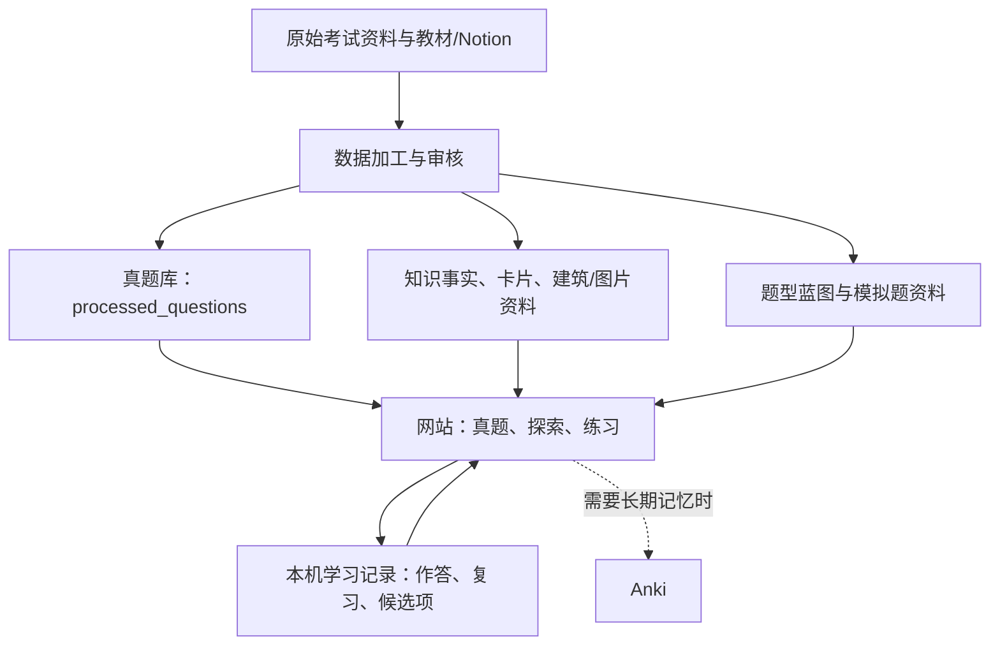

# 网站架构与考试学习价值说明

> 更新：2026-07-19。本文按仓库当前实现整理，目的是把“边学习边积累”的内容还原成一张可维护的地图；它不是新的开发规范。

## 一句话定位

这是一个面向建筑考试的学习中枢，而不只是题库。它把**真题、可追溯的模拟练习、按关系组织的知识内容、图片／建筑案例，以及个人作答记录**放在同一条学习路径上。

三种工具各自负责不同的事：

| 工具 | 应负责什么 |
| --- | --- |
| Notion | 原始教材笔记、长解释、尚在整理的知识来源 |
| 本网站 | 以考试任务为中心的检索、练习、复习和知识导航 |
| Anki | 需要长期记住的最小知识单元 |

换言之：网站不需要复制 Notion，也不需要重做 Anki；它应该帮助你从“这题不会”回到“该补哪个知识点”，再回到下一次作答。

## 总体结构

网站目前可以分为五层：

1. **来源层**：历年试卷的 Markdown 转写、图片、Anki/Notion 导入资料。
2. **知识层**：原子事实、学习卡、建筑实体、关系链接、各科知识地图。
3. **考试层**：真题、题型蓝图、答案记录、可验证的模拟练习。
4. **交互层**：探索、题库、练习、复习、评估等网页入口。
5. **个人状态层**：浏览器 `localStorage` 中的作答与复习状态；目前没有账号、云同步或服务器数据库。

## 当前拥有的数据

### 1. 真题与原始资料

| 数据 | 当前规模 | 用途 |
| --- | ---: | --- |
| 已处理真题 Markdown | 134 题 | 网站“真题库”实际读取的主来源；含题干、年份、科目、题号、标签与图片引用。 |
| 年份覆盖 | 2013–2020、2022–2026 | 2021 年不在当前已处理集合中。 |
| 科目分布 | 建筑史 40、建筑计划 39、建筑构法 29、建筑环境工学 13、结构力学 13 | 当前正式四科范围不包含结构力学。 |
| 原始试卷转写 | 22 份 Markdown | 用于追溯和再次提取题目／考点。 |
| 生成题题库 | 395 题，24 个题型蓝图 | 由原子事实和题型规则生成；与“真题库主来源”是两套并存的数据，不应混为同一份真题。 |

### 2. 知识、案例与图片

| 数据 | 当前规模 | 用途 |
| --- | ---: | --- |
| 原子事实库 | 3,397 条 | 模拟题、答案依据与关系型学习内容的底层事实。 |
| 建筑实体 | 399 个 | 建筑史的建筑、人物、样式与图片关系。 |
| 学习卡名称索引 | 213 张 | 连接建筑／考点与卡片化解释。 |
| 图片资产索引 | 890 项 | 图像题、建筑卡和图片审核的资产清单。 |
| 本地建筑图片 | 436 张 | 建筑史浏览、识图与图像题使用。 |
| 建筑计划案例图 | 52 张 | 计划类型学与案例学习使用。 |

此外，`data/` 中保留了各科知识地图、答案索引、覆盖矩阵、证据链接、审计报告和待审核队列。这些大多是“内容生产与质量控制资料”，并非都直接展示给学习者。

### 3. 答案、证据与质量控制

- 建筑计划答案记录：8 组；建筑构法答案记录：29 组。
- 可靠自动判分白名单：103 个可精确比对的作答项；其他题目应以自我判断或标示为草稿／待审核的答案为准。
- 每个正式练习单元都设计为在提交后显示答案、认知任务、答案依据、置信度和主题标签。
- `scripts/` 下约 100 个脚本负责导入、提取、生成、关联、审计和验证；它们属于内容生产管线，不是日常学习入口。

## 前台部分：每一部分在做什么

### A. 首页与主导航：选择学习模式

首页、全局导航和入口页的意图是把功能收成四个方向：

- **探索**：想理解知识之间的关系时进入。
- **真题库**：想看考试如何实际发问时进入。
- **练习／复习**：想根据做题状态补弱项时进入。
- **模拟题**：想在有限、已验证的题型范围内检验时进入。

考试帮助：避免在众多页面之间凭感觉跳转，让每次学习先回答“我现在是理解、找题、练习还是检验”。

### B. 真题库与题目详情

主要路由：`/exam/past`、`/question/[id]`。

- 读取 `data/processed_questions` 的 134 道已处理真题。
- 可按年份、科目、类别、标签筛选；题目有稳定 ID，避免排序变化导致学习记录错位。
- 题目详情可以标记学习状态，并从题目回到相关资料。

考试帮助：用真实题型校准“考试到底会怎么问”，而不只是在背知识清单。

### C. 探索：把知识变成可走的路径

主要路由：`/explore` 及其子页。

建筑史可从时间轴、关系网络、样式／运动卡、建筑卡、西洋核心建筑、以及“建筑史 × 构法”进入；其他科有计划类型学、环境公式和构法辨析等专题入口。

考试帮助：在遇到陌生名词或混淆关系时，补的是一条“为什么相关”的路径，而不是孤立地补一张卡。

### D. 知识地图与专题复习

主要路由包括：`/architecture-history-knowledge-map`、`/planning-knowledge-map`、`/environment-knowledge-map`、`/environment-knowledge`、`/construction-methods-knowledge-map`、`/knowledge-map`。

它们按科目把知识点、答案记录和易混辨析集中起来；其中建筑史还提供建筑详情页、时间轴和网络视图。

考试帮助：适合在做错后按科目回溯，确认自己缺的是概念、公式条件、案例辨认，还是相近构法的区分。

### E. 正式模拟练习：四科当前可依赖的入口

当前状态文件标记为 `FOUR_SECTION_LEARNING_SYSTEM_PASS`。正式入口和范围如下：

| 科目 | 入口 | 当前形式 | 适合检验什么 |
| --- | --- | --- |
| 建筑史 | `/exam/mock/history-mwb` | 已审核的图片—建筑／建筑师配对生成 | 识图、名称与人物关联。 |
| 建筑计划 | `/exam/mock/planning-full` | 2023 年 Q4 的 20 个索引单元重建 | 按真题结构组织的计划作答。 |
| 建筑构法 | `/exam/mock/building-construction-full` | RC 共享词库生成；资料不足时回退到 2024 年 Q3 重建 | 构件、材料与 RC 词汇关系。 |
| 建筑环境工学 | `/exam/mock/env-calc` | CO₂ 换气公式计算生成 | 公式选择、条件与计算过程。 |

考试帮助：这些入口优先保证“来源可说明、答案可追溯、题型不乱编”，而不是追求大量随机题。

### F. 轻量练习、复习与评估工作台

- `/practice`、`/review`：汇总错题、不确定题、稍后再做题，作为回流队列。
- `/practice/light`：轻量的跨资料练习。
- `/assessment`、`/assessment/images`、`/assessment/drafts`、`/assessment/audit`：用于人工确认图片、候选题和草稿答案的内部工作台。

考试帮助：前两类页面把“做错”转成下一轮复习；评估工作台则防止未经确认的内容直接混入正式练习。

## 学习状态如何保存

当前状态只保存在浏览器本机，包括题目作答状态、尝试记录、最近一题、筛选条件、评估候选清单和使用统计。

这意味着：刷新页面通常不会丢失，但清理浏览器数据、换浏览器或换设备后不会自动同步。它很适合个人快速学习，但尚不适合把进度当作唯一、长期保存的学习档案。

## 推荐的实际使用方式

1. **先做真题或正式模拟练习（30–50 分钟）**：优先暴露真正的缺口。
2. **把不会的题标为错／不确定／稍后再做（5 分钟）**：不要当场把所有延伸内容都打开。
3. **从相关知识地图或探索页补一个最小主题（15–25 分钟）**：例如一个公式条件、一组构法辨析或一条建筑史关系。
4. **回到同题或相同题型再答（10 分钟）**：确认补充是否转化为作答能力。
5. **需要长期保留的最小事实再进入 Anki**：不要把整套网站资料再次复制成卡片。

## 哪些内容已成熟，哪些仍应谨慎使用

### 可作为当前学习主干

- 四科正式模拟入口（建筑史、计划、构法、环境）及其已验证范围。
- 已处理真题库、真题筛选和题目学习状态。
- 建筑史的时间、建筑、人物、样式关系资料。
- 基于来源、答案依据与置信度展示的学习反馈。

### 适合探索或试用，但不应过度承诺

- 计划的数字题／设施题旧原型页面：状态文件已列为 `deprecated`，不应作为正式主入口。
- 环境的现象词库、判断题包等：可用于补充练习，但目前未进入正式环境蓝图。
- 构法的部分静态格式和关系生成：可学习，但题库多样性仍有限。
- 建筑史的非图片核心题型：部分来源或评分依据仍需人工审核。
- 结构力学与専門 2-2：仓库有资料，但不在当前“四科正式系统”范围。

## 目前最值得记住的边界

1. **真题主来源是 `data/processed_questions`，不是 395 道生成题。** 两套数据可以共存，但页面和文档必须清楚标明“真题”或“生成练习”。
2. **正式模拟题必须保留来源与限制。** 题量不是价值核心；可追溯和不误导更重要。
3. **Notion 是详细内容的权威来源。** 网站应保存导航、摘要、关系和考试行为，而不是复制长笔记。
4. **浏览器本机记录不等于长期档案。** 在考试前若进度很重要，应另行备份或将关键记忆放入 Anki。
5. **内部审核页面与学习页面不同。** 审核队列、数据报告和脚本是为了让内容变可靠，不需要成为每天学习的负担。

## 给未来自己的简化判断法

当你又想把新东西塞进网站时，先问它属于哪一类：

| 新内容的性质 | 应放的位置 |
| --- | --- |
| 一道有来源的真实题目 | `processed_questions`，再进入真题库。 |
| 一个明确、可复用、已核对的知识关系 | 原子事实／学习卡／知识地图。 |
| 一个能说明模仿哪种真题结构、且答案可核对的题型 | 题型蓝图与正式／候选模拟练习。 |
| 还不确定、只是从教材或 Notion 摘出的笔记 | 留在 Notion 或审核队列，暂不进入正式练习。 |
| 只是帮助你整理或检查资料的脚本、报告 | 保留在内容生产层，不必增加前台入口。 |

这条判断法的核心是：**先决定内容扮演的角色，再决定它是否需要出现在学习者面前。**
